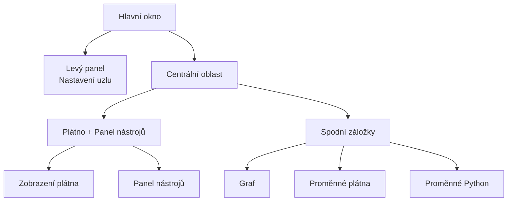

## Anatomie hlavního rozhraní

FloWorks organizuje své hlavní okno do **tří funkčních zón**, které vycházejí z jasné filozofie:
> *Střed obrazovky slouží pro pracovní postup (Plátno). Vlevo se nachází nastavení vybraného uzlu. Vpravo pomocné nástroje. Dole vizualizace a data.*

Toto uspořádání není náhodné: umožňuje **vytvářet a spouštět toky bez ztráty detailu**, přičemž nastavení aktivního uzlu a analytické nástroje zůstávají vždy dostupné.

---

### 1. Levý panel: Nastavení uzlu

Tento panel, umístěný vlevo, je určen **výhradně k zobrazení a úpravě parametrů uzlu, který máte vybraný** na Plátně.

**Co zde uvidíte:**

- **Nadpis** udávající funkci panelu.
- **Název vybraného uzlu** vyznačený v rámečku. Pokud není vybrán žádný uzel, zobrazí se o tom informace.
- **Posuvná oblast nastavení**, kde se zobrazují specifické možnosti každého uzlu (např. prahové hodnoty, názvy signálů, parametry akvizice atd.).

**Filozofie návrhu:**

- Panel je **vždy viditelný**; nejedná se o vyskakovací okno.
- Když není vybrán žádný uzel, zobrazí se prázdný prostor, který vybízí k výběru uzlu.
- Po kliknutí na libovolný uzel na Plátně se tento panel **automaticky aktualizuje** a zobrazí jeho možnosti.

| | |
|:---:|:---:|
|  |  |
| *Levý panel bez výběru* | *Levý panel s vybraným uzlem* |

---

### 2. Centrální oblast: Plátno a panel nástrojů

Prav oblast je rozdělena svisle: nahoře je **Plátno** a dole **spodní záložky**.

#### Plátno (zobrazení uzlů)

Je **vizuálním jádrem FloWorks**. Zde se:

- Umisťují a propojují uzly tvořící váš pracovní postup.
- Pohybujete po mřížce (*pan* nebo *zoom*) pro zobrazení celého toku.
- Vybírají uzly k úpravě v levém panelu.

#### Panel nástrojů (Drawer)

Vpravo od Plátna se nachází **boční rozbalovací panel** s pomocnými nástroji. Lze jej otevřít nebo zavřít podle potřeby a uvolnit tak prostor pro Plátno.

| Ikona | Nástroj | Účel |
|:-----:|:------------|:----------------|
| 📉 | Analytické panely | Vizualizace a analýza signálů (grafy, metriky). |
| 🧮 | Vědecká kalkulačka | Rychlé výpočty bez opuštění prostředí. |
| 📊 | Tabulkový procesor | Prohlížení a manipulace s číselnými daty v tabulkovém formátu. |
| 📈 | Monitor výkonu | Zobrazení obecných metrik počítače (využití CPU, paměť atd.). |
| 🐍 | Python konzole | Přímý přístup k interpretu Pythonu pro pokročilé úkoly. |

| | | | | |
|:---:|:---:|:---:|:---:|:---:|
|  |  |  |  |  |
| *Analýza* | *Kalkulačka* | *Tabulkový procesor* | *Monitor* | *Python konzole* |

**Filozofie návrhu:**
Panel nástrojů umožňuje **udržet pozornost na Plátně** bez ztráty přístupu k funkcím, které občas potřebujete. Je přirozeným rozšířením pracovního postupu, nikoli trvalým rozptýlením.

[Tutorial Python konzole](tutorial-console.md){ .md-button }
[Tutorial Spreadsheet](tutorial-spreadsheet.md){ .md-button .md-button--primary }

---

### 3. Spodní záložky: Graf a proměnné

Pod Plátnem se nachází oblast se záložkami, která nabízí dva doplňující se pohledy:

#### 📈 Graf
- Vizuálně reprezentuje data generovaná nebo získaná uzly.
- Automaticky se aktualizuje, jakmile uzly produkují nové hodnoty.
- Sdílí stejné zobrazení jako Analytické panely, což zajišťuje vizuální konzistenci.

#### 📋 Proměnné plátna (Workspace)
- Zobrazuje tabulku s **proměnnými, signály nebo daty** na Plátně přítomných ve vašem toku.
- Aktualizuje se v reálném čase spolu s grafem.
- Je to "surový" pohled na data: ideální pro ladění a číselnou verifikaci.

#### 📋 Proměnné Python (Terminál)
- Zobrazuje tabulku s **proměnnými, signály nebo daty** deklarovanými v python terminálu.
- Aktualizuje se v reálném čase.
- Zobrazuje rozměry a vlastnosti každé uložené proměnné.

| |
|:---:|
|  |
| *Záložka Graf* |
|  |
| *Záložka Proměnné plátna* |
|  |
| *Záložka Proměnné Python* |

---

### 4. Vlastnosti rozvržení

- **Měnitelné panely**
  Jak oddělení vlevo/vpravo, tak horní/dolní je možné upravit přetažením okrajů, aby se rozhraní přizpůsobilo vašemu pracovnímu postupu.

- **Počáteční proporce**
  - Levý panel: **25 %** celkové šířky.
  - Pravá oblast: zbývajících **75 %**.
  - Svisle zabírá Plátno přibližně **480 px** a spodní záložky **320 px** (lze změnit).

- **Okraje a mezery**
  Okraje jsou minimální, aby se maximálně využil pracovní prostor, aniž by se obětovala čitelnost.

---

### 5. Reaktivita rozhraní

FloWorks je navrženo tak, aby **každá akce na Plátně měla okamžitý efekt v panelech**:

- Po výběru uzlu levý panel zobrazí jeho možnosti.
- Po spuštění toku se graf a tabulka dat automaticky aktualizují.
- Po odstranění uzlu se konfigurační panel vyprázdní, pokud to byl vybraný uzel.
- Pokud tok obsahuje neuložené změny, rozhraní to vizuálně indikuje (např. hvězdičkou v názvu nebo indikátorem).

Tato **reaktivní zkušenost** eliminuje nutnost ručního obnovování zobrazení: vždy vidíte nejnovější stav své práce.

---

### 6. Změna motivu za běhu

FloWorks umožňuje změnit vizuální motiv (světlý/tmavý) **bez restartu aplikace**. Můžete přepínat mezi motivy během práce a **rozhraní se okamžitě přizpůsobí**, přičemž stav vašeho toku zůstane nedotčen.

**Praktický přínos:**
Pracujte s motivem, který vám vyhovuje podle podmínek osvětlení nebo osobních preferencí, bez přerušení relace.

---

### 7. Internacionalizace (vícejazyčnost)

Všechny texty rozhraní (nabídky, nadpisy, tlačítka, zprávy) jsou připraveny k **zobrazení ve více jazycích**. FloWorks obsahuje překladatelský systém, který umožňuje snadno změnit jazyk aplikace bez nutnosti reinstalace nebo restartu.

**Filozofie návrhu:**
Nástroj je určen pro uživatele z různých regionů; jazyk by neměl být překážkou.

---

> **Vizuální shrnutí:** Obrazovka je uspořádána tak, abyste viděli **vše podstatné na první pohled**: uzly (střed), nastavení uzlu (vlevo), pomocné nástroje (vpravo, rozbalovací) a výsledky/data (dole). Vše reaktivní, s okamžitou změnou motivu a vícejazyčnou podporou.
