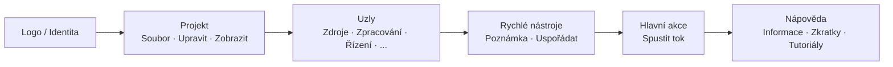

## Hlavní panel nástrojů: Organizace a filozofie

Horní panel nástrojů je **rychlé velitelské centrum** FloWorks. Jeho design následuje logiku pracovního postupu: zleva doprava najdete akce v typickém pořadí, v jakém je během relace potřebujete.

### Organizace podle skupin

Panel je rozdělen na **šest funkčních skupin**, oddělených jemnými svislými čarami. Každá skupina sdružuje související akce, abyste je nemuseli hledat v rozptýlených nabídkách.

---

### 1. Identita (Logo)

Na levém konci uvidíte **logo FloWorks**. Není pouze dekorativní: kliknutím na něj se otevře **uvítací dialog**, který obsahuje obecné informace a filozofii použití.

- **Tooltip:** "Informace a uvítání FloWorks".

**Filozofie:** Logo funguje jako vstupní bod k identitě a počáteční nápovědě, aniž by zabíralo místo v nabídkách.

---

### 2. Projekt: Soubor, Upravit a Zobrazit

Sdružuje operace související se **správou projektu a vzhledem rozhraní**.

#### 📁 Soubor
- **Nový**: vytvoří prázdný tok.
- **Otevřít**: načte existující projekt.
- **Uložit / Uložit jako**: uloží aktuální tok.
- **Ukončit**: zavře aplikaci.

#### ✂️ Upravit
- **Zpět / Znovu**: vrátí nebo obnoví změny na Plátně.
- **Vyjmout / Kopírovat / Vložit**: manipuluje s vybranými uzly.
- **Předvolby**: otevře okno globální konfigurace.

#### 👁️ Zobrazit
Tato nabídka řídí, jak se rozhraní zobrazuje a přizpůsobuje vašim preferencím:

- **Jazyk**: změní jazyk celé aplikace (nabídky, tlačítka, zprávy).
- **Téma**: přepíná mezi vizuálními tématy (světlé, tmavé atd.) za běhu.
- **Velikost písma**: upraví velikost textu v celém rozhraní, s předdefinovanými a vlastními možnostmi.
- **Prohlížeč záznamů**: zobrazí interní protokoly aplikace (užitečné pro pokročilé ladění).

**Filozofie:** Vše související s "mým projektem a mým pracovním prostředím" je pohromadě, ale odděleno od akcí, které přidávají nebo spouštějí uzly.

---

### 3. Uzly (podle kategorií)

Tato skupina je **automaticky generována z katalogu uzlů** dostupného ve FloWorks. Není ručně zakódována: pokud je do programu přidán nový uzel, jeho kategorie se zde automaticky objeví.

Typické kategorie zahrnují:

- **Zdroje** (generátory signálů, vstupy dat).
- **Zpracování** (filtry, matematické transformace).
- **Řízení** (logika toku, podmínky).
- **Výstupy** (příjemce, vizualizéry, exportéři).
- A jakákoli jiná kategorie definovaná komunitou nebo vašimi vlastními uzly.

**Inteligentní chování:**

- Pokud kategorie obsahuje **jeden uzel**, panel zobrazí pímo tlačítko s jeho názvem; kliknutím se uzel přidá na Plátno.
- Pokud obsahuje **více uzlů**, zobrazí se rozbalovací nabídka se všemi. Výběrem se umístí na Plátno.

**Filozofie:** Přístup k uzlům je vždy viditelný, bez nutnosti otevírat postranní panel. Panel se přizpůsobuje katalogu, zachovává konzistenci a vyhýbá se ruční konfiguraci.

---

### 4. Rychlé nástroje

Dvě tlačítka pro přímou produktivitu:

- **📝 Lepicí poznámka**: přidá vizuální poznámku na Plátno pro dokumentaci částí toku.
- **🔧 Automaticky uspořádat**: přerovná všechny uzly na Plátně do přehledné a čitelné podoby jediným kliknutím.

**Filozofie:** Jsou to akce často používané, které si nezaslouží být skryty v nabídkách. Jeden klik a hotovo.

---

### 5. Hlavní akce: Spustit tok

Tlačítko **Spustit** je vizuálně zvýrazněno barevným okrajem (obvykle zeleným) a ikonou "přehrát". Je to nejnápadnější tlačítko na panelu, protože představuje centrální akci FloWorks: **zapnout tok dat**.

- Kliknutím se **spustí aktuální tok** a aktualizuje se graf a spodní tabulka dat.
- Tlačítko se při stisknutí mírně změní, poskytující hmatovou zpětnou vazbu.

**Filozofie:** Nejdůležitější akce musí být nejvíce viditelná. Není třeba procházet nabídky pro spuštění; je vždy na dosah kliknutí.

---

### 6. Nápověda

Na konci panelu najdete nabídku **Nápověda** s přímými odkazy na:

- **Informace**: podrobnosti o verzi a projektu.
- **Klávesové zkratky**: úplný seznam zkratek pro pokročilé uživatele.
- **Tutoriály**: návody krok za krokem pro učení se FloWorks.

**Filozofie:** Nápověda je vždy dostupná, ale oddělena od pracovního postupu, aby nepřekážela.

---

### Adaptivní vlastnosti

- **Okamžitý překlad**: při změně jazyka z nabídky Zobrazit se **všechny texty na panelu okamžitě aktualizují**, bez restartu.
- **Témata a velikost písma**: panel se okamžitě překreslí v novém vizuálním stylu.
- **Dynamický katalog**: pokud jsou do programu přidány nové uzly, jejich kategorie se na panelu objeví automaticky, bez ručního zásahu.

**Shrnutí:** Panel nástrojů je navržen tak, aby byl **intuitivní, rychlý a přizpůsobivý**. Následuje přirozený pracovní postup: nakonfigurovat projekt → upravit → přidat uzly → spustit → konzultovat nápovědu. Vše ostatní zůstává mimo dosah, ale dostupné, když jej potřebujete.
