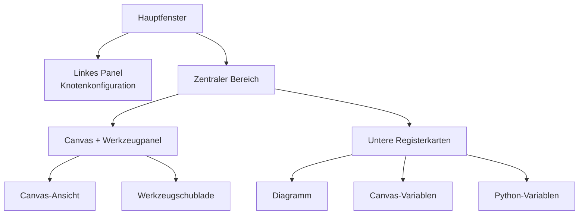

## Anatomie der Hauptoberfläche

FloWorks gliedert das Hauptfenster in **drei funktionale Bereiche**, die einer klaren Philosophie folgen:

> *Die Bildschirmmitte ist für den Arbeitsablauf (das Canvas) vorgesehen. Links die Konfiguration des ausgewählten Knotens. Rechts die Hilfswerkzeuge. Unten die Visualisierung und die Daten.*

Diese Anordnung ist nicht willkürlich: Sie ermöglicht es Ihnen, **Flows zu erstellen und auszuführen, ohne die Details aus den Augen zu verlieren**, wobei die Konfiguration des aktiven Knotens und die Analysewerkzeuge stets griffbereit sind.

---

### 1. Linkes Panel: Knotenkonfiguration

Dieses Panel auf der linken Seite ist **ausschließlich der Anzeige und Bearbeitung der Parameter des auf dem Canvas ausgewählten Knotens** gewidmet.

**Was Sie hier sehen:**

- Einen **Titel**, der die Funktion des Panels angibt.
- Den **Namen des ausgewählten Knotens** in einem hervorgehobenen Feld. Wenn kein Knoten ausgewählt ist, erscheint ein entsprechender Hinweis.
- Einen **scrollbarer Konfigurationsbereich**, in dem die spezifischen Optionen jedes Knotens angezeigt werden (z. B. Schwellenwerte, Signalnamen, Erfassungsparameter usw.).

**Designphilosophie:**

- Das Panel ist **immer sichtbar**; es handelt sich nicht um ein Pop-up-Fenster.
- Wenn kein Knoten ausgewählt ist, wird ein leerer Bereich angezeigt, der Sie auffordert, einen Knoten auszuwählen.
- Wenn Sie auf einen beliebigen Knoten im Canvas klicken, aktualisiert sich dieses Panel **automatisch**, um dessen Optionen anzuzeigen.

| | |
|:---:|:---:|
|  |  |
| *Linkes Panel ohne Auswahl* | *Linkes Panel mit ausgewähltem Knoten* |

---

### 2. Zentraler Bereich: Canvas und Werkzeugpanel

Der rechte Bereich ist vertikal geteilt: Oben befindet sich das **Canvas**, darunter die **unteren Registerkarten**.

#### Canvas (Knotenansicht)

Dies ist das **visuelle Herzstück von FloWorks**. Hier können Sie:

- Die Knoten, die Ihren Arbeitsablauf bilden, platzieren und verbinden.
- Im Gitter navigieren (durch *Verschieben* oder *Zoomen*), um den gesamten Flow zu sehen.
- Knoten auswählen, um sie im linken Panel zu bearbeiten.

#### Werkzeugschublade (Tool Drawer)

Rechts vom Canvas befindet sich eine **einklappbare Seitenleiste**, die Hilfswerkzeuge enthält. Sie können sie bei Bedarf öffnen oder schließen, um Platz für das Canvas zu schaffen.

| Symbol | Werkzeug | Verwendungszweck |
|:-----:|:------------|:----------------|
| 📉 | Analysepanele | Visualisierung und Analyse von Signalen (Diagramme, Kennzahlen). |
| 🧮 | Wissenschaftlicher Rechner | Schnelle Berechnungen, ohne die Umgebung zu verlassen. |
| 📊 | Tabellenkalkulation | Numerische Daten in Tabellenform anzeigen und bearbeiten. |
| 📈 | Leistungsmonitor | Allgemeine Computerkennzahlen anzeigen (CPU-Auslastung, Speicher usw.). |
| 🐍 | Python-Konsole | Direkter Zugriff auf einen Python-Interpreter für erweiterte Aufgaben. |

| | | | | |
|:---:|:---:|:---:|:---:|:---:|
|  |  |  |  |  |
| *Analyse* | *Rechner* | *Tabellenkalkulation* | *Monitor* | *Python-Konsole* |

**Designphilosophie:**
Das Werkzeugpanel ermöglicht es Ihnen, **den Fokus auf dem Canvas zu behalten**, ohne den Zugriff auf Funktionen aufzugeben, die Sie in bestimmten Momenten benötigen. Es ist eine natürliche Erweiterung des Arbeitsablaufs, keine ständige Ablenkung.

[Tutorial Python Console](tutorial-console.md){ .md-button }
[Tutorial Spreadsheet](tutorial-spreadsheet.md){ .md-button .md-button--primary }

---

### 3. Untere Registerkarten: Diagramm und Variablen

Unterhalb des Canvas befindet sich ein Bereich mit Registerkarten, der zwei komplementäre Ansichten zeigt:

#### 📈 Diagramm (Plot)
- Stellt die von den Knoten erzeugten oder erfassten Daten visuell dar.
- Aktualisiert sich automatisch, sobald die Knoten neue Werte produzieren.
- Teilt dieselbe Ansicht wie die Analysepanele und gewährleistet so visuelle Konsistenz.

#### 📋 Canvas-Variablen (Arbeitsbereich)
- Zeigt eine Tabelle mit den **Variablen, Signalen oder Daten** auf dem Canvas, die in Ihrem Flow vorhanden sind.
- Aktualisiert sich in Echtzeit zusammen mit dem Diagramm.
- Dies ist die "Rohansicht" der Daten: ideal zum Debuggen und zur numerischen Überprüfung.

#### 📋 Python-Variablen (Terminal)
- Zeigt eine Tabelle mit den **Variablen, Signalen oder Daten**, die in der Python-Konsole deklariert sind.
- Aktualisiert sich in Echtzeit.
- Zeigt die Dimensionen und Eigenschaften jeder gespeicherten Variable an.

| |
|:---:|
|  |
| *Diagramm-Registerkarte* |
|  |
| *Canvas-Variablen-Registerkarte* |
|  |
| *Python-Variablen-Registerkarte* |

---

### 4. Layout-Eigenschaften

- **Größenveränderbare Panels**
  Sowohl die Aufteilung links/rechts als auch oben/unten lässt sich durch Ziehen der Ränder anpassen, um die Oberfläche an Ihren Arbeitsablauf anzupassen.

- **Anfängliche Proportionen**
  - Linkes Panel: **25%** der Gesamtbreite.
  - Rechter Bereich: verbleibende **75%**.
  - Vertikal nimmt das Canvas etwa **480 px** und die unteren Registerkarten **320 px** ein (änderbar).

- **Ränder und Abstände**
  Die Ränder sind minimal, um den Arbeitsbereich zu maximieren, ohne die Lesbarkeit zu beeinträchtigen.

---

### 5. Reaktivität der Oberfläche

FloWorks ist so konzipiert, dass **alles, was Sie im Canvas tun, sofortige Auswirkungen auf die Panels** hat:

- Wenn Sie einen Knoten auswählen, zeigt das linke Panel seine Optionen an.
- Wenn Sie einen Flow ausführen, aktualisieren sich Diagramm und Datentabelle automatisch.
- Wenn Sie einen Knoten löschen, leert sich das Konfigurationspanel, falls es der ausgewählte Knoten war.
- Wenn der Flow nicht gespeicherte Änderungen enthält, zeigt die Oberfläche dies visuell an (z. B. durch ein Sternchen im Titel oder einen Indikator).

Dieses **reaktive Erlebnis** erspart es Ihnen, die Ansicht manuell zu aktualisieren: Sie sehen stets den aktuellsten Stand Ihrer Arbeit.

---

### 6. Sofortiges Wechseln des Designs

FloWorks ermöglicht es Ihnen, das visuelle Design (hell/dunkel) **ohne Neustart der Anwendung** zu ändern. Sie können zwischen Designs wechseln, während Sie arbeiten, und die **Oberfläche passt sich sofort an**, wobei der Zustand Ihres Flows unberührt bleibt.

**Praktischer Nutzen:**
Arbeiten Sie mit dem Design, das Ihnen je nach Lichtverhältnissen oder persönlicher Vorliebe am angenehmsten ist, ohne Ihre Sitzung zu unterbrechen.

---

### 7. Internationalisierung (Mehrsprachigkeit)

Alle Texte der Oberfläche (Menüs, Titel, Schaltflächen, Meldungen) sind darauf vorbereitet, **in mehreren Sprachen angezeigt** zu werden. FloWorks enthält ein Übersetzungssystem, mit dem Sie die Sprache der Anwendung einfach ändern können, ohne eine Neuinstallation oder einen Neustart durchführen zu müssen.

**Designphilosophie:**
Das Werkzeug ist für Benutzer aus verschiedenen Regionen gedacht; Sprache sollte keine Barriere sein.

---

> **Visuelle Zusammenfassung:** Der Bildschirm ist so organisiert, dass Sie **auf einen Blick alles Relevante sehen**: Knoten (Mitte), Knotenkonfiguration (links), Hilfswerkzeuge (rechts, einklappbar) und Ergebnisse/Daten (unten). Alles ist reaktiv, mit sofortigem Designwechsel und Mehrsprachenunterstützung.
