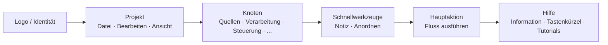

## Haupt-Symbolleiste: Organisation und Philosophie

Die obere Symbolleiste ist das **schnelle Kommandozentrum** von FloWorks. Ihr Design folgt einer Arbeitsablauf-Logik: von links nach rechts finden Sie die Aktionen in der typischen Reihenfolge, in der Sie sie während einer Sitzung benötigen.

### Organisation nach Gruppen

Die Leiste ist in **sechs funktionale Gruppen** unterteilt, getrennt durch feine vertikale Linien. Jede Gruppe fasst verwandte Aktionen zusammen, damit Sie nicht in verstreuten Menüs suchen müssen.

---

### 1. Identität (Logo)

Ganz links sehen Sie das **FloWorks-Logo**. Es ist nicht nur dekorativ: ein Klick darauf öffnet den **Willkommensdialog**, der allgemeine Informationen und die Nutzungsphilosophie enthält.

- **Tooltip:** "Information und Willkommen bei FloWorks".

**Philosophie:** Das Logo dient als Zugangspunkt zur Identität und zur anfänglichen Hilfe, ohne Platz in Menüs zu beanspruchen.

---

### 2. Projekt: Datei, Bearbeiten und Ansicht

Dieser Bereich gruppiert Operationen, die mit der **Projektverwaltung und dem Erscheinungsbild der Benutzeroberfläche** zusammenhängen.

#### 📁 Datei
- **Neu**: erstellt einen leeren Fluss.
- **Öffnen**: lädt ein bestehendes Projekt.
- **Speichern / Speichern unter**: speichert den aktuellen Fluss.
- **Beenden**: schließt die Anwendung.

#### ✂️ Bearbeiten
- **Rückgängig / Wiederherstellen**: macht Änderungen auf der Zeichenfläche rückgängig oder stellt sie wieder her.
- **Ausschneiden / Kopieren / Einfügen**: bearbeitet ausgewählte Knoten.
- **Einstellungen**: öffnet das Fenster der globalen Konfiguration.

#### 👁️ Ansicht
Dieses Menü steuert, wie die Benutzeroberfläche aussieht und sich an Ihre Vorlieben anpasst:

- **Sprache**: ändert die Sprache der gesamten Anwendung (Menüs, Schaltflächen, Meldungen).
- **Design**: wechselt zwischen visuellen Designs (hell, dunkel usw.) im laufenden Betrieb.
- **Schriftgröße**: passt die Textgröße in der gesamten Benutzeroberfläche an, mit vordefinierten und benutzerdefinierten Optionen.
- **Protokollanzeige**: zeigt die internen Anwendungsprotokolle an (nützlich für erweiterte Fehlersuche).

**Philosophie:** Alles, was mit "meinem Projekt und meiner Arbeitsumgebung" zu tun hat, ist beieinander, aber getrennt von den Aktionen, die Knoten hinzufügen oder ausführen.

---

### 3. Knoten (nach Kategorien)

Diese Gruppe wird **automatisch aus dem verfügbaren Knotenkatalog** von FloWorks generiert. Sie ist nicht hartcodiert: wenn ein neuer Knoten zum Programm hinzugefügt wird, erscheint seine Kategorie hier automatisch.

Typische Kategorien umfassen:

- **Quellen** (Signalgeneratoren, Dateneingänge).
- **Verarbeitung** (Filter, mathematische Transformationen).
- **Steuerung** (Flusslogik, Bedingungen).
- **Ausgaben** (Senken, Visualisierer, Exporteure).
- Und jede andere Kategorie, die von der Community oder Ihren eigenen benutzerdefinierten Knoten definiert wird.

**Intelligentes Verhalten:**

- Enthält eine Kategorie **nur einen Knoten**, zeigt die Leiste direkt eine Schaltfläche mit dessen Namen an; beim Klicken wird dieser Knoten auf die Zeichenfläche hinzugefügt.
- Enthält sie **mehrere Knoten**, wird ein Dropdown-Menü mit allen angezeigt. Bei Auswahl eines wird er auf die Zeichenfläche platziert.

**Philosophie:** Der Zugriff auf Knoten ist immer sichtbar, ohne ein Seitenpanel öffnen zu müssen. Die Leiste passt sich dem Katalog an, bewahrt Konsistenz und vermeidet manuelle Konfiguration.

---

### 4. Schnellwerkzeuge

Zwei Schaltflächen für direkte Produktivität:

- **📝 Haftnotiz**: fügt der Zeichenfläche eine visuelle Notiz hinzu, um Teile des Flusses zu dokumentieren.
- **🔧 Automatisch anordnen**: ordnet alle Knoten auf der Zeichenfläche mit einem Klick übersichtlich und lesbar an.

**Philosophie:** Dies sind häufig verwendete Aktionen, die es nicht verdienen, in Menüs versteckt zu sein. Ein Klick und fertig.

---

### 5. Hauptaktion: Fluss ausführen

Die Schaltfläche **Ausführen** ist visuell durch einen farbigen Rand (normalerweise grün) und ein "Play"-Symbol hervorgehoben. Sie ist die auffälligste Schaltfläche der Leiste, denn sie repräsentiert die zentrale Aktion von FloWorks: **den Datenfluss in Gang setzen**.

- Beim Klicken wird **der aktuelle Fluss ausgeführt** und das untere Diagramm sowie die Datentabelle aktualisiert.
- Die Schaltfläche ändert beim Drücken leicht ihr Erscheinungsbild und gibt so haptisches Feedback.

**Philosophie:** Die wichtigste Aktion muss die sichtbarste sein. Man muss nicht durch Menüs navigieren, um auszuführen; sie ist immer einen Klick entfernt.

---

### 6. Hilfe

Am Ende der Leiste finden Sie das Menü **Hilfe**, mit direktem Zugriff auf:

- **Information**: Details zur Version und zum Projekt.
- **Tastenkürzel**: eine vollständige Liste von Kombinationen für fortgeschrittene Benutzer.
- **Tutorials**: Schritt-für-Schritt-Anleitungen zum Erlernen von FloWorks.

**Philosophie:** Die Hilfe ist immer verfügbar, aber vom Arbeitsablauf getrennt, um nicht zu stören.

---

### Adaptive Eigenschaften

- **Sofortige Übersetzung**: beim Ändern der Sprache über das Ansicht-Menü **aktualisieren sich alle Texte der Leiste sofort**, ohne Neustart.
- **Designs und Schriftgröße**: die Leiste zeichnet sich sofort im neuen visuellen Stil neu.
- **Dynamischer Katalog**: wenn neue Knoten zum Programm hinzugefügt werden, erscheinen ihre Kategorien automatisch in der Leiste, ohne manuelles Eingreifen.

**Zusammenfassung:** Die Symbolleiste ist so konzipiert, dass sie **intuitiv, schnell und anpassungsfähig** ist. Sie folgt dem natürlichen Arbeitsablauf: Projekt konfigurieren → bearbeiten → Knoten hinzufügen → ausführen → Hilfe konsultieren. Alles andere ist aus dem Weg geräumt, aber zugänglich, wenn es gebraucht wird.
