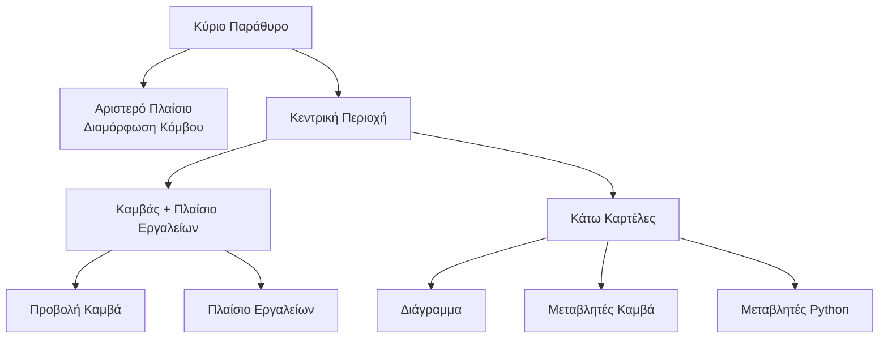

## Ανατομία της Κύριας Διεπαφής

Το FloWorks οργανώνει το κύριο παράθυρό του σε **τρεις λειτουργικές ζώνες** που βασίζονται σε μια σαφή φιλοσοφία:
> *Το κέντρο της οθόνης είναι για τη ροή εργασίας (το Καμβάς). Στα αριστερά, η διαμόρφωση του επιλεγμένου κόμβου. Στα δεξιά, βοηθητικά εργαλεία. Κάτω, οπτικοποίηση και δεδομένα.*

Αυτή η διάταξη δεν είναι αυθαίρετη: επιτρέπει **να κατασκευάζετε και να εκτελείτε ροές χωρίς να χάνετε λεπτομέρειες**, διατηρώντας πάντα προσβάσιμη τη διαμόρφωση του ενεργού κόμβου και τα εργαλεία ανάλυσης.

---

### 1. Αριστερό Πλαίσιο: Διαμόρφωση Κόμβου

Αυτό το πλαίσιο, τοποθετημένο στα αριστερά, είναι αφιερωμένο **αποκλειστικά στην εμφάνιση και επεξεργασία των παραμέτρων του κόμβου που έχετε επιλέξει** στον Καμβά.

**Τι βλέπετε εδώ:**

- Έναν **τίτλο** που υποδεικνύει τη λειτουργία του πλαισίου.
- Το **όνομα του επιλεγμένου κόμβου** σε ένα επισημασμένο πλαίσιο. Αν δεν έχει επιλεγεί κανένας κόμβος, εμφανίζεται ένα μήνυμα που το υποδεικνύει.
- Μια **κυλιόμενη περιοχή διαμόρφωσης** όπου εμφανίζονται οι επιλογές που είναι ειδικές για κάθε κόμβο (π.χ. τιμές κατωφλίου, ονόματα σημάτων, παράμετροι απόκτησης κ.λπ.).

**Φιλοσοφία σχεδιασμού:**

- Το πλαίσιο είναι **πάντα ορατό**; δεν είναι αναδυόμενο παράθυρο.
- Όταν δεν έχει επιλεγεί κόμβος, εμφανίζεται ένας κενός χώρος που σας προσκαλεί να επιλέξετε έναν.
- Κάνοντας κλικ σε οποιονδήποτε κόμβο στον Καμβά, αυτό το πλαίσιο ενημερώνεται **αυτόματα** για να εμφανίσει τις επιλογές του.

| | |
|:---:|:---:|
|  |  |
| *Αριστερό πλαίσιο χωρίς επιλογή* | *Αριστερό πλαίσιο με επιλεγμένο κόμβο* |

---

### 2. Κεντρική Περιοχή: Καμβάς και Πλαίσιο Εργαλείων

Η περιοχή στα δεξιά χωρίζεται κάθετα: πάνω βρίσκεται ο **Καμβάς** και κάτω οι **κάτω καρτέλες**.

#### Καμβάς (Προβολή Κόμβων)

Είναι η **οπτική καρδιά του FloWorks**. Εδώ:

- Τοποθετείτε και συνδέετε τους κόμβους που σχηματίζουν τη ροή εργασίας σας.
- Μετακινείστε στο πλέγμα (κάνοντας *pan* ή *zoom*) για να δείτε ολόκληρη τη ροή.
- Επιλέγετε κόμβους για να τους επεξεργαστείτε στο αριστερό πλαίσιο.

#### Πλαίσιο Εργαλείων (Drawer)

Στα δεξιά του Καμβά υπάρχει ένα **πλαϊνό αναδιπλούμενο πλίσιο** που περιέχει βοηθητικά εργαλεία. Μπορείτε να το ανοίξετε ή να το κλείσετε ανάλογα με τις ανάγκες σας, ελευθερώνοντας χώρο για τον Καμβά.

| Εικονίδιο | Εργαλείο | Χρήση |
|:-----:|:------------|:----------------|
| 📉 | Πλαίσια Ανάλυσης | Οπτικοποίηση και ανάλυση σημάτων (διαγράμματα, μετρικές). |
| 🧮 | Επιστημονικός Υπολογιστής | Γρήγοροι υπολογισμοί χωρίς να φύγετε από το περιβάλλον. |
| 📊 | Υπολογιστικό Φύλλο | Προβολή και χειρισμός αριθμητικών δεδομένων σε μορφή πίνακα. |
| 📈 | Παρακολούθηση Επιδόσεων | Προβολή γενικών μετρικών του Υπολογιστή (χρήση CPU, μνήμη κ.λπ.). |
| 🐍 | Κονσόλα Python | Άμεση πρόσβαση σε διερμηνέα Python για προχωρημένες εργασίες. |

| | | | | |
|:---:|:---:|:---:|:---:|:---:|
|  |  |  |  |  |
| *Ανάλυση* | *Υπολογιστής* | *Υπολογιστικό φύλλο* | *Παρακολούθηση* | *Κονσόλα Python* |

**Φιλοσοφία σχεδιασμού:**
Το πλαίσιο εργαλείων επιτρέπει **να διατηρείτε την εστίαση στον Καμβά** χωρίς να θυσιάζετε την πρόσβαση σε λειτουργίες που χρειάζεστε σε συγκεκριμένες στιγμές. Είναι μια φυσική επέκταση της ροής εργασίας, όχι μόνιμο περισπασμό.

[Οδηγός Κονσόλας Python](tutorial-console.md){ .md-button }
[Οδηγός Spreadsheet](tutorial-spreadsheet.md){ .md-button .md-button--primary }

---

### 3. Κάτω Καρτέλε: Διάγραμμα και Μεταβλητές

Κάτω από τον Καμβά βρίσκεται μια περιοχή με καρτέλες που εμφανίζει δύο συμπληρωματικές προβολές:

#### 📈 Διάγραμμα
- Αναπαριστά οπτικά τα δεδομένα που παράγονται ή αποκτώνται από τους κόμβους.
- Ενημερώνεται αυτόματα καθώς οι κόμβοι παράγουν νέες τιμές.
- Μοιράζεται την ίδια προβολή με τα Πλαίσια Ανάλυσης, εγγυώμενη οπτική συνέπεια.

#### 📋 Μεταβλητές Καμβά (Workspace)
- Εμφανίζει έναν πίνακα με τις **μεταβλητές, σήματα ή δεδομένα** που υπάρχουν στον Καμβά της ροής σας.
- Ενημερώνεται σε πραγματικό χρόνο μαζί με το διάγραμμα.
- Είναι η "ωμή" προβολή των δεδομένων: ιδανική για αποσφαλμάτωση και αριθμητική επαλήθευση.

#### 📋 Μεταβλητές Python (Τερματικό)
- Εμφανίζει έναν πίνακα με τις **μεταβλητές, σήματα ή δεδομένα** που δηλώνονται στο τερματικό python.
- Ενημερώνεται σε πραγματικό χρόνο.
- Εμφανίζει τις διαστάσεις και τις ιδιότητες κάθε αποθηκευμένης μεταβλητής.

| |
|:---:|
|  |
| *Καρτέλα Διάγραμμα* |
|  |
| *Καρτέλα Μεταβλητές Καμβά* |
|  |
| *Καρτέλα Μεταβλητές Python* |

---

### 4. Ιδιότητες Διάταξης

- **Πλαίσια με δυνατότητα αλλαγής μεγέθους**
  Τόσο ο διαχωρισμός αριστερά/δεξιά όσο και ο διαχωρισμός πάν/κάτω είναι ρυθμίσιμοι σύροντας τα όρια, για να προσαρμόσετε τη διεπαφή στη ροή εργασίας σας.

- **Αρχικές αναλογίες**
  - Αριστερό πλαίσιο: **25%** του συνολικού πλάτους.
  - Περιοχή δεξιά: τα υπόλοιπα **75%**.
  - Κατακόρυφα, ο Καμβάς καταλαμβάνει περίπου **480 px** και οι κάτω καρτέλες **320 px** (μπορείτε να τα αλλάξετε).

- **Περιθώρια και διαστήματα**
  Τα περιθώρια είναι ελάχιστα για να αξιοποιείται στο έπακρο ο χώρος εργασίας, χωρίς να θυσιάζεται η αναγνωσιμότητα.

---

### 5. Ανταπόκριση της Διεπαφής

Το FloWorks σχεδιάστηκε έτσι ώστε **κάθε ενέργεια στον Καμβά να έχει άμεσο αποτέλεσμα στα πλαίσια**:

- Όταν επιλέγετε έναν κόμβο, το αριστερό πλαίσιο εμφανίει τις επιλογές του.
- Όταν εκτελείτε μια ροή, το διάγραμμα και ο πίνακας δεδομένων ενημερώνονται αυτόματα.
- Όταν διαγράφετε έναν κόμβο, το πλαίσιο διαμόρφωσης καθαρίζεται αν ήταν ο επιλεγμένος κόμβος.
- Αν η ροή έχει μη αποθηκευμένες αλλαγές, η διεπαφή το υποδεικνύει οπτικά (π.χ. με αστερίσκο στον τίτλο ή έναν δείκτη).

Αυτή η **ανταποκρινόμενη εμπειρία** αποφεύγει την ανάγκη χειροκίνητης ανανέωσης της προβολής: βλέπετε πάντα την πιο πρόσφατη κατάσταση της εργασίας σας.

---

### 6. Αλλαγή Θέματος εν Λειτουργία

Το FloWorks επιτρέπει την αλλαγή του οπτικού θέματος (ανοιχτό/σκούρο) **χωρίς επανεκκίνηση της εφαρμογής**. Μπορείτε να εναλλάσσστε μεταξύ θεμάτων ενώ εργάζεστε και **η διεπαφή προσαρμόζεται αμέσως**, διατηρώντας άθικτη την κατάσταση της ροής σας.

**Πρακτικό όφελος:**
Εργαστείτε με το θέμα που σας είναι πιο άνετο ανάλογα με τις συνθήκες φωτισμού ή τις προσωπικές προτιμήσεις, χωρίς να διακόψετε τη συνεδρία.

---

### 7. Διεθνοποίηση (Πολυγλωσσία)

Όλα τα κείμενα της διεπαφής (μενού, τίτλοι, κουμπιά, μηνύματα) είναι προετοιμασμένα για **εμφάνιση σε πολλές γλώσσες**. Το FloWorks περιλαμβάνει ένα σύστημα μετάφρασης που επιτρέπει την εύκολη αλλαγή της γλώσσας της εφαρμογής, χωρίς ανάγκη επανεγκατάστασης ή επανεκκίνησης.

**Φιλοσοφία σχεδιασμού:**
Το εργαλείο έχει σχεδιαστεί για χρήστες από διαφορετικές περιοχές· η γλώσσα δεν πρέπει να αποτελεί εμπόδιο.

---

> **Οπτική περίληψη:** Η οθόνη είναι οργανωμένη έτσι ώστε να βλέπετε **όλα τα σχετικά με μια ματιά**: κόμβοι (κέντρο), διαμόρφωση κόμβου (αριστερά), βοηθητικά εργαλεία (δεξιά, αναδιπλούμενα) και αποτελέσματα/δεδομένα (κάτω). Όλα ανταποκρινόμενα, με άμεση αλλαγή θέματος και πολυγλωσσική υποστήριξη.
