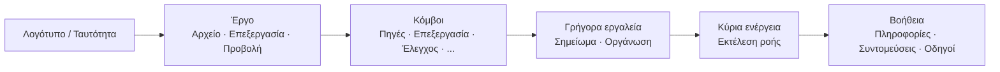

## Κύρια Γραμμή Εργαλείων: Οργάνωση και Φιλοσοφία

Η επάνω γραμμή εργαλείων είναι το **γρήγορο κέντρο εντολών** του FloWorks. Ο σεδιασμός της ακολουθεί μια λογική ροής εργασίας: από αριστερά προς τα δεξιά, θα βρείτε τις ενέργειες με τη σειρά που τις χρειάζεστε σε μια συνεδρία.

### Οργάνωση ανά ομάδες

Η γραμμή χωρίζεται σε **έξι λειτουργικές ομάδες**, διαχωρισμένες με λεπτές κάθετες ραμμές. Κάθε ομάδα συγκεντρώνει σχετικές ενέργειες, ώστε να μην χρειάζεται να τις αναζητάτε σε διάσπαρτα μενού.

---

### 1. Ταυτότητα (Λογότυπο)

Στο αριστερό άκρο θα δείτε το **λογότυπο του FloWorks**. Δεν είναι διακοσμητικό: το κλικ σε αυτό ανοίγει τον **διάλογο καλωσορίσματος**, που περιλαμβάνει γενικές πληροφορίες και τη φιλοσοφία χρήσης.

- **Tooltip:** "Πληροφορίες και καλωσόρισμα FloWorks".

**Φιλοσοφία:** Το λογότυπο λειτουργεί ως σημείο πρόσβασης στην ταυτότητα και την αρχική βοήθεια, χωρίς να καταλαμβάνει χώρο σε μενού.

---

### 2. Έργο: Αρχείο, Επεξεργασία και Προβολή

Συγκεντρώνει λειτουργίες που σχετίζονται με τη **διαχείριση έργου και την εμφάνιση της διεπαφής**.

#### 📁 Αρχείο
- **Νέο**: δημιουργεί έναν κενό ροή.
- **Άνοιγμα**: φορτώνει ένα υπάρχον έργο.
- **Αποθήκευση / Αποθήκευση ως**: αποθηκεύει την τρέχουσα ροή.
- **Έξοδος**: κλείνει την εφαρμογή.

#### ✂️ Επεξεργασία
- **Αναίρεση / Επανάληψη**: αναιρεί ή επαναφέρει αλλαγές στον Καμβά.
- **Αποκοπή / Αντιγραφή / Επικόλληση**: χειρίζεται επιλεγμένους κόμβους.
- **Προτιμήσεις**: ανοίγει το παράθυρο καθολικής διαμόρφωσης.

#### 👁️ Προβολή
Αυτό το μενού ελέγχει πώς φαίνεται και προαρμόζεται η διεπαφή στις προτιμήσεις σας:

- **Γλώσσα**: αλλάζει τη γλώσσα ολόκληρης της εφαρμογής (μενού, κουμπιά, μηνύματα).
- **Θέμα**: εναλλάσσει μεταξύ οπτικών θεμάτων (ανοιχτό, σκοτεινό κ.λπ.) σε πραγματικό χρόνο.
- **Μέγεθος γραμματοσειράς**: ρυθμίζει το μέγεθος κειμένου σε όλη τη διεπαφή, με προκαθορισμένες και προσαρμοσμένες επιλογές.
- **Προβολέας αρχείων καταγραφής**: εμφανίζει τα εσωτερικά αρχεία καταγραφής της εφαρμογής (χρήσιμο για προχωρημένο αποσφαλμάτωση).

**Φιλοσοφία:** Ό,τι σχετίζεται με "το έργο μου και το περιβάλλον εργασίας μου" είναι μαζί, αλλά χωριστά από ενέργειες που προσθέτουν ή εκτελούν κόμβους.

---

### 3. Κόμβοι (ανά κατηγορία)

Αυτή η ομάδα είναι **αυτο-γενόμενη από τον κατάλογο κόμβων** διαθέσιμο στο FloWorks. Δεν είναι χειροκίνητα κωδικοποιημένη: αν προστεθεί ένας νέος κόμβος στο πρόγραμμα, η κατηγορία του εμφανίζεται αυτόματα εδώ.

Οι τυπικές κατηγορίες περιλαμβάνουν:

- **Πηγές** (γεννήτριες σημάτων, εισόδους δεδομένων).
- **Επεξεργασία** (φίλτρα, μαθηματικοί μετασχηματισμοί).
- **Έλεγχος** (λογική ροής, συνθήκες).
- **Εξόδους** (καταβόθρες, οπτικοποιητές, εξαγωγείς).
- Και οποιαδήποτε άλλη κατηγορία ορισμένη από την κοινότητα ή τα δικά σας προσαρμοσμένα nodes.

**Έξυπνη συμπεριφορά:**

- Αν μια κατηγορία περιέχει **έναν μόνο κόμβο**, η γραμμή εμφανίζει απεθείας ένα κουμπί με το όνομά του· το κλικ προσθέτει αυτόν τον κόμβο στον Καμβά.
- Αν περιέχει **πολλούς κόμβους**, εμφανίζεται ένα αναδυόμενο μενού με όλους. Η επιλογή ενός τον τοποθετεί στον Καμβά.

**Φιλοσοφία:** Η πρόσβαση στους κόμβους είναι πάντα ορατή, χωρίς ανάγκη ανοίγματος πλαϊνού πάνελ. Η γραμμή προσαρμόζεται στον κατάλογο, διατηρώντας συνοχή και αποφεύγοντας χειροκίνητες διαμορφώσεις.

---

### 4. Γρήγορα εργαλεία

Δύο κουμπιά για άμεση παραγωγικότητα:

- **📝 Αυτοκόλλητο σημείωμα**: προσθέτει ένα οπτικό σημείωμα στον Καμβά για τεκμηρίωση τμημάτων της ροής.
- **🔧 Αυτόματη οργάνωση**: αναδιοργανώνει όλους τους κόμβους στον Καβά με τακτοποιημένο και ευανάγνωστο τρόπο με ένα μόνο κλικ.

**Φιλοσοφία:** Είναι ενέργειες που χρησιμοποιούνται συχνά και δεν αξίζει να είναι κρυμμένες σε μενού. Ένα κλικ και έτοιμο.

---

### 5. Κύρια ενέργεια: Εκτέλεση ροής

Το κουμπί **Εκτέλεση** είναι οπτικά τονισμένο με έγχρωμο περίγραμμα (συνήθως πράσινο) και ένα εικονίδιο "play". Είναι το πιο εντυπωσιακό κουμπί της γραμμής, γιατί αντιπροσωπεύει την κεντρική ενέργεια του FloWorks: **την έναρξη της ροής δεδομένων**.

- Με το κλικ, **εκτελείται η τρέχουσα ροή** και ενημερώνονται το γράφημα και ο πίνακας δεδομένων κάτω.
- Το κουμπί αλλάζει ελαφρώς εμφάνιση όταν πιέζεται, δίνοντας απτική ανάδραση.

**Φιλοσοφία:** Η πιο σημαντική ενέργεια πρέπει να είναι η πιο ορατή. Δεν χρειάζεται πλοήγηση σε μενού για εκτέλεση· είναι πάντα ένα κλικ μακριά.

---

### 6. Βοήθεια

Στο τέλος της γραμμής, θα βρείτε το μενού **Βοήθεια**, με άμεσες συνδέσεις σε:

- **Πληροφορίες**: λεπτομέρειες για την έκδοση και το έργο.
- **Συντομεύσεις πληκτρολογίου**: πλήρης λίστα συνδυασμών για προχωρημένους χρήστες.
- **Οδηγοί**: βήμα προς βήμα οδηγοί για να μάθετε το FloWorks.

**Φιλοσοφία:** Η βοήθεια είναι πάντα διαθέσιμη, αλλά χωριστά αό τη ροή εργασίας για να μην ενοχλεί.

---

### Προσαρμοστικά χαρακτηριστικά

- **Άμεση μετάφραση**: όταν αλλάζετε γλώσσα από το μενού Προβολή, **όλα τα κείμενα της γραμμής ενημερώνονται αμέσως**, χωρίς επανεκκίνηση.
- **Θέματα και μέγεθος γραμματοσειράς**: η γραμμή ξανασχεδιάζεται αμέσως με το νέο οπτικό στυλ.
- **Δυναμικός κατάλογος**: αν προστεθούν νέοι κόμβοι στο πρόγραμμα, οι κατηγορίες τους εμφανίζονται αυτόματα στη γραμμή, χωρίς χειροκίνητη παρέμβαση.

**Περίληψη:** Η γραμμή εργαλείων σχεδιάζεται για να είναι **διαισθητική, γρήγορη και προσαρμόσιμη**. Ακολουθεί τη φυσική ροή ργασίας: διαμόρφωση έργου → επεξεργασία → προσθήκη κόμβων → εκτέλεση → συμβουλευτείτε βοήθεια. Όλα τα υπόλοιπα μένουν εκτός δρόμου, αλλά προσβάσιμα όταν τα χρειάζεστε.
