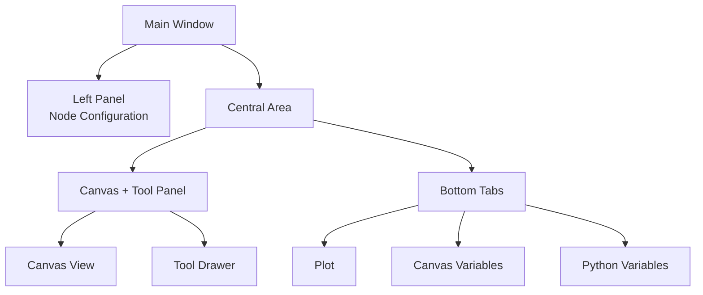

## Anatomy of the Main Interface

FloWorks organizes its main window into **three functional zones** that follow a clear philosophy:
> *The center of the screen is for the workflow (the Canvas). On the left, the configuration of the selected node. On the right, auxiliary tools. At the bottom, visualization and data.*

This layout is not arbitrary: it allows you to **build and run flows without losing sight of the details**, always keeping the active node configuration and analysis tools within reach.

---

### 1. Left Panel: Node Configuration

This panel, located on the left, is dedicated **exclusively to displaying and editing the parameters of the node you have selected** on the Canvas.

**What you see here:**

- A **title** indicating the panel's function.
- The **name of the selected node** in a highlighted box. If no node is selected, a message indicating so appears.
- A **scrollable configuration area** where the specific options for each node are shown (for example, threshold values, signal names, acquisition parameters, etc.).

**Design philosophy:**

- The panel is **always visible**; it is not a pop-up window.
- When no node is selected, an empty space is shown that invites you to select one.
- When you click on any node in the Canvas, this panel updates **automatically** to show its options.

| | |
|:---:|:---:|
|  |  |
| *Left panel without selection* | *Left panel with a node selected* |

---

### 2. Central Area: Canvas and Tool Panel

The right area is divided vertically: the **Canvas** is at the top and the **bottom tabs** are below.

#### Canvas (Node View)

This is the **visual heart of FloWorks**. Here is where you:

- Place and connect the nodes that form your workflow.
- Navigate the grid (by *panning* or *zooming*) to see the entire flow.
- Select nodes to edit them in the left panel.

#### Tool Drawer

To the right of the Canvas there is a **collapsible side panel** that contains auxiliary tools. You can open or close it as needed, freeing up space for the Canvas.

| Icon | Tool | What it is for |
|:-----:|:------------|:----------------|
| 📉 | Analysis Panels | Visualization and analysis of signals (plots, metrics). |
| 🧮 | Scientific Calculator | Quick calculations without leaving the environment. |
| 📊 | Spreadsheet | View and manipulate numerical data in tabular format. |
| 📈 | Performance Monitor | View general Computer metrics (CPU usage, memory, etc.). |
| 🐍 | Python Console | Direct access to a Python interpreter for advanced tasks. |

| | | | | |
|:---:|:---:|:---:|:---:|:---:|
|  |  |  |  |  |
| *Analysis* | *Calculator* | *Spreadsheet* | *Monitor* | *Python Console* |

**Design philosophy:**
The tool panel allows you to **keep the focus on the Canvas** without sacrificing access to functions you need at specific moments. It is a natural extension of the workflow, not a permanent distraction.

[Tutorial Python Console](tutorial-console.md){ .md-button }
[Tutorial Spreadsheet](tutorial-spreadsheet.md){ .md-button .md-button--primary }

---

### 3. Bottom Tabs: Plot and Variables

Below the Canvas there is a tabbed area that shows two complementary views:

#### 📈 Plot
- Visually represents the data generated or acquired by the nodes.
- Updates automatically as the nodes produce new values.
- Shares the same view as the Analysis Panels, ensuring visual consistency.

#### 📋 Canvas Variables (Workspace)
- Displays a table with the **variables, signals or data** on the Canvas present in your flow.
- Updates in real time along with the plot.
- It is the "raw" view of the data: ideal for debugging and numerical verification.

#### 📋 Python Variables (Terminal)
- Displays a table with the **variables, signals or data** declared in the Python terminal.
- Updates in real time.
- Shows the dimensions and properties of each stored variable.

| |
|:---:|
|  |
| *Plot Tab* |
|  |
| *Canvas Variables Tab* |
|  |
| *Python Variables Tab* |

---

### 4. Layout Properties

- **Resizable panels**
  Both the left/right and top/bottom splits are adjustable by dragging the edges, to adapt the interface to your workflow.

- **Initial proportions**
  - Left panel: **25%** of the total width.
  - Right area: remaining **75%**.
  - Vertically, the Canvas occupies approximately **480 px** and the bottom tabs **320 px** (you can change this).

- **Margins and spacing**
  Margins are minimal to maximize workspace, without sacrificing readability.

---

### 5. Interface Reactivity

FloWorks is designed so that **everything you do on the Canvas has an immediate effect on the panels**:

- When you select a node, the left panel shows its options.
- When you run a flow, the plot and data table update automatically.
- When you delete a node, the configuration panel clears if it was the selected node.
- If the flow has unsaved changes, the interface indicates this visually (for example, with an asterisk in the title or an indicator).

This **reactive experience** avoids having to manually refresh the view: you always see the most recent state of your work.

---

### 6. Hot Theme Switching

FloWorks allows you to change the visual theme (light/dark) **without restarting the application**. You can switch between themes while you work and **the interface adapts instantly**, keeping the state of your flow intact.

**Practical benefit:**
Work with the theme that is most comfortable for you depending on lighting conditions or personal preference, without interrupting your session.

---

### 7. Internationalization (Multi-language)

All interface texts (menus, titles, buttons, messages) are prepared to **be displayed in multiple languages**. FloWorks includes a translation system that allows you to change the application language easily, without needing to reinstall or restart.

**Design philosophy:**
The tool is designed for users from different regions; language should not be a barrier.

---

> **Visual summary:** The screen is organized so that you see **everything relevant at a glance**: nodes (center), node configuration (left), auxiliary tools (right, collapsible) and results/data (bottom). Everything is reactive, with instant theme switching and multi-language support.
