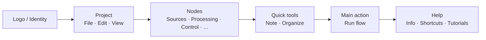

## Main Toolbar: Organization and Philosophy

The top toolbar is the **quick command center** of FloWorks. Its design follows a workflow logic: from left to right, you will find actions in the typical order you need them during a session.

### Organization by groups

The bar is divided into **six functional groups**, separated by subtle vertical lines. Each group clusters related actions so you do not have to search through scattered menus.

---

### 1. Identity (Logo)

At the far left you will see the **FloWorks logo**. It is not just decorative: clicking it opens the **welcome dialog**, which includes general information and usage philosophy.

- **Tooltip:** "FloWorks information and welcome".

**Philosophy:** The logo acts as an access point to identity and initial help, without taking up space in menus.

---

### 2. Project: File, Edit and View

Groups operations related to **project management and interface appearance**.

#### 📁 File
- **New**: creates a blank flow.
- **Open**: loads an existing project.
- **Save / Save as**: saves the current flow.
- **Exit**: closes the application.

#### ✂️ Edit
- **Undo / Redo**: reverts or restores changes on the Canvas.
- **Cut / Copy / Paste**: manipulates selected nodes.
- **Preferences**: opens the global configuration window.

#### 👁️ View
This menu controls how the interface looks and adapts to your preferences:

- **Language**: changes the language of the entire application (menus, buttons, messages).
- **Theme**: toggles between visual themes (light, dark, etc.) on the fly.
- **Font size**: adjusts text size throughout the interface, with preset and custom options.
- **Log viewer**: shows the application's internal logs (useful for advanced debugging).

**Philosophy:** Everything related to "my project and my work environment" is together, but separated from actions that add or run nodes.

---

### 3. Nodes (by categories)

This group is **auto-generated from the node catalog** available in FloWorks. It is not hard-coded: if a new node is added to the program, its category appears here automatically.

Typical categories include:

- **Sources** (signal generators, data inputs).
- **Processing** (filters, mathematical transformations).
- **Control** (flow logic, conditionals).
- **Outputs** (sinks, viewers, exporters).
- And any other category defined by the community or by your own custom nodes.

**Smart behavior:**

- If a category contains **a single node**, the bar shows a button with its name directly; clicking it adds that node to the Canvas.
- If it contains **several nodes**, a dropdown menu is shown with all of them. Choosing one places it on the Canvas.

**Philosophy:** Node access is always visible, with no need to open a side panel. The bar adapts to the catalog, maintaining consistency and avoiding manual configurations.

---

### 4. Quick tools

Two direct productivity buttons:

- **📝 Sticky note**: adds a visual note to the Canvas to document parts of the flow.
- **🔧 Auto-organize**: rearranges all Canvas nodes in an orderly, readable layout with a single click.

**Philosophy:** These are frequently used actions that do not deserve to be hidden in menus. One click and done.

---

### 5. Main action: Run flow

The **Run** button is visually highlighted with a colored border (usually green) and a "play" icon. It is the most eye-catching button on the bar, because it represents the central action of FloWorks: **starting the data flow**.

- When clicked, the **current flow is executed** and the bottom plot and data table are updated.
- The button changes appearance slightly when pressed, giving tactile feedback.

**Philosophy:** The most important action must be the most visible. There is no need to navigate menus to run; it is always one click away.

---

### 6. Help

At the end of the bar, you will find the **Help** menu, with direct access to:

- **Information**: details about the version and project.
- **Keyboard shortcuts**: a complete list of combinations for advanced users.
- **Tutorials**: step-by-step guides to learn FloWorks.

**Philosophy:** Help is always available, but set apart from the workflow so it does not get in the way.

---

### Adaptive features

- **Instant translation**: when changing the language from the View menu, **all texts on the bar update immediately**, without restarting.
- **Themes and font size**: the bar is redrawn with the new visual style instantly.
- **Dynamic catalog**: if new nodes are added to the program, their categories appear automatically on the bar, with no manual intervention.

**Summary:** The toolbar is designed to be **intuitive, fast and adaptable**. It follows the natural workflow: configure project → edit → add nodes → run → consult help. Everything else stays out of the way, but accessible when you need it.
