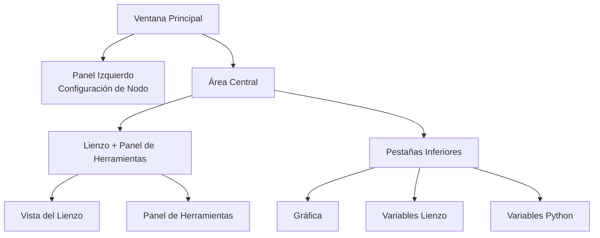

## Anatomía de la Interfaz Principal

FloWorks organiza su ventana principal en **tres zonas funcionales** que responden a una filosofía clara:  
> *El centro de la pantalla es para el flujo de trabajo (el Lienzo). A la izquierda, la configuración del nodo seleccionado. A la derecha, herramientas auxiliares. Abajo, visualización y datos.*

Esta disposición no es arbitraria: permite **construir y ejecutar flujos sin perder de vista el detalle**, manteniendo siempre accesible la configuración del nodo activo y las herramientas de análisis.

---

### 1. Panel Izquierdo: Configuración del Nodo

Este panel, situado a la izquierda, está dedicado **exclusivamente a mostrar y editar los parámetros del nodo que tienes seleccionado** en el Lienzo.

**Qué ves aquí:**

- Un **título** que indica la función del panel.
- El **nombre del nodo seleccionado** en un recuadro destacado. Si no hay ningún nodo seleccionado, aparece un mensaje indicándolo.
- Un **área de configuración desplazable** donde aparecen las opciones específicas de cada nodo (por ejemplo, valores de umbral, nombres de señales, parámetros de adquisición, etc.).

**Filosofía de diseño:**

- El panel está **siempre visible**; no es una ventana emergente.  
- Cuando no hay nodo seleccionado, se muestra un espacio vacío que invita a seleccionar uno.  
- Al hacer clic en cualquier nodo del Lienzo, este panel se actualiza **automáticamente** para mostrar sus opciones.

| | |
|:---:|:---:|
|  |  |
| *Panel izquierdo sin selección* | *Panel izquierdo con un nodo seleccionado* |

---

### 2. Área Central: Lienzo y Panel de Herramientas

El área derecha se divide verticalmente: arriba está el **Lienzo** y abajo las **pestañas inferiores**.

#### Lienzo (Vista de Nodos)

Es el **corazón visual de FloWorks**. Aquí es donde:

- Colocas y conectas los nodos que forman tu flujo de trabajo.
- Te desplazas por la parrilla (haciendo *pan* o *zoom*) para ver todo el flujo.
- Seleccionas nodos para editarlos en el panel izquierdo.

#### Panel de Herramientas (Drawer)

A la derecha del Lienzo hay un **panel lateral desplegable** que contiene herramientas auxiliares. Puedes abrirlo o cerrarlo según lo necesites, liberando espacio para el Lienzo.

| Icono | Herramienta | Para qué sirve |
|:-----:|:------------|:----------------|
| 📉 | Paneles de Análisis | Visualización y análisis de señales (gráficas, métricas). |
| 🧮 | Calculadora Científica | Cálculos rápidos sin salir del entorno. |
| 📊 | Hoja de Cálculo | Ver y manipular datos numéricos en formato tabular. |
| 📈 | Monitor de Rendimiento | Ver métricas generales del Computador (uso de CPU, memoria, etc.). |
| 🐍 | Consola Python | Acceso directo a un intérprete Python para tareas avanzadas. |

| | | | | |
|:---:|:---:|:---:|:---:|:---:|
|  |  |  |  |  |
| *Análisis* | *Calculadora* | *Hoja de Cálculo* | *Monitor* | *Consola Python* |

**Filosofía de diseño:**  
El panel de herramientas permite **mantener el foco en el Lienzo** sin sacrificar el acceso a funciones que necesitas en momentos puntuales. Es una extensión natural del flujo de trabajo, no una distracción permanente.

[Tutorial Consola Python](tutorial-console.md){ .md-button }
[Tutorial Spreadsheet](tutorial-spreadsheet.md){ .md-button .md-button--primary }

---

### 3. Pestañas Inferiores: Gráfica y Variables

Debajo del Lienzo se encuentra un área con pestañas que muestra dos vistas complementarias:

#### 📈 Gráfica
- Representa visualmente los datos generados o adquiridos por los nodos.
- Se actualiza automáticamente a medida que los nodos producen nuevos valores.
- Comparte la misma vista que los Paneles de Análisis, garantizando coherencia visual.

#### 📋 Variables Lienzo (Workspace)
- Muestra una tabla con las **variables, señales o datos** en el Lienzo presentes en tu flujo.
- Se actualiza en tiempo real junto con la gráfica.
- Es la vista "cruda" de los datos: ideal para depuración y verificación numérica.

#### 📋 Variables Python (Terminal)
- Muestra una tabla con las **variables, señales o datos** declarados en la terminal python.
- Se actualiza en tiempo real.
- muestra las dimensiones y propiedades de cada variable almacenada.

| |
|:---:|
|  |
| *Pestaña Gráfica* |
|  |
| *Pestaña Variables Lienzo* |
|  |
| *Pestaña Variables Python* |

---

### 4. Propiedades del Layout

- **Paneles redimensionables**  
  Tanto la separación izquierda/derecha como la superior/inferior son ajustables arrastrando los bordes, para adaptar la interfaz a tu flujo de trabajo.

- **Proporciones iniciales**  
  - Panel izquierdo: **25%** del ancho total.  
  - Área derecha: **75%** restante.  
  - Verticalmente, el Lienzo ocupa aproximadamente **480 px** y las pestañas inferiores **320 px** (puedes cambiarlo).

- **Márgenes y espaciados**  
  Los márgenes son mínimos para aprovechar al máximo el espacio de trabajo, sin sacrificar legibilidad.

---

### 5. Reactividad de la Interfaz

FloWorks está diseñado para que **todo lo que haces en el Lienzo tenga un efecto inmediato en los paneles**:

- Al seleccionar un nodo, el panel izquierdo muestra sus opciones.
- Al ejecutar un flujo, la gráfica y la tabla de datos se actualizan automáticamente.
- Al eliminar un nodo, el panel de configuración se limpia si era el nodo seleccionado.
- Si el flujo tiene cambios sin guardar, la interfaz lo indica visualmente (por ejemplo, con un asterisco en el título o un indicador).

Esta **experiencia reactiva** evita tener que refrescar manualmente la vista: siempre ves el estado más reciente de tu trabajo.

---

### 6. Cambio de Tema en Caliente

FloWorks permite cambiar el tema visual (claro/oscuro) **sin reiniciar la aplicación**. Puedes alternar entre temas mientras trabajas y **la interfaz se adapta al instante**, manteniendo el estado de tu flujo intacto.

**Beneficio práctico:**  
Trabaja con el tema que te resulte más cómodo según las condiciones de iluminación o preferencia personal, sin interrumpir tu sesión.

---

### 7. Internacionalización (Multi-idioma)

Todos los textos de la interfaz (menús, títulos, botones, mensajes) están preparados para **ser mostrados en varios idiomas**. FloWorks incluye un sistema de traducción que permite cambiar el idioma de la aplicación fácilmente, sin necesidad de reinstalar o reiniciar.

**Filosofía de diseño:**  
La herramienta está pensada para usuarios de diferentes regiones; el idioma no debe ser una barrera.

---

> **Resumen visual:** La pantalla está organizada para que veas **todo lo relevante de un vistazo**: nodos (centro), configuración del nodo (izquierda), herramientas auxiliares (derecha, desplegables) y resultados/datos (abajo). Todo reactivo, con cambio de tema instantáneo y multi-idioma.