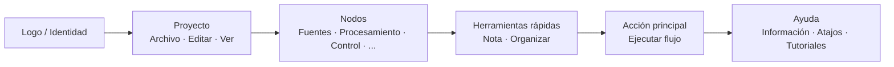

## Barra de Herramientas Principal: Organización y Filosofía

La barra de herramientas superior es el **centro de mando rápido** de FloWorks. Su diseño sigue una lógica de flujo de trabajo: de izquierda a derecha, encontrarás las acciones en el orden típico en que las necesitas durante una sesión.

### Organización por grupos

La barra está dividida en **seis grupos funcionales**, separados por líneas verticales sutiles. Cada grupo agrupa acciones relacionadas para que no tengas que buscar en menús dispersos.

---

### 1. Identidad (Logo)

Al extremo izquierdo verás el **logo de FloWorks**. No es decorativo: al hacer clic sobre él se abre el **diálogo de bienvenida**, que incluye información general, y filosofía de uso.

- **Tooltip:** "Información y bienvenida de FloWorks".

**Filosofía:** El logo actúa como un punto de acceso a la identidad y la ayuda inicial, sin ocupar espacio en menús.

---

### 2. Proyecto: Archivo, Editar y Ver

Agrupa las operaciones relacionadas con la **gestión del proyecto y la apariencia de la interfaz**.

#### 📁 Archivo
- **Nuevo**: crea un flujo en blanco.
- **Abrir**: carga un proyecto existente.
- **Guardar / Guardar como**: guarda el flujo actual.
- **Salir**: cierra la aplicación.

#### ✂️ Editar
- **Deshacer / Rehacer**: revierte o restaura cambios en el Lienzo.
- **Cortar / Copiar / Pegar**: manipula nodos seleccionados.
- **Preferencias**: abre la ventana de configuración global.

#### 👁️ Ver
Este menú controla cómo se ve y se adapta la interfaz a tus preferencias:

- **Idioma**: cambia el idioma de toda la aplicación (menús, botones, mensajes).
- **Tema**: alterna entre temas visuales (claro, oscuro, etc.) en caliente.
- **Tamaño de fuente**: ajusta el tamaño del texto en toda la interfaz, con opciones predefinidas y personalizado.
- **Visor de registros**: muestra los logs internos de la aplicación (útil para depuración avanzada).

**Filosofía:** Todo lo relacionado con "mi proyecto y mi entorno de trabajo" está junto, pero separado de las acciones que añaden o ejecutan nodos.

---

### 3. Nodos (por categorías)

Este grupo es **auto-generado a partir del catálogo de nodos** disponible en FloWorks. No está codificado manualmente: si se añade un nuevo nodo al programa, su categoría aparece automáticamente aquí.

Las categorías típicas incluyen:

- **Fuentes** (generadores de señales, entradas de datos).
- **Procesamiento** (filtros, transformaciones matemáticas).
- **Control** (lógica de flujo, condicionales).
- **Salidas** (sinks, visualizadores, exportadores).
- Y cualquier otra categoría definida por la comunidad o por tus propios nodos personalizados.

**Comportamiento inteligente:**

- Si una categoría contiene **un solo nodo**, la barra muestra directamente un botón con su nombre; al hacer clic, se añade ese nodo al Lienzo.
- Si contiene **varios nodos**, se muestra un menú desplegable con todos ellos. Al elegir uno, se coloca en el Lienzo.

**Filosofía:** El acceso a los nodos está siempre visible, sin necesidad de abrir un panel lateral. La barra se adapta al catálogo, manteniendo la coherencia y evitando configuraciones manuales.

---

### 4. Herramientas rápidas

Dos botones de productividad directa:

- **📝 Nota adhesiva**: añade una nota visual al Lienzo para documentar partes del flujo.
- **🔧 Organizar automáticamente**: reorganiza todos los nodos del Lienzo de forma ordenada y legible con un solo clic.

**Filosofía:** Son acciones que se usan con frecuencia y que no merecen estar escondidas en menús. Un clic y listo.

---

### 5. Acción principal: Ejecutar flujo

El botón **Ejecutar** está destacado visualmente con un borde de color (normalmente verde) y un icono de "play". Es el botón más llamativo de la barra, porque representa la acción central de FloWorks: **poner en marcha el flujo de datos**.

- Al hacer clic, se **ejecuta el flujo actual** y se actualizan la gráfica y la tabla de datos inferiores.
- El botón cambia ligeramente de apariencia al presionarlo, dando retroalimentación táctil.

**Filosofía:** La acción más importante debe ser la más visible. No hay que navegar por menús para ejecutar; siempre está a un clic.

---

### 6. Ayuda

Al final de la barra, encontrarás el menú de **Ayuda**, con accesos directos a:

- **Información**: detalles sobre la versión y el proyecto.
- **Atajos de teclado**: una lista completa de combinaciones para usuarios avanzados.
- **Tutoriales**: guías paso a paso para aprender FloWorks.

**Filosofía:** La ayuda está siempre disponible, pero apartada del flujo de trabajo para no estorbar.

---

### Características adaptativas

- **Traducción instantánea**: al cambiar el idioma desde el menú Ver, **todos los textos de la barra se actualizan al momento**, sin reiniciar.
- **Temas y tamaño de fuente**: la barra se redibuja con el nuevo estilo visual de inmediato.
- **Catálogo dinámico**: si se añaden nuevos nodos al programa, sus categorías aparecen automáticamente en la barra, sin intervención manual.

**Resumen:** La barra de herramientas está diseñada para ser **intuitiva, rápida y adaptable**. Sigue el flujo natural de trabajo: configurar proyecto → editar → añadir nodos → ejecutar → consultar ayuda. Todo lo demás queda fuera del camino, pero accesible cuando lo necesitas.