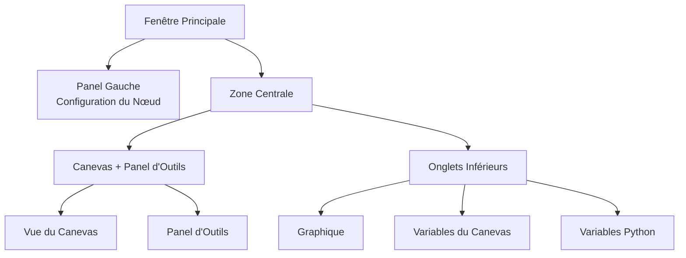

## Anatomie de l'Interface Principale

FloWorks organise sa fenêtre principale en **trois zones fonctionnelles** qui répondent à une philosophie claire :
> *Le centre de l'écran est destiné au flux de travail (le Canevas). À gauche, la configuration du nœud sélectionné. À droite, les outils auxiliaires. En bas, la visualisation et les données.*

Cette disposition n'est pas arbitraire : elle permet de **construire et d'exécuter des flux sans perdre de vue le détail**, en gardant toujours accessibles la configuration du nœud actif et les outils d'analyse.

---

### 1. Panel Gauche : Configuration du Nœud

Ce panel, situé à gauche, est dédié **exclusivement à afficher et éditer les paramètres du nœud que vous avez sélectionné** sur le Canevas.

**Ce que vous voyez ici :**

- Un **titre** indiquant la fonction du panel.
- Le **nom du nœud sélectionné** dans un encadré mis en évidence. Si aucun nœud n'est sélectionné, un message l'indiquant apparaît.
- Une **zone de configuration défilante** où apparaissent les options spécifiques de chaque nœud (par exemple, valeurs de seuil, noms de signaux, paramètres d'acquisition, etc.).

**Philosophie de conception :**

- Le panel est **toujours visible** ; ce n'est pas une fenêtre surgissante.
- Lorsqu'aucun nœud n'est sélectionné, un espace vide s'affiche et invite à en sélectionner un.
- En cliquant sur n'importe quel nœud du Canevas, ce panel se met à jour **automatiquement** pour afficher ses options.

| | |
|:---:|:---:|
|  |  |
| *Panel gauche sans sélection* | *Panel gauche avec un nœud sélectionné* |

---

### 2. Zone Centrale : Canevas et Panel d'Outils

La zone de droite est divisée verticalement : le **Canevas** est en haut et les **onglets inférieurs** sont en bas.

#### Canevas (Vue des Nœuds)

C'est le **cœur visuel de FloWorks**. C'est ici que vous :

- Placez et connectez les nœuds qui forment votre flux de travail.
- Vous déplacez sur la grille (par *panning* ou *zoom*) pour voir l'ensemble du flux.
- Sélectionnez des nœuds pour les éditer dans le panel gauche.

#### Panel d'Outils (Drawer)

À droite du Canevas se trouve un **panel latéral rétractable** qui contient des outils auxiliaires. Vous pouvez l'ouvrir ou le fermer selon vos besoins, libérant ainsi de l'espace pour le Canevas.

| Icône | Outil | À quoi ça sert |
|:-----:|:------------|:----------------|
| 📉 | Panneaux d'Analyse | Visualisation et analyse de signaux (graphiques, métriques). |
| 🧮 | Calculatrice Scientifique | Calculs rapides sans quitter l'environnement. |
| 📊 | Feuille de Calcul | Voir et manipuler des données numériques en format tabulaire. |
| 📈 | Moniteur de Performance | Voir les métriques générales de l'Ordinateur (utilisation CPU, mémoire, etc.). |
| 🐍 | Console Python | Accès direct à un interpréteur Python pour des tâches avancées. |

| | | | | |
|:---:|:---:|:---:|:---:|:---:|
|  |  |  |  |  |
| *Analyse* | *Calculatrice* | *Feuille de Calcul* | *Moniteur* | *Console Python* |

**Philosophie de conception :**
Le panel d'outils permet de **garder le focus sur le Canevas** sans sacrifier l'accès aux fonctions dont vous avez besoin à des moments précis. C'est une extension naturelle du flux de travail, pas une distraction permanente.

[Tutorial Console Python](tutorial-console.md){ .md-button }
[Tutorial Spreadsheet](tutorial-spreadsheet.md){ .md-button .md-button--primary }

---

### 3. Onglets Inférieurs : Graphique et Variables

Sous le Canevas se trouve une zone à onglets qui affiche deux vues complémentaires :

#### 📈 Graphique
- Représente visuellement les données générées ou acquises par les nœuds.
- Se met à jour automatiquement à mesure que les nœuds produisent de nouvelles valeurs.
- Partage la même vue que les Panneaux d'Analyse, garantissant une cohérence visuelle.

#### 📋 Variables du Canevas (Workspace)
- Affiche un tableau avec les **variables, signaux ou données** sur le Canevas présents dans votre flux.
- Se met à jour en temps réel avec le graphique.
- C'est la vue "brute" des données : idéale pour le débogage et la vérification numérique.

#### 📋 Variables Python (Terminal)
- Affiche un tableau avec les **variables, signaux ou données** déclarées dans le terminal Python.
- Se met à jour en temps réel.
- Affiche les dimensions et propriétés de chaque variable stockée.

| |
|:---:|
|  |
| *Onglet Graphique* |
|  |
| *Onglet Variables du Canevas* |
|  |
| *Onglet Variables Python* |

---

### 4. Propriétés du Layout

- **Panneaux redimensionnables**
  Les séparations gauche/droite et haut/bas sont ajustables en faisant glisser les bords, pour adapter l'interface à votre flux de travail.

- **Proportions initiales**
  - Panel gauche : **25%** de la largeur totale.
  - Zone droite : **75%** restants.
  - Verticalement, le Canevas occupe environ **480 px** et les onglets inférieurs **320 px** (vous pouvez changer cela).

- **Marges et espacements**
  Les marges sont minimales pour maximiser l'espace de travail, sans sacrifier la lisibilité.

---

### 5. Réactivité de l'Interface

FloWorks est conçu pour que **tout ce que vous faites sur le Canevas ait un effet immédiat sur les panels** :

- Lorsque vous sélectionnez un nœud, le panel gauche affiche ses options.
- Lorsque vous exécutez un flux, le graphique et le tableau de données se mettent à jour automatiquement.
- Lorsque vous supprimez un nœud, le panel de configuration se vide si c'était le nœud sélectionné.
- Si le flux a des modifications non enregistrées, l'interface l'indique visuellement (par exemple, avec un astérisque dans le titre ou un indicateur).

Cette **expérience réactive** évite d'avoir à rafraîchir manuellement la vue : vous voyez toujours l'état le plus récent de votre travail.

---

### 6. Changement de Thème à Chaud

FloWorks permet de changer le thème visuel (clair/sombre) **sans redémarrer l'application**. Vous pouvez alterner entre les thèmes pendant que vous travaillez et **l'interface s'adapte instantanément**, en gardant l'état de votre flux intact.

**Bénéfice pratique :**
Travaillez avec le thème qui vous convient le mieux selon les conditions d'éclairage ou vos préférences personnelles, sans interrompre votre session.

---

### 7. Internationalisation (Multi-langue)

Tous les textes de l'interface (menus, titres, boutons, messages) sont préparés pour **être affichés en plusieurs langues**. FloWorks inclut un système de traduction qui permet de changer la langue de l'application facilement, sans nécessiter de réinstallation ou de redémarrage.

**Philosophie de conception :**
L'outil est pensé pour des utilisateurs de différentes régions ; la langue ne doit pas être une barrière.

---

> **Résumé visuel :** L'écran est organisé pour que vous voyiez **tout ce qui est pertinent d'un seul coup d'œil** : nœuds (centre), configuration du nœud (gauche), outils auxiliaires (droite, rétractables) et résultats/données (bas). Tout est réactif, avec changement de thème instantané et support multi-langue.
