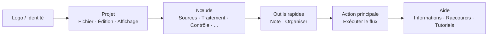

## Barre d'Outils Principale : Organisation et Philosophie

La barre d'outils supérieure est le **centre de commande rapide** de FloWorks. Son design suit une logique de flux de travail : de gauche à droite, vous trouverez les actions dans l'ordre typique dont vous avez besoin pendant une session.

### Organisation par groupes

La barre est divisée en **six groupes fonctionnels**, séparés par des lignes verticales subtiles. Chaque groupe regroupe des actions liées pour que vous n'ayez pas à chercher dans des menus dispersés.

---

### 1. Identité (Logo)

À l'extrême gauche vous verrez le **logo de FloWorks**. Il n'est pas décoratif : en cliquant dessus, le **dialogue de bienvenue** s'ouvre, qui inclut des informations générales et la philosophie d'utilisation.

- **Tooltip :** "Informations et bienvenue de FloWorks".

**Philosophie :** Le logo agit comme un point d'accès à l'identité et à l'aide initiale, sans occuper d'espace dans les menus.

---

### 2. Projet : Fichier, Édition et Affichage

Regroupe les opérations liées à la **gestion du projet et à l'apparence de l'interface**.

#### 📁 Fichier
- **Nouveau** : crée un flux vierge.
- **Ouvrir** : charge un projet existant.
- **Enregistrer / Enregistrer sous** : sauvegarde le flux actuel.
- **Quitter** : ferme l'application.

#### ✂️ Édition
- **Annuler / Refaire** : rétablit ou restaure les changements sur le Canevas.
- **Couper / Copier / Coller** : manipule les nœuds sélectionnés.
- **Préférences** : ouvre la fenêtre de configuration globale.

#### ️ Affichage
Ce menu contrôle comment l'interface s'affiche et s'adapte à vos préférences :

- **Langue** : change la langue de toute l'application (menus, boutons, messages).
- **Thème** : bascule entre les thèmes visuels (clair, sombre, etc.) à chaud.
- **Taille de police** : ajuste la taille du texte dans toute l'interface, avec des options prédéfinies et personnalisées.
- **Visionneur de journaux** : affiche les logs internes de l'application (utile pour le débogage avancé).

**Philosophie :** Tout ce qui concerne "mon projet et mon environnement de travail" est réuni, mais séparé des actions qui ajoutent ou exécutent des nœuds.

---

### 3. Nœuds (par catégories)

Ce groupe est **auto-généré à partir du catalogue de nœuds** disponible dans FloWorks. Il n'est pas codé en dur : si un nouveau nœud est ajouté au programme, sa catégorie apparaît ici automatiquement.

Les catégories typiques incluent :

- **Sources** (générateurs de signaux, entrées de données).
- **Traitement** (filtres, transformations mathématiques).
- **Contrôle** (logique de flux, conditionnels).
- **Sorties** (puits, visualiseurs, exportateurs).
- Et toute autre catégorie définie par la communauté ou par vos propres nœuds personnalisés.

**Comportement intelligent :**

- Si une catégorie contient **un seul nœud**, la barre affiche directement un bouton avec son nom ; en cliquant, ce nœud est ajouté au Canevas.
- Si elle contient **plusieurs nœuds**, un menu déroulant s'affiche avec tous. En choisissant un, il est placé sur le Canevas.

**Philosophie :** L'accès aux nœuds est toujours visible, sans besoin d'ouvrir un panneau latéral. La barre s'adapte au catalogue, maintenant la cohérence et évitant les configurations manuelles.

---

### 4. Outils rapides

Deux boutons de productivité directe :

- **📝 Note adhésive** : ajoute une note visuelle au Canevas pour documenter des parties du flux.
- **🔧 Organiser automatiquement** : réorganise tous les nœuds du Canevas de manière ordonnée et lisible en un seul clic.

**Philosophie :** Ce sont des actions fréquemment utilisées qui ne méritent pas d'être cachées dans des menus. Un clic et c'est fait.

---

### 5. Action principale : Exécuter le flux

Le bouton **Exécuter** est mis en évidence visuellement avec une bordure de couleur (normalement verte) et une icône de "lecture". C'est le bouton le plus accrocheur de la barre, car il représente l'action centrale de FloWorks : **mettre en marche le flux de données**.

- En cliquant, le **flux actuel est exécuté** et le graphique et la table de données inférieurs sont mis à jour.
- Le bouton change légèrement d'apparence en étant enfoncé, donnant un retour tactile.

**Philosophie :** L'action la plus importante doit être la plus visible. Il n'est pas nécessaire de naviguer dans des menus pour exécuter ; c'est toujours à un clic.

---

### 6. Aide

À la fin de la barre, vous trouverez le menu **Aide**, avec des accès directs à :

- **Informations** : détails sur la version et le projet.
- **Raccourcis clavier** : une liste complète de combinaisons pour les utilisateurs avancés.
- **Tutoriels** : guides pas à pas pour apprendre FloWorks.

**Philosophie :** L'aide est toujours disponible, mais à l'écart du flux de travail pour ne pas gêner.

---

### Caractéristiques adaptatives

- **Traduction instantanée** : en changeant la langue depuis le menu Affichage, **tous les textes de la barre se mettent à jour immédiatement**, sans redémarrer.
- **Thèmes et taille de police** : la barre est redessinée avec le nouveau style visuel instantanément.
- **Catalogue dynamique** : si de nouveaux nœuds sont ajoutés au programme, leurs catégories apparaissent automatiquement sur la barre, sans intervention manuelle.

**Résumé :** La barre d'outils est conçue pour être **intuitive, rapide et adaptable**. Elle suit le flux naturel de travail : configurer le projet → éditer → ajouter des nœuds → exécuter → consulter l'aide. Tout le reste reste hors du chemin, mais accessible quand vous en avez besoin.
