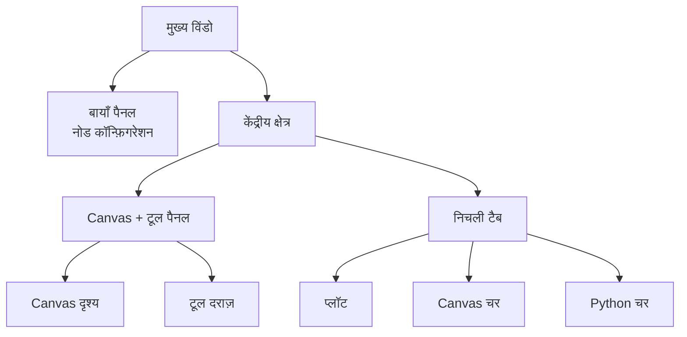

## मुख्य इंरफ़ेस की संरचना

FloWorks अपनी मुख्य विंडो को **तीन कार्यात्मक क्षेत्रों** में विभाजित करता है, जो एक स्पष्ट दर्शन का पालन करते हैं:

> *स्क्रीन का केंद्र वर्कफ़्लो (Canvas) के लिए है। बाईं ओर, चयनित नोड का कॉन्फ़िगरेशन। दाईं ओर, सहायक उपकरण। नीचे, विज़ुअलाइज़ेशन और डेटा।*

यह लेआउट मनमाना नहीं है: यह आपको **विवरणों को नज़रअंदाज़ किए बिना फ़्लो बनाने और चलाने** की अनुमति देता है, सक्रिय नोड कॉन्फ़िगरेशन और विश्लेषण उपकरणों को हमेशा पहुँच में रखते हुए।

---

### 1. बायाँ पैनल: नोड कॉन्फ़िगरेशन

यह पैनल, जो बाईं ओर स्थित है, **केवल Canvas पर चयनित नोड के पैरामीटर प्रदर्शित करने और संपादित करने** क लिए समर्पत है।

**यहाँ आप क्या देखते हैं:**

- पैनल के कार्य को इंगित करता हुआ एक **शीर्षक**।
- एक हाइलाइट किए गए बॉक्स में **चयनित नोड का नाम**। यदि कोई नोड चयनित नहीं है, तो एक संदेश दिखाई देता है।
- एक **स्क्रॉल करने योग्य कॉन्फ़िगरेशन क्षेत्र** जहाँ प्रत्येक नोड के लिए विशिष्ट विकल्प दिखाए जाते हैं (उदाहरण के लिए, थ्रेशोल्ड मान, सिग्नल नाम, अधिग्रहण पैरामीटर, आदि)।

**डिज़ाइन दर्शन:**

- पैनल **हमेशा दृश्यमान** है; यह एक पॉप-अप विंडो नहीं है।
- जब कोई नोड चयनित नहीं होता, तो एक खाली स्थान दिखाया जाता है जो आपको एक नोड चुनने के लिए आमंत्रित करता है।
- जब आप Canvas पर किसी भी नोड पर क्लिक करते हैं, तो यह पैनल **स्वचालित रूप से अपडेट** होता है ताकि उसके विकल्प दिखाए जा सकें।

| | |
|:---:|:---:|
|  |  |
| *बायाँ पैनल बिना चयन के* | *बायाँ पैनल चयनित नोड के साथ* |

---

### 2. केंद्रीय क्षेत्र: Canvas और टूल पैनल

दाईं ओर का क्षेत्र लंबवत रूप से विभाजित है: **Canvas** ऊपर है और **निचली टैब** नीचे हैं।

#### Canvas (नोड दृश्य)

यह **FloWorks का दृश्य केंद्र** है। यहाँ आप:

- अपने वर्कफ़्लो बनाने वाले नोड्स रखते और जोड़ते हैं।
- ग्रिड में नेविगेट करते हैं (पैनिंग या ज़ूमिंग द्वारा) ताकि पूरे फ़्लो को देख सकें।
- नोड्स को बाएँ पैनल में संपादित करने के लिए चयनित करते हैं।

#### टूल दराज़ (Tool Drawer)

Canvas के दाईं ओर एक **संक्षिप्त बाज़ू पैनल** है जिसमें सहायक उपकरण होते हैं। आप इसे आवश्यकतानुसार खोल या बंद कर सकते हैं, Canvas के लिए जगह मुक्त करते हुए।

| आइकन | उपकरण | इसका उपयोग |
|:-----:|:------------|:----------------|
| 📉 | विशलेषण पैनल | सिग्नल का विज़ुअलाइज़ेशन और विश्लेषण (प्लॉट, मेट्रिक्स)। |
| 🧮 | वैज्ञानिक कैलकुलेटर | वातावरण छोड़े बिना त्वरित गणना। |
| 📊 | स्प्रेडशीट | तालिका प्रारूप में संख्यात्मक डेटा देखना और हेरफेर करना। |
| 📈 | प्रदर्शन ॉनिटर | सामान्य कंप्यूटर मेट्रिक्स देखना (सीपीयू उपयोग, मेमोरी, आदि)। |
| 🐍 | Python कंसोल | उन्नत कार्यों के लिए Python इंटरप्रेटर तक सीधी पहुँच। |

| | | | | |
|:---:|:---:|:---:|:---:|:---:|
|  |  |  |  |  |
| *विश्लेषण* | *कैलकुलेटर* | *स्प्रेडशीट* | *मॉनिटर* | *Python कंसोल* |

**डिज़ाइन दर्शन:**
टूल पैनल आपको **Canvas पर ध्यान केंद्रित रखने** की अनुमति देता है, बिना उन कार्यों तक पहुँच का त्याग किए जो आपको विशिष्ट क्षणों में चाहिए। यह वर्कफ़्लो का एक प्राकृतिक विस्तार है, न कि एक स्थायी विचलित करने वाला तत्व।

[Tutorial Python Console](tutorial-console.md){ .md-button }
[Tutorial Spreadsheet](tutorial-spreadsheet.md){ .md-button .md-button--primary }

---

### 3. निचली टैब: प्लॉट और चर

Canvas के नीचे एक टैब क्षेत्र है जो दो पूरक दृश्य प्रदरशित करता है:

#### 📈 प्लॉट
- नोड्स द्वारा उत्पन्न या अधिग्रहीत डेटा का दृश्य प्रतिनिधित्व।
- नोड्स के नए मान उत्पन्न करने के साथ ही स्वचालित रूप से अपडेट होता है।
- विश्लेषण पैनलों के साथ एक ही दृश्य साझा करता है, जिससे दृश्य स्थिरता सुनिश्चित होती है।

#### 📋 Canvas चर (वर्कस्पेस)
- आपके फ़्लो में मौजूद Canvas पर **चर, सिग्नल या डेटा** वाली एक तालिका प्रदर्शित करता है।
- प्लॉट के साथ वास्तविक समय में अपडेट होता है।
- यह डेटा का "कच्चा" दृश्य है: डीबगिंग और संख्यात्मक सत्यापन के लिए आदर्श।

#### 📋 Python चर (टर्मिनल)
- Python टर्मिनल में घोषित **चर, सिग्नल या डेटा** वाली एक तालिका प्रदर्शित करता है।
- वास्तविक समय में अपडेट होता है।
- प्रत्येक संग्रहीत चर के आयाम और गुण दिखाता है।

| |
|:---:|
|  |
| *प्लॉट टैब* |
|  |
| *Canvas चर टैब* |
|  |
| *Python चर टैब* |

---

### 4. लेआउट गुण

- **आकार बदलने योग्य पैनल**
  बाएँ/दाएँ और ऊपर/नीचे दोनों विभाजन किनारों को खींकर समायोजित किए ा सकते हैं, ताकि इंटरफ़ेस को आपके वर्कफ़्लो के अनुरूप बनाया जा सके।

- **प्रारंभिक अनुपात**
  - बायाँ पैनल: कुल चौड़ाई का **25%**।
  - दायाँ क्षेत्र: शेष **75%**।
  - लंबवत रूप से, Canvas लगभग **480 px** और निचली टैब **320 px** घेरता है (आप इसे बदल सकते हैं)।

- **हाशिए और अंतराल**
  हाशिए न्यूनतम हैं ताकि कार्यस्थान को अधिकतम किया जा सके, बिना पठनीयता से समझौता किए।

---

### 5. इंटरफ़ेस की प्रतिक्रियाशीलता

FloWorks इस प्रकार डिज़ाइन किया गया है कि **Canvas पर किया गया हर काम पैनलों पर तुरंत प्रभाव डाले**:

- जब आप एक नोड चुनते हैं, तो बायाँ पैनल उसके विकल्प दिखाता है।
- जब आप एक फ़्लो चलाते हैं, तो प्लॉट और डेटा तालिका स्वचालित रूप से अपडेट होती है।
- जब आप एक नोड हटाते हैं, तो कॉन्फ़िगरेशन पैनल साफ़ हो जाता है यदि वह चयनित नोड था।
- यदि फ़्लो में unsaved परिवर्तन हैं, तो इंटरफ़ेस इसे दृश्य रूप से इंगित करता है (उदाहरण के लिए, शीर्षक में एक तारक चिह्न या एक संकेतक के साथ)।

यह **प्रतिक्रियाशील अनुभव** दृश्य को मैन्युअल रूप से रीफ़्रेश करने की आश्यकता से बचाता है: आप हमेशा अपने काम की सबसे हाल की स्थिति देखते हैं।

---

### 6. त्वरित थीम स्विचिंग

FloWorks आपको **एप्लिकेशन को पुनरारंभ किए बिना** दृश्य थीम (हल्की/गहरी) बदलने की अनुमति देता है। आप काम करते समय थीम के बीच स्विच कर सकते हैं और **इंटरफ़ेस तुरंत अनुकूलित हो जाता है**, आपके फ़्लो की स्थिति को बरकरार रखते हुए।

**व्यावहारिक लाभ:**
प्रकाश स्थितियों या व्यक्तिगत प्राथमिकताओं के आधार पर जो थीम सबसे आरामदायक हो, उसके साथ काम करें, बिना अपने सत्र को बाधि किए।

---

### 7. अंतर्राष्ट्रीयकरण (बहुभाषी)

सभी इंटरफ़ेस टेक्स्ट (मेनू, शीर्षक, बटन, संदेश) **कई भाषाओं में प्रदर्शित करने** के लिए तैयार हैं। FloWorks में एक अनुवाद प्रणाली शामिल है जो आपको आसानी से एप्लिकेशन की भाषा बदलने की अनुमति दती है, बिना पुनर्स्थापना या पुनरारंभ की आवश्यकता के।

**डिज़ाइन दर्शन:**
यह उपकरण विभिन्न क्षेत्रों के उपयोगकर्ताओं के लिए डिज़ाइन किया गया है; भाषा एक बाधा नहीं होनी चाहिए।

---

> **दृश्य सारांश:** स्क्रीन इस प्रकार व्यवस्थित है कि आप **एक नज़र में सब कुछ प्रासंगिक देख सकें**: नोड्स (केंद्र), नोड कॉन्फ़िगरेशन (बाएँ), सहायक उपकरण (दाएँ, संक्षिप्त) और परिणाम/डेटा (नीचे)। सब कुछ प्रतिक्रियाशील है, त्वरित थीम स्विचिंग और बहुभाषी समर्थन के साथ।
