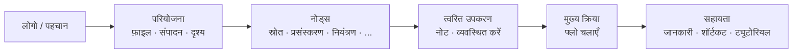

## मुख्य टूलबार: संगठन और दर्शन

ऊपरी टूलबार FloWorks का **त्वरित कमान्ड केंद्र** है। इसका डिज़ाइन वर्कफ़्लो तर्क का अनुसरण करता है: बाएँ से दाएँ, आपको एक सत्र के दौरान जिन क्रियाओं की आवश्यकता होती है, वे सामान्य क्रम में मिलती हैं।

### समूहों द्वारा संगठन

टूलबार **छह कार्यात्मक समूहों** में विभाजित है, जिन्हें सूक्ष्म ऊर्ध्वाधर रेखाओं द्वारा अलग किया गया है। प्रत्येक समूह संबंधित क्रियाओं को एक साथ रखता है ताकि आपको बिखरे हु मेनू में खोजना न पड़े।

---

### 1. पहचान (लोगो)

सबसे बाएँ किनारे पर आप **FloWorks लोगो** देखेंगे। यह केवल सजावटी नहीं है: इस पर क्लिक करने से **स्वागत संवाद** खुलता है, जिसमें सामान्य जानकारी और उपयोग दर्शन शामिल है।

- **टूलटिप:** "FloWorks की जानकारी और स्वागत"।

**दर्शन:** लोगो पहचान और प्रारंभिक सहायता तक पहुँच का एक बिंदु के रूप में कार्य करता है, मेनू में जगह नहीं लेता।

---

### 2. परियोजना: फ़ाइल, संपादन और दृश्य

परियोजना प्रबंधन और इंटरफ़ेस उपस्थिति से संबंधित संचालन को एक साथ रखता है।

#### 📁 फ़ाइल
- **नया**: एक खाली फ्लो बनाता है।
- **खोलें**: एक मौजूदा परियोजना लोड करता है।
- **सहेजें / इस रूप में सहेजें**: वर्तमान फ्लो सहेजता है।
- **बाहर निकलें**: एप्लिकेशन बंद करता है।

#### ✂️ संपादन
- **पूर्ववत / फिर से करें**: कैनवास पर परिवर्तनों को पूर्ववत या पुनर्स्थापित करता है।
- **काटें / प्रतिलिपि बनाएँ / चिपकाएँ**: चयनित नोडस में हेरफेर करता है।
- **प्राथमिकताएँ**: वैश्विक कॉन्फ़िगरेशन विंडो खोलता है।

#### 👁️ दृश्य
यह मेनू नियंत्रित करता है कि इंटरफ़ेस आपकी प्राथमिकताओं के अनुरूप कैसे दिखता है और अनुकूलित होता है:

- **भाषा**: पूरे एप्लिकेशन की भाषा बदलता है (मेनू, बटन, संदेश)।
- **थीम**: दृश्य थीम (हल्का, गहरा, आदि) के बीच तुरंत स्विच करता है।
- **फ़ॉन्ट आकार**: पूर्वनिर्धारित और कस्टम विकल्पों के साथ पूरे इंटरफ़ेस में टेक्स्ट का आकार समायोजित करता है।
- **लॉग व्यूअर**: एप्लिकेशन के आतरिक लॉग प्रदर्शित करता है (उन्नत डीबगिंग के लिए उपयोगी)।

**दर्शन:** "मेरा परियोजना और मेरा कार्यस्थान" से संबंधित सब कुछ एक साथ है, लेकिन नोड्स जोड़ने या चलाने वाली क्रियाओं से अलग है।

---

### 3. नोड्स (श्रेणियों द्वारा)

यह समूह FloWorks में उपलब्ध **नोड्स कैटलॉग से स्वचालित रूप से उत्पन्न** होता है। यह मैन्युअल रूप से कोडित नहीं है: यदि कार्यक्रम में एक नया नोड जोड़ा जाता है, तो उसकी श्रेणी यहाँ स्वचालित रूप से दिखाई देती है।

सामान्य श्रेणियों में शामिल है:

- **स्रोत** (सिग्नल जनरेटर, डेटा इनपुट)।
- **प्रसंस्करण** (फ़िल्टर, गणितीय परिवर्तन)।
- **नियंत्रण** (प्रवाह तर्क, शर्तें)।
- **आउटपुट** (सिंक, विज़ुअलाइज़र, निर्यातक)।
- और समुदाय या आपके स्वयं के कस्टम नोड्स द्वारा परिभाषि कोई अन्य श्रेणी।

**बुद्धिमान व्यवहार:**

- यदि एक श्रेणी में **एक नोड** है, तो टूलबार सीधे उसके नाम वाला एक बटन दिखाती है; क्लिक करने पर वह नोड कैनवास पर जोड़ दिया जाता है।
- यदि इसमें **कई नोड्स** हैं, तो उन सभी के साथ एक ड्रॉप-डाउन मेनू प्रदर्शित होता है। एक का चयन करने पर इसे कैनवास पर रखा जाता है।

**दर्शन:** नोड्स तक पहुँच हमेशा दृश्यमान है, बिना साइड पैनल खोले। टूलबार कैटलॉग के अनुरूप अनुकूलित होती है, स्थिरता बनाए रखती है और मैन्युअल कॉन्फ़िगरेशन से बचाती है।

---

### 4. त्वरित उपकरण

सीधे उत्पादकता के लिए दो बटन:

- **📝 स्टिकी नोट**: प्रवाह के भागों को दस्तावेज़ करने के लिए कैनवास पर एक दृश्य नोट जोड़ता है।
- **🔧 स्वचालित व्यवस्था**: एक ही क्लिक में कैनवास पर सभी नोड्स को व्यवस्थित और पठनीय क्रम मं पुनर्व्यवस्थित करता है।

**दर्शन:** ये ऐसी क्रियाएँ हैं जिनका अक्सर उपयोग किया जाता है और जो मेनू में छिपी नहीं होनी चाहिए। एक क्लिक और हो गया।

---

### 5. मुख्य क्रिया: फ्लो चलाएँ

**चलाएँ** बटन को रंगीन सीमा (आमतौर पर हरी) और "प्ले" आइकन के साथ दृश्य रूप से हाइलाइट किया गया है। यह टूलबार का सबसे आकर्षक बटन है, क्योंकि यह FloWorks की केंद्रीय क्रिया का प्रतिनिधित्व करता है: **डेटा प्रवाह शुरू करना**।

- क्लिक करने पर **वर्तमान फ्लो निष्पादित** होता है और निचला ग्राफ़ और डेटा तालिका अपडेट होती है।
- दबाने पर बटन थोड़ा उपस्थिति बदलता है, स्पर्श प्रतिक्रिया देता है।

**दर्शन:** सबसे महत्वपूर्ण क्रिया सबसे दृश्यमान होनी चाहिए। चलाने के लिए मेनू में नेविगेट करने की आवश्यकता नहीं; हमेशा एक क्लिक दूर।

---

### 6. सहायता

टूलबार के अंत में, आपको **सहायता** मेनू मिलेगा, जिमें सीधे पहुँच है:

- **जानकारी**: संस्करण और परियोजना के बारे में विवरण।
- **कीबोर्ड शॉर्टकट**: उन्नत उपयोगकर्ताओं के लिए संयोजनों की एक पूरी सूची।
- **ट्यूटोरियल**: FloWorks सीखने के लिए चरण-दर-चरण मार्गदर्शिकाएँ।

**दर्शन:** सहायता हमेशा उपलब्ध है, लेकिन वर्कफ़्लो से अलग ताकि बाधा न उत्पन्न हो।

---

### अनुकूली विशेषताएँ

- **त्वरित अनुवाद**: दृश्य मेनू से भाषा बदलने पर **टूलबार के सभी टेक्स्ट तुरंत अपडेट** होते हैं, बिना पुनरारंभ किए।
- **थीम और फ़ॉन्ट आकार**: टूलबार तुरंत नए दृश्य शैली के साथ पुनर्संरचित होती है।
- **गतिशील कैटलॉग**: यदि कार्यक्रम में नए नोड्स जोड़े जाते हैं, तो उनकी श्रेणियाँ टूलबार पर स्वचालित रूप से दिखाई देती हैं, बिना मैन्युअल हस्तक्षेप के।

**सारांश:** टूलबार को **सहज, त्वरित और अनुकूली** होने के लिए डिज़ाइन किया गया है। यह प्राकृतिक कार्यप्रवाह का अनुसरण करता है: परियोजना कॉन्फ़िगर करें → संपादित करें → नोड्स जोड़ें → चलाएँ → सहायता देखें। बाकी सब रास्ते से हट दिया गया है, लेकिन जब आवश्यक हो तब पहुँच योग्य है।
