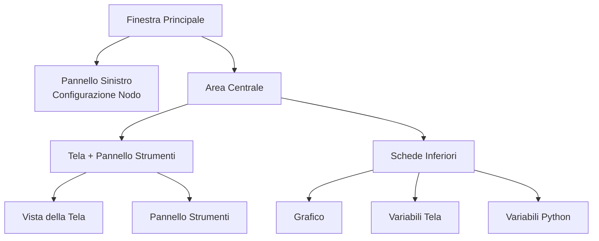

## Anatomia dell'Interfaccia Principale

FloWorks organizza la sua finestra principale in **tre zone funzionali** che rispondono a una filosofia chiara:
> *Il centro dello schermo è dedicato al flusso di lavoro (la Tela). A sinistra, la configurazione del nodo selezionato. A destra, strumenti ausiliari. In basso, visualizzazione e dati.*

Questa disposizione non è arbitraria: permette di **costruire ed eseguire flussi senza perdere di vista il dettaglio**, mantenendo sempre accessibili la configurazione del nodo attivo e gli strumenti di analisi.

---

### 1. Pannello Sinistro: Configurazione del Nodo

Questo pannello, situato a sinistra, è dedicato **esclusivamente a mostrare e modificare i parametri del nodo che hai selezionato** nella Tela.

**Cosa vedi qui:**

- Un **titolo** che indica la funzione del pannello.
- Il **nome del nodo selezionato** in un riquadro evidenziato. Se non è selezionato alcun nodo, appare un messaggio che lo indica.
- Un'**area di configurazione scorrevole** dove compaiono le opzioni specifiche di ciascun nodo (ad esempio, valori di soglia, nomi dei segnali, parametri di acquisizione, ecc.).

**Filosofia di progettazione:**

- Il pannello è **sempre visibile**; non è una finestra a comparsa.
- Quando non c'è un nodo selezionato, viene mostrato uno spazio vuoto che invita a selezionarne uno.
- Cliccando su qualsiasi nodo della Tela, questo pannello si aggiorna **automaticamente** per mostrarne le opzioni.

| | |
|:---:|:---:|
|  |  |
| *Pannello sinistro senza selezione* | *Pannello sinistro con nodo selezionato* |

---

### 2. Area Centrale: Tela e Pannello Strumenti

L'area destra è divisa verticalmente: in alto c'è la **Tela** e in basso le **schede inferiori**.

#### Tela (Vista Nodi)

È il **cuore visivo di FloWorks**. Qui è dove:

- Collochi e colleghi i nodi che formano il tuo flusso di lavoro.
- Ti sposti nella griglia (facendo *pan* o *zoom*) per vedere l'intero flusso.
- Selezioni i nodi per modificarli nel pannello sinistro.

#### Pannello Strumenti (Drawer)

A destra della Tela c'è un **pannello laterale a scomparsa** che contiene strumenti ausiliari. Puoi aprirlo o chiuderlo secondo necessità, liberando spazio per la Tela.

| Icona | Strumento | A cosa serve |
|:-----:|:------------|:----------------|
| 📉 | Pannelli di Analisi | Visualizzazione e analisi dei segnali (grafici, metriche). |
| 🧮 | Calcolatrice Scientifica | Calcoli rapidi senza uscire dall'ambiente. |
| 📊 | Foglio di Calcolo | Visualizzare e manipolare dati numerici in formato tabellare. |
| 📈 | Monitor Prestazioni | Vedere le metriche generali del Computer (uso CPU, memoria, ecc.). |
| 🐍 | Console Python | Accesso diretto a un interprete Python per attività avanzate. |

| | | | | |
|:---:|:---:|:---:|:---:|:---:|
|  |  |  |  |  |
| *Analisi* | *Calcolatrice* | *Foglio di calcolo* | *Monitor* | *Console Python* |

**Filosofia di progettazione:**
Il pannello strumenti permette di **mantenere la concentrazione sulla Tela** senza sacrificare l'accesso alle funzioni di cui hai bisogno in momenti specifici. È un'estensione naturale del flusso di lavoro, non una distrazione permanente.

[Tutorial Console Python](tutorial-console.md){ .md-button }
[Tutorial Spreadsheet](tutorial-spreadsheet.md){ .md-button .md-button--primary }

---

### 3. Schede Inferiori: Grafico e Variabili

Sotto la Tela si trova un'area con schede che mostra due viste complementari:

#### 📈 Grafico
- Rappresenta visivamente i dati generati o acquisiti dai nodi.
- Si aggiorna automaticamente man mano che i nodi producono nuovi valori.
- Condivide la stessa vista dei Pannelli di Analisi, garantendo coerenza visiva.

#### 📋 Variabili Tela (Workspace)
- Mostra una tabella con le **variabili, i segnali o i dati** presenti nella Tela del tuo flusso.
- Si aggiorna in tempo reale insieme al grafico.
- È la vista "grezza" dei dati: ideale per il debug e la verifica numerica.

#### 📋 Variabili Python (Terminale)
- Mostra una tabella con le **variabili, i segnali o i dati** dichiarati nel terminale python.
- Si aggiorna in tempo reale.
- Mostra le dimensioni e le proprietà di ciascuna variabile memorizzata.

| |
|:---:|
|  |
| *Scheda Grafico* |
|  |
| *Scheda Variabili Tela* |
|  |
| *Scheda Variabili Python* |

---

### 4. Proprietà del Layout

- **Pannelli ridimensionabili**
  Sia la separazione sinistra/destra sia quella superiore/inferiore sono regolabili trascinando i bordi, per adattare l'interfaccia al tuo flusso di lavoro.

- **Proporzioni iniziali**
  - Pannello sinistro: **25%** della larghezza totale.
  - Area destra: il **75%** restante.
  - Verticalmente, la Tela occupa circa **480 px** e le schede inferiori **320 px** (modificabili).

- **Margini e spaziature**
  I margini sono minimi per sfruttare al massimo lo spazio di lavoro, senza sacrificare la leggibilità.

---

### 5. Reattività dell'Interfaccia

FloWorks è progettato in modo che **tutto ciò che fai nella Tela abbia un effetto immediato nei pannelli**:

- Selezionando un nodo, il pannello sinistro ne mostra le opzioni.
- Eseguendo un flusso, il grafico e la tabella dati si aggiornano automaticamente.
- Eliminando un nodo, il pannello di configurazione si svuota se era il nodo selezionato.
- Se il flusso ha modifiche non salvate, l'interfaccia lo indica visivamente (ad esempio, con un asterisco nel titolo o un indicatore).

Questa **esperienza reattiva** evita di dover aggiornare manualmente la vista: vedi sempre lo stato più recente del tuo lavoro.

---

### 6. Cambio Tema al Volo

FloWorks permette di cambiare il tema visuale (chiaro/scuro) **senza riavviare l'applicazione**. Puoi alternare i temi mentre lavori e **l'interfaccia si adatta all'istante**, mantenendo intatto lo stato del tuo flusso.

**Beneficio pratico:**
Lavora con il tema che trovi più comodo in base alle condizioni di illuminazione o alle preferenze personali, senza interrompere la sessione.

---

### 7. Internazionalizzazione (Multilingua)

Tutti i testi dell'interfaccia (menu, titoli, pulsanti, messaggi) sono pronti per **essere visualizzati in più lingue**. FloWorks include un sistema di traduzione che permette di cambiare facilmente la lingua dell'applicazione, senza necessità di reinstallare o riavviare.

**Filosofia di progettazione:**
Lo strumento è pensato per utenti di diverse regioni; la lingua non dovrebbe essere una barriera.

---

> **Riassunto visivo:** La schermata è organizzata in modo che tu veda **tutto ciò che è rilevante a colpo d'occhio**: nodi (centro), configurazione del nodo (sinistra), strumenti ausiliari (destra, a scomparsa) e risultati/dati (sotto). Tutto reattivo, con cambio tema istantaneo e supporto multilingua.
