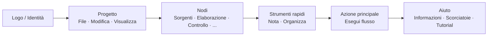

## Barra degli strumenti principale: Organizzazione e filosofia

La barra degli strumenti superiore è il **centro di comando rapido** di FloWorks. Il suo design segue una logica di flusso di lavoro: da sinistra a destra, troverai le azioni nell'ordine tipico in cui ti servono durante una sessione.

### Organizzazione per gruppi

La barra è divisa in **sei gruppi funzionali**, separati da sottili linee verticali. Ogni gruppo raggruppa azioni correlate in modo da non doverle cercare in menu dispersi.

---

### 1. Identità (Logo)

All'estremità sinistra vedrai il **logo di FloWorks**. Non è decorativo: cliccandolo si apre la **finestra di benvenuto**, che include informazioni generali e la filosofia d'uso.

- **Tooltip:** "Informazioni e benvenuto di FloWorks".

**Filosofia:** Il logo funge da punto di accesso all'identità e all'aiuto iniziale, senza occupare spazio nei menu.

---

### 2. Progetto: File, Modifica e Visualizza

Raggruppa le operazioni relative alla **gestione del progetto e all'aspetto dell'interfaccia**.

#### 📁 File
- **Nuovo**: crea un flusso vuoto.
- **Apri**: carica un progetto esistente.
- **Salva / Salva con nome**: salva il flusso attuale.
- **Esci**: chiude l'applicazione.

#### ✂️ Modifica
- **Annulla / Ripristina**: annulla o ripristina le modifiche sulla Tela.
- **Taglia / Copia / Incolla**: manipola i nodi selezionati.
- **Preferenze**: apre la finestra di configurazione globale.

#### 👁️ Visualizza
Questo menu controlla come appare e si adatta l'interfaccia alle tue preferenze:

- **Lingua**: cambia la lingua di tutta l'applicazione (menu, pulsanti, messaggi).
- **Tema**: alterna tra i temi visivi (chiaro, scuro, ecc.) al volo.
- **Dimensione carattere**: regola la dimensione del testo in tutta l'interfaccia, con opzioni predefinite e personalizzate.
- **Visualizzatore log**: mostra i log interni dell'applicazione (utile per il debug avanzato).

**Filosofia:** Tutto ciò che riguarda "il mio progetto e il mio ambiente di lavoro" è insieme, ma separato dalle azioni che aggiungono o eseguono nodi.

---

### 3. Nodi (per categorie)

Questo gruppo è **auto-generato dal catalogo dei nodi** disponibile in FloWorks. Non è codificato manualmente: se viene aggiunto un nuovo nodo al programma, la sua categoria appare automaticamente qui.

Le categorie tipiche includono:

- **Sorgenti** (generatori di segnali, ingressi dati).
- **Elaborazione** (filtri, trasformazioni matematiche).
- **Controllo** (logica di flusso, condizionali).
- **Uscite** (pozzi, visualizzatori, esportatori).
- E qualsiasi altra categoria definita dalla comunità o dai tuoi nodi personalizzati.

**Comportamento intelligente:**

- Se una categoria contiene **un solo nodo**, la barra mostra direttamente un pulsante con il suo nome; al clic, quel nodo viene aggiunto alla Tela.
- Se contiene **più nodi**, viene mostrato un menu a discesa con tutti. Scegliendone uno, viene posizionato sulla Tela.

**Filosofia:** L'accesso ai nodi è sempre visibile, senza bisogno di aprire un pannello laterale. La barra si adatta al catalogo, mantenendo coerenza ed evitando configurazioni manuali.

---

### 4. Strumenti rapidi

Due pulsanti per la produttività diretta:

- **📝 Nota adesiva**: aggiunge una nota visiva alla Tela per documentare parti del flusso.
- **🔧 Organizza automaticamente**: riorganizza tutti i nodi sulla Tela in modo ordinato e leggibile con un solo clic.

**Filosofia:** Sono azioni usate frequentemente che non meritano di essere nascoste nei menu. Un clic e fatto.

---

### 5. Azione principale: Esegui flusso

Il pulsante **Esegui** è evidenziato visivamente con un bordo colorato (normalmente verde) e un'icona "play". È il pulsante più appariscente della barra, perché rappresenta l'azione centrale di FloWorks: **mettere in moto il flusso di dati**.

- Al clic, si **esegue il flusso attuale** e si aggiornano il grafico e la tabella dati inferiore.
- Il pulsante cambia leggermente aspetto alla pressione, dando un feedback tattile.

**Filosofia:** L'azione più importante deve essere la più visibile. Non c'è bisogno di navigare nei menu per eseguire; è sempre a un clic di distanza.

---

### 6. Aiuto

Alla fine della barra, troverai il menu **Aiuto**, con accessi diretti a:

- **Informazioni**: dettagli sulla versione e il progetto.
- **Scorciatoie da tastiera**: un elenco completo di combinazioni per utenti avanzati.
- **Tutorial**: guide passo dopo passo per imparare FloWorks.

**Filosofia:** L'aiuto è sempre disponibile, ma tenuto separato dal flusso di lavoro per non disturbare.

---

### Caratteristiche adattative

- **Traduzione istantanea**: al cambiare la lingua dal menu Visualizza, **tutti i testi della barra si aggiornano al momento**, senza riavvio.
- **Temi e dimensione carattere**: la barra si ridisegna immediatamente con il nuovo stile visivo.
- **Catalogo dinamico**: se vengono aggiunti nuovi nodi al programma, le loro categorie appaiono automaticamente nella barra, senza intervento manuale.

**Riepilogo:** La barra degli strumenti è progettata per essere **intuitiva, rapida e adattabile**. Segue il flusso naturale di lavoro: configura progetto → modifica → aggiungi nodi → esegui → consulta aiuto. Tutto il resto resta fuori mano, ma accessibile quando serve.
