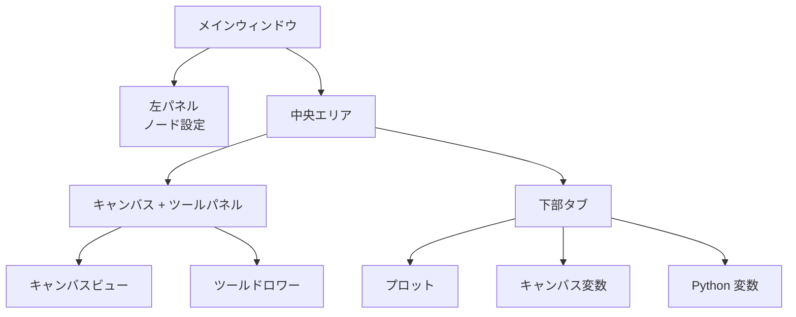

## メインインターフェースの解剖

FloWorks は、メインウィンドウを**3 つの機能ゾーン**に分けています。これは明確な理念に基づいています：
> *画面の中央はワークフロー（キャンバス）用です。左側は選択されたノードの設定用、右側は補助ツール用、下部は可視化とデータ用です。*

このレイアウトは恣意的ものではありません。詳細を見失うことなく**フローを構築・実行できる**よう、アクティブなノードの設定と分析ツールが常にアクセス可能な状態を保ちます。

---

### 1. 左パネル：ノード設定

このパネルは左側にあり、**キャンバス上で選したノードのパラメータを表示および編集することに専念しています**。

**ここで見られるもの：**

- パネルの機能を示す**タイトル**。
- 強調表示されたボックス内に表示される**選択されたノードの名前**。ノードが選択されていない場合は、その旨を示すメッセージが表示されます。
- 各ノード固有のオプション（例：しきい値、信号名、取得パラメータなど）が表示される**スクロール可能な設定エリア**。

**デザイン哲学：**

- パネルは**常に表示されます**；ポップアップウィンドウではありません。
- ノードが選択されていない場合は、ノードを選択するよう促す空のスペースが表示されます。
- キャンバス上の任意のノードをクリックすると、このパネルはそのオプションを表示するために**自動的に**更新されます。

| | |
|:---:|:---:|
|  |  |
| *選択なしの左パネル* | *ノーが選択された左パネル* |

---

### 2. 中央エリア：キャンバスとツールパネル

右側のエリアは垂直に分割されています：上部に**キャンバス**、下部に**下部タブ**があります。

#### キャンバス（ノードビュー）

ここは **FloWorks のビジュアル的な中心**です。ここでは以下を行います：

- ワークフローを構成するノードを配置および接続します。
- グリッド上を移動（*パン*または*ズーム*）して、フロー全体を確認します。
- ノードを選択して、左パネルで編集します。

#### ツールドロワー

キャンバスの右側には、補助ツールを含む**折りたたみ可能なサイドパネル**があります。必要に応じて開閉でき、キャンバスのスペースを確保できます。

| アイコン | ツール | 用途 |
|:-----:|:------------|:----------------|
| 📉 | 分析パネル | 信号の可視化と分析（グラフ、指標）。 |
| 🧮 | 科学電卓 | 環境を離れずに迅速な計算を行います。 |
| 📊 | スプレッドシート | 表形式で数値データを表示および操作します。 |
| 📈 | パフォーマンスモニター | コンピュータの全般的な指標（CPU 使用率、メモリなど）を確認します。 |
| 🐍 | Python コンソール | 高度なタスクのために Python インタープリタに直接アクセスします。 |

| | | | | |
|:---:|:---:|:---:|:---:|:---:|
|  |  |  |  |  |
| *分析* | *電卓* | *スプレッドシート* | *モニター* | *Python コンソール* |

**デザイン哲学：**
ツールパネルは、**キャンバスに焦点を当てたまま**、特定の瞬間に必要な機能へのアクセスを犠牲にしないようにします。これはワークフローの自然な拡張であり、恒常的な気晴らしではありません。

[Python コンソールチュートリアル](tutorial-console.md){ .md-button }
[スプレッドシートチュートリアル](tutorial-spreadsheet.md){ .md-button .md-button--primary }

---

### 3. 下部タブ：プロットと変数

キャンバスの下には、2 つの補完的なビューを示すタブ付きエリアがあります：

#### 📈 プロット
- ノードによって生成または取得されたデータを視覚的に表します。
- ノードが新しい値を生成するたびに自動的に更新されます。
- 分析パネルと同じビューを共有し、視覚的な一貫性を保証します。

#### 📋 キャンバス変数（ワークスペース）
- フロー内のキャンバス上に存在する**変数、信号、またはデータ**を含むテーブルを表示します。
- プロットとともにリアルタイムで更新されます。
- これはデータの「生」のビューです：デバッグと数値検証に最適です。

#### 📋 Python 変数（ターミナル）
- Python ターミナルで宣言された**変数、信号、またはデータ**を含むテーブルを表示します。
- リアルタイムで更新されます。
- 保存された各変数の次元とプロパティを表示します。

| |
|:---:|
|  |
| *プロットタブ* |
|  |
| *キャンバス変数タブ* |
|  |
| *Python 変数タブ* |

---

### 4. レイアウトのプロパティ

- **サイズ変更可能なパネル**
  左右および上下の分割は、エッジをドラッグすることで調整でき、インターフェースをワークフローに適応させられます。

- **初期比率**
  - 左パネル：総幅の **25%**。
  - 右エリア：残りの **75%**。
  - 垂直方向では、キャンバスが約 **480 px**、下部タブが約 **320 px** です（変更可能）。

- **マージンと間隔**
  マージンは最小限に抑えられ、ワークスペースを最大限に活用しつつ、可読性を損ないません。

---

### 5. インターフェースの反応性

FloWorks は、**キャンバス上で行うすべての操作がパネルに即座に影響を与える**ように設計されています

- ノードを選択すると、左パネルにそのオプションが表示されます。
- フローを実行すると、プロットとデータテーブルが自動的に更新されます。
- ノードを削除すると、それが選択されていたノードであれば設定パネルがクリアされます。
- フローに保存されていない変更がある場合、インターフェースは視覚的にそれを示します（例：タイトルのアスタリスクやインジケータ）。

この**反応的な体験**により、手動でビューを更新する必要がなくなります：常に作業の最新状態が表示されます。

---

### 6. ホットテーマ切り替え

FloWorks では、**アプリケーションを再起動せずに**ビジュアルテーマ（ライト/ダーク）を変更できます。作業中にテーマを切り替えると、**インターフェースは即座に適応し**、フローの状態をそのまま維持します。

**実用的な利点：**
照明件や個人の好みに応じて、最も快適なテーマで作業でき、セッションを中断することはありません。

---

### 7. 国際化（多言語）

ンターフェースのすべてのテキスト（メニュー、タイトル、ボタン、メッセージ）は、**複数の言語で表示できる**ように準備されています。FloWorks には翻訳システムが含まれており、アプリケーションの言語を簡単に変更でき、再インストールや再起動は不要です。

**デザイン哲学：**
このツールは、さまざまな地域のユーザーを想定して設計されています。言語は障壁になるべきではありません。

---

> **ビジュアル要約：** 画面は、**関連するすべての情報を一目で確認できる**ように構成されています：ノード（中央）、ノード設定（左）、補助ツール（右、折りたたみ可能）、結果/データ（下）。すべてが反応的で、即時のテーマ切り替えと多言語サポートを備えています。
