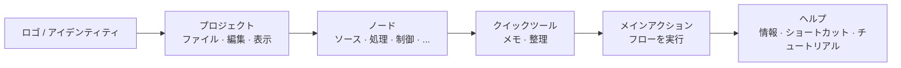

## メインツールバー：構成と理

上部ツールバーは FloWorks の**クイックコマンドセンター**です。そのデザインはワークフローロジックに従っています：左から右へ、セッション中に必要となる典型的な順序でアクションが配置されています。

### グループ別の構成

ツールバーは**6 つの機能グループ**に分かれており、微妙な垂直線で区切られています。各グループは関連するアクションをまとめているため、散在したメニューを探す必要がありません。

---

### 1. アイデンティティ（ロゴ）

左端には **FloWorks ロゴ**が表示されます。これは装飾ではありません：クリックすると**ようこそダイアログ**が開き、一般的な情報と使用理念が含まれます。

- **ツールチップ：** "FloWorks の情報とようこそ"。

**理念：** ロゴは、アイデンティティと初期ヘルプへのアクセスポイントとして機能し、メニューのスペースを占有しません。

---

### 2. プロジェクト：ファイル、編集、表示

**プロジェクト管理とインターフェースの外観**に関連する操作をグループ化します。

#### 📁 ファイル
- **新規**：空白のフローを作成します。
- **開く**：既存のプロジェクトを読み込みます。
- **保存 / 名前を付けて保存**：現在のフローを保存します。
- **終了**：アプリケーションを閉じます。

#### ✂️ 編集
- **元に戻す / やり直し**：キャンバス上の変更を復元または元に戻します。
- **切り取り / コピー / 貼り付け**：選択したノードを操作します。
- **設定**：グローバル構成ウィンドウを開きます。

#### 👁️ 表示
このメニューは、インターフェースの表示方法とユーザーの設定への適応を制御します：

- **言語**：アプリケーション全体の言語を変更します（メニュー、ボタン、メッセージ）。
- **テーマ**：ビジュアルテーマ（ライト、ダークなど）をホットスワップします。
- **フォントサイズ**：インターフェース全体のテキストサイズを調整し、プリセットおよびカスタムオプションを提供します。
- **ログビューア**：アプリケーションの内部ログを表示します（高度なデバッグに有用）。

**理念：** "自分のプロジェクトと作業環境"に関連するすべてが一緒にありますが、ノードを追加または実行するアクションとは分離されています。

---

### 3. ノド（カテゴリ別）

このグループは、FloWorks で利用可能な**ノードカタログから自動生成**されます。ハードコーディングされていません：プログラムに新しいノードが追加されると、そのカテゴリがここに自動的に表示されます。

典型的なカテゴリには以下が含まれます：

- **ソース**（信号ジェネレーター、データ入力）。
- **処理**（フィルター、数学的変換）。
- **制御**（フローロジック、条件）。
- **出力**（シンク、ビューア、エクスポーター）。
- およびコミュニティまたは独自のカスタムノードによって定義されたその他のカテゴリ。

**スマートな動作：**

- カテゴリに**1 つのノード**しか含まれない場合、ツールバーはその名前のボタンを直接表示します。クリックすると、そのノードがキャンバスに追加されます。
- **複数のノード**が含まれている場合は、それらすべてを含むドロップダウンメニューが表示されます。1 つを選択するとキャンバスに配置されます。

**理念：** ノードへのアクセスは常に表示されており、サイドパネルを開く必要がありません。ツールバーはカタログに適応し、一貫性を維持し、手動構成を回避します。

---

### 4. クイックツール

2 つの直接的な生産性ボタン：

- **📝 付箋メモ**：フローの一部を文書化するために、キャンバスに視覚的なメモを追加します。
- **🔧 自動整理**：1 回のクリックで、すべてのキャンバスノードを整然と読みやすいレイアウトに再配置します。

**理念：** これらは頻繁に使用されるアクションであり、メニューに隠されているべきではありません。クリックするだけで完了です。

---

### 5. メインアクション：フローを実行

**実行**ボタンは、色付きの枠線（通常は緑）と"再生"アイコンで視覚的に強調表示されています。これはツールバーで最も目引くボタンです。なぜなら、FloWorks の中心的なアクション、つまり**データフローを開始する**ことを表しているからです。

- クリックすると、**現在のフローが実行され**、下部のグラフとデータテーブルが更新されます。
- ボタンは押下時に外観がわずかに変化し、触覚フィードバックを提供します。

**理念：** 最も重要なアクションは最も目立つ必要があります。実行するためにメニューを操作する必要はありません。常にクリック 1 回で実行できます。

---

### 6. ヘルプ

ツールバーの最後に、**ヘルプ**メニューがあり、以下に直接アクセスできます：

- **情報**：バージョンとプロジェクトの詳細。
- **キーボードショートカット**：上級ユーザー向けの完全な組み合わせリスト。
- **チュートリアル**：FloWorks を学ぶためのステップバイステップガイド。

**理念：** ヘルプは常に利用可能ですが、ワークフローから離れた場所にあり、妨げになりません。

---

### アダプティブ機能

- **即時翻訳**：表示メニューから言語を変更すると、**ツールバーのすべてのテキストが即座に更新され**、再起動は不要です。
- **テーマとフォントサイズ**：ツールバーは新しいビジュアルスタイルで即座に再描画されます。
- **動的カタログ**：プログラムに新しいノードが追加されると、そのカテゴリがツールバーに自動的に表示されます。手動介入は不要です。

**まとめ：** ツールバーは**直感的、高速、かつ適応的**に設計されています。自然なワークフローに従います：プロジェクトを構成 → 編集 → ノードを追加 → 実行 → ヘルプを参照。それ以外のすべては邪魔になりませんが、必要なとにアクセスできます。
