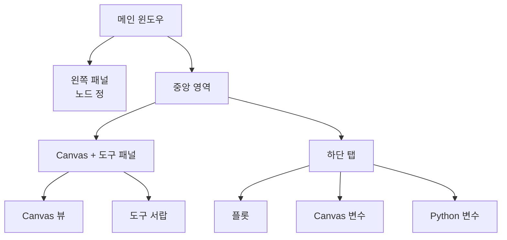

## 주 인터페이스 구조

FloWorks는 명확한 철학을 따르는 **세 가지 기능 영역**으로 메인 윈도우를 구성합니다:

> *화면 중앙은 워크플로우(Canvas)를 위한 공간입니다. 왼쪽은 선택한 노드의 설정, 오른쪽은 보조 도구, 하단은 시각화와 데이터를 위한 공간입니다.*

이 레이아웃은 임의로 정해진 것이 아닙니다. 활성 노드 설정과 분석 도구를 항상 손쉽게 접근할 수 있도록 하여, **세부 사항을 놓치지 않고 플로우를 구축하고 실행**할 수 있게 합니다.

---

### 1. 왼쪽 패널: 노드 설정

왼쪽에 위치한 이 패널은 **Canvas에서 선택한 노드의 매개변수를 표시하고 편집하는 것에 전념**합니다.

**여기서 볼 수 있는 것:**

- 패널의 기능을 나타내는 **제목**.
- 강조 표시된 상자 안의 **선택한 노드 이름**. 노드가 선택되지 않은 경우, 이를 알리는 메시지가 표시됩니다.
- 각 노드에 대한 특정 옵션(예: 임계값, 신호 이름, 데이터 수집 매개변수 등)이 표시되는 **스크롤 가능한 설정 영역**.

**디자인 철학:**

- 패널은 **항상 표시**됩니다. 팝업 창이 아닙니다.
- 노가 선택되지 않은 경우, 노드를 선택하도록 안내하는 빈 공간이 표시됩니다.
- Canvas의 어떤 노드를 클릭하면, 이 패널은 해당 옵션을 표시하기 위해 **자동으로 업데이트**됩니다.

| | |
|:---:|:---:|
|  |  |
| *선택이 없는 왼쪽 패널* | *노드가 선택된 왼쪽 패널* |

---

### 2. 중앙 영역: Canvas 및 도구 패널

오른쪽 영역은 수직으로 나뉩니다. 위쪽은 **Canvas**, 아래쪽은 **하단 탭**입니다.

#### Canvas (노드 뷰)

이곳은 **FloWorks의 시각적 핵심**입니다. 여기에서 다음을 수행합니다:

- 워크플로우를 구성하는 노드를 배치하고 연결합니다.
- 전체 플로우를 볼 수 있도록 그리드를 탐색합니다(이동 또는 확대/축소).
- 왼쪽 패널에서 편집할 노드를 선택합니다.

#### 도구 서랍 (Tool Drawer)

Canvas 오른쪽에는 보조 도구가 포함된 **접을 수 있는 사이드 패널**이 있습니다. 필요에 따라 열거나 닫아 Canvas 공간을 확보할 수 있습니다.

| 아이콘 | 도구 | 용도 |
|:-----:|:------------|:----------------|
| 📉 | 분석 패널 | 신호의 시각화 및 분석(플롯, 지표). |
| 🧮 | 공학용 계산기 | 환경을 떠나지 않고 빠른 계산. |
| 📊 | 스프레드시트 | 표 형식으로 수치 데이터를 보고 조작합니다. |
| 📈 | 성능 모니터 | 일반 컴퓨터 지표(CPU 사용량, 메모리 등)를 확인합니다. |
| 🐍 | Python 콘솔 | 고급 작업을 위한 Python 인터프리터에 직접 접근합니다. |

| | | | | |
|:---:|:---:|:---:|:---:|:---:|
|  |  |  |  |  |
| *분석* | *계산기* | *스프레드시트* | *모니터* | *Python 콘솔* |

**디자인 철학:**
도구 패널을 통해 **Canvas에 집중**하면서도 필요한 순간에 필요한 기능에 접근할 수 있습니다. 이는 영구적인 방해 요소가 아닌 워크플로우의 자연스러운 확장입니다.

[Tutorial Python Console](tutorial-console.md){ .md-button }
[Tutorial Spreadsheet](tutorial-spreadsheet.md){ .md-button .md-button--primary }

---

### 3. 하단 탭: 플롯 및 변수

Canvas 아래에는 두 가지 보완적인 뷰를 보여주는 탭 영역이 있습니다.

#### 📈 플롯
- 노드에서 생성되거나 수집된 데이터를 시각적으로 표현합니다.
- 노드가 새 값을 생성함에 따라 자동으로 업데이트됩니다.
- 분석 패널과 동일한 뷰를 공유하여 시각적 일관성을 보장합니다.

#### 📋 Canvas 변수 (작업 공간)
- 플로우에 존재하는 Canvas의 **변수, 신호 또는 데이터**가 있는 테이블을 표시합니다.
- 플롯과 함께 실시간으로 업데이트됩니다.
- 이는 데이터의 "원시" 보기로, 디버깅과 수치 검증에 이상적입니다.

#### 📋 Python 변수 (터미널)
- Python 터미널에 선언된 **변수, 신호 또는 데이터**가 있는 테이블을 표시합니다.
- 실시간으로 업데이트됩니다.
- 저장된 각 변수의 차원과 속성을 보여줍니다.

| |
|:---:|
|  |
| *플롯 탭* |
|  |
| *Canvas 변수 탭* |
|  |
| *Python 변수 탭* |

---

### 4. 레이아웃 속성

- **크기 조정 가능한 패널**
  왼쪽/오른쪽 및 위/아래 분할 모두 가장자리를 드래그하여 조정할 수 있어, 인터페이스를 워크플로우에 맞게 조정할 수 있습니다.

- **초기 비율**
  - 왼쪽 패널: 전체 너비의 **25%**.
  - 오른쪽 영역: 나머지 **75%**.
  - 수직으로, Canvas는 약 **480 px**, 하단 탭은 **320 px**를 차지합니다(변경 가능).

- **여백 및 간격**
  가독성을 희생하지 않으면서 작업 공간을 최대화하기 위해 여백을 최소화합니다.

---

### 5. 인터페이스 반응성

FloWorks는 **Canvas에서 수행하는 모든 작업이 패널에 즉각적인 영향을 미치도록** 설계되었습니다:

- 노드를 선택하면 왼쪽 패널에 해당 옵션이 표시됩니다.
- 플로우를 실행하면 플롯과 데이터 테이블이 자동으로 업데이트됩니다.
- 노드를 삭제하면, 해당 노드가 선택된 노드였다면 설정 패널이 지워집니다.
- 플로우에 저장되지 않은 변경 사항이 있는 경우, 인터페이스가 이를 시각적으로 표시합니다(예: 제목에 별표 또는 표시기).

이 **반응형 경험**은 뷰를 수동으로 새로 고칠 필요가 없습니다. 항상 작업의 가장 최근 상태를 볼 수 있습니다.

---

### 6. 테마 즉시 전환

FloWorks를 사용하면 **애플리케이션을 다시 시작하지 않고** 시각적 테마(밝음/어두움)를 변경할 수 있습니다. 작업 중에 테마를 전환할 수 있으며, **인터페이스가 즉시 적응**하여 플로우 상태를 그대로 유지합니다.

**실제 이점:**
조명 조건이나 개인 취향에 따라 가장 편안한 테마로 작업할 수 있으며, 세션을 중단하지 않습니다.

---

### 7. 국제화 (다국어)

모든 인터페이스 텍스트(메뉴, 제목, 버튼, 메시지)는 **여러 언어로 표시**될 수 있도록 준비되어 있습니다. FloWorks에는 재설치나 재시작 없이 애플리케이션 언어를 쉽게 변경할 수 있는 번역 시스템이 포함되어 있습니다.

**디자인 철학:**
이 도구는 다양한 지역의 사용자를 위해 설계되었습니다. 언어는 장벽이 되어서는 안 됩니다.

---

> **시각적 요약:** 화면은 한눈에 **모든 관련 정보를 볼 수 있도록** 구성되어 있습니다: 노드(중앙), 노드 설정(왼쪽), 보조 도구(오른쪽, 접을 수 있음), 결과/데이터(하단). 모든 것이 반응형이며, 즉각적인 테마 전환과 다국어 지원이 제공됩니다.
