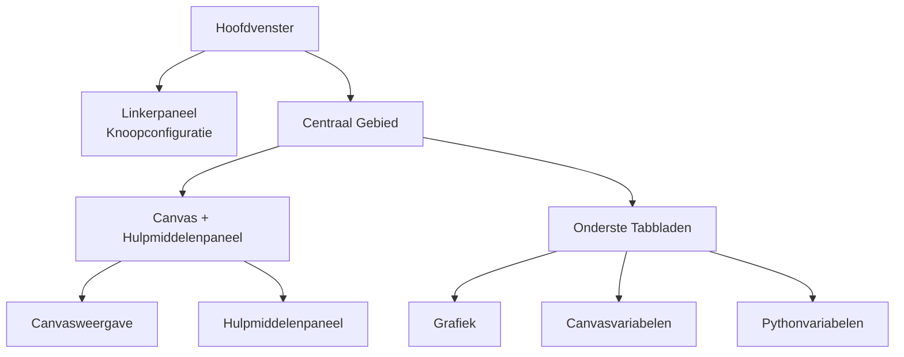

## Anatomie van het Hoofdvenster

FloWorks organiseert het hoofdvenster in **drie functionele zones** die voortkomen uit een duidelijke filosofie:
> *Het midden van het scherm is voor de workflow (het Canvas). Links de configuratie van de geselecteerde knoop. Rechts hulpmiddelen. Onderaan visualisatie en gegevens.*

Deze indeling is niet willekeurig: ze maakt het mogelijk om **flows op te bouwen en uit te voeren zonder het detail uit het oog te verliezen**, waarbij de configuratie van de actieve knoop en de analysehulpmiddelen altijd toegankelijk blijven.

---

### 1. Linkerpaneel: Knoopconfiguratie

Dit paneel, links geplaatst, is **uitsluitend bestemd voor het weergeven en bewerken van de parameters van de knoop die u hebt geselecteerd** op het Canvas.

**Wat u hier ziet:**

- Een **titel** die de functie van het paneel aangeeft.
- De **naam van de geselecteerde knoop** in een gemarkeerd vak. Als er geen knoop is geselecteerd, verschijnt een bericht dat dit aangeeft.
- Een **scrollbaar configuratiegebied** waar de specifieke opties van elke knoop verschijnen (bijvoorbeeld drempelwaarden, signaalnamen, acquisitieparameters, enz.).

**Ontwerpfilosofie:**

- Het paneel is **altijd zichtbaar**; het is geen pop-upvenster.
- Wanneer geen knoop is geselecteerd, wordt een lege ruimte getoond die uitnodigt om er een te selecteren.
- Bij het klikken op een willekeurige knoop op het Canvas wordt dit paneel **automatisch bijgewerkt** om de opties ervan te tonen.

| | |
|:---:|:---:|
|  |  |
| *Linkerpaneel zonder selectie* | *Linkerpaneel met geselecteerde knoop* |

---

### 2. Centraal Gebied: Canvas en Hulpmiddelenpaneel

Het rechtergedeelte is verticaal verdeeld: bovenaan bevindt zich het **Canvas** en onderaan de **onderste tabbladen**.

#### Canvas (Knoopweergave)

Dit is het **visuele hart van FloWorks**. Hier kunt u:

- De knopen plaatsen en verbinden die uw workflow vormen.
- Door het raster navigeren (door te *pannen* of te *zoomen*) om de hele flow te bekijken.
- Knopen selecteren om ze in het linkerpaneel te bewerken.

#### Hulpmiddelenpaneel (Drawer)

Rechts van het Canvas bevindt zich een **uitklapbaar zijpaneel** met hulpmiddelen. U kunt dit openen of sluiten naar behoefte, waardoor ruimte voor het Canvas vrijkomt.

| Pictogram | Hulpmiddel | Waarvoor dient het |
|:-----:|:------------|:----------------|
| 📉 | Analysepanelen | Visualisatie en analyse van signalen (grafieken, metrieken). |
| 🧮 | Wetenschappelijke Rekenmachine | Snelle berekeningen zonder de omgeving te verlaten. |
| 📊 | Rekenblad | Numerieke gegevens in tabelvorm bekijken en manipuleren. |
| 📈 | Prestatiemonitor | Algemene metrieken van de Computer bekijken (CPU-gebruik, geheugen, enz.). |
| 🐍 | Pythonconsole | Directe toegang tot een Python-interpreter voor geavanceerde taken. |

| | | | | |
|:---:|:---:|:---:|:---:|:---:|
|  |  |  |  |  |
| *Analyse* | *Rekenmachine* | *Rekenblad* | *Monitor* | *Pythonconsole* |

**Ontwerpfilosofie:**
Het hulpmiddelenpaneel maakt het mogelijk om **de focus op het Canvas te houden** zonder de toegang tot functies op te geven die u af en toe nodig hebt. Het is een natuurlijke uitbreiding van de workflow, geen permanente afleiding.

[Tutorial Pythonconsole](tutorial-console.md){ .md-button }
[Tutorial Spreadsheet](tutorial-spreadsheet.md){ .md-button .md-button--primary }

---

### 3. Onderste Tabbladen: Grafiek en Variabelen

Onder het Canvas bevindt zich een tabbladgebied dat twee aanvullende weergaven biedt:

#### 📈 Grafiek
- Geeft de door de knopen gegenereerde of verkregen gegevens visueel weer.
- Wordt automatisch bijgewerkt naarmate knopen nieuwe waarden produceren.
- Deelt dezelfde weergave als de Analysepanelen, wat visuele consistentie garandeert.

#### 📋 Canvasvariabelen (Werkruimte)
- Toont een tabel met de **variabelen, signalen of gegevens** die op het Canvas in uw flow aanwezig zijn.
- Wordt in realtime bijgewerkt samen met de grafiek.
- Dit is de "ruwe" weergave van de gegevens: ideaal voor debugging en numerieke verificatie.

#### 📋 Pythonvariabelen (Terminal)
- Toont een tabel met de **variabelen, signalen of gegevens** die in de python-terminal zijn gedeclareerd.
- Wordt in realtime bijgewerkt.
- Toont de afmetingen en eigenschappen van elke opgeslagen variabele.

| |
|:---:|
|  |
| *Tabblad Grafiek* |
|  |
| *Tabblad Canvasvariabelen* |
|  |
| *Tabblad Pythonvariabelen* |

---

### 4. Eigenschappen van de Indeling

- **Verstelbare panelen**
  Zowel de scheiding links/rechts als boven/onder is aan te passen door de randen te slepen, zodat de interface aansluit bij uw workflow.

- **Initiële verhoudingen**
  - Linkerpaneel: **25%** van de totale breedte.
  - Rechtergebied: de overige **75%**.
  - Verticaal neemt het Canvas ongeveer **480 px** in en de onderste tabbladen **320 px** (aanpasbaar).

- **Marges en afstanden**
  De marges zijn minimaal om de werkruimte maximaal te benutten, zonder de leesbaarheid op te offeren.

---

### 5. Reactiviteit van de Interface

FloWorks is ontworpen zodat **alles wat u op het Canvas doet onmiddellijk effect heeft op de panelen**:

- Bij het selecteren van een knoop toont het linkerpaneel de opties ervan.
- Bij het uitvoeren van een flow worden de grafiek en de gegevenstabel automatisch bijgewerkt.
- Bij het verwijderen van een knoop wordt het configuratiepaneel leeggemaakt als dit de geselecteerde knoop was.
- Als de flow niet-opgeslagen wijzigingen bevat, geeft de interface dit visueel aan (bijvoorbeeld met een asterisk in de titel of een indicator).

Deze **reactieve ervaring** voorkomt dat u de weergave handmatig hoeft te vernieuwen: u ziet altijd de meest recente staat van uw werk.

---

### 6. Thema Wisselen Tijdens Gebruik

FloWorks maakt het mogelijk om het visuele thema (licht/donker) te wijzigen **zonder de toepassing te herstarten**. U kunt tijdens het werken tussen themas wisselen en **de interface past zich onmiddellijk aan**, waarbij de staat van uw flow onveranderd blijft.

**Praktisch voordeel:**
Werk met het thema dat het meest comfortabel is voor u, afhankelijk van de lichtomstandigheden of persoonlijke voorkeur, zonder uw sessie te onderbreken.

---

### 7. Internationalisering (Meertaligheid)

Alle teksten in de interface (menu's, titels, knoppen, berichten) zijn voorbereid om **in meerdere talen weergegeven te worden**. FloWorks bevat een vertaalsysteem waarmee u eenvoudig de taal van de toepassing kunt wijzigen, zonder opnieuw te hoeven installeren of herstarten.

**Ontwerpfilosofie:**
Het hulpmiddel is bedoeld voor gebruikers uit verschillende regio's; taal zou geen barrière moeten zijn.

---

> **Visuele samenvatting:** Het scherm is georganiseerd zodat u **alles wat relevant is in één oogopslag ziet**: knopen (midden), knoopconfiguratie (links), hulpmiddelen (rechts, uitklapbaar) en resultaten/gegevens (onder). Alles reactief, met onmiddellijke themawisseling en meertalige ondersteuning.
