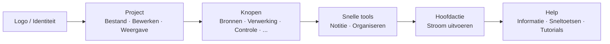

## Hoofdwerkbalk: Organisatie en filosofie

De bovenste werkbalk is het **snelle commandocentrum** van FloWorks. Het ontwerp volgt een werkstroomlogica: van links naar rechts vindt u de acties in de typische volgorde waarin u ze tijdens een sessie nodig heeft.

### Organisatie per groep

De balk is verdeeld in **zes functionele groepen**, gescheiden door subtiele verticale lijnen. Elke groep bundelt gerelateerde acties, zodat u niet hoeft te zoeken in verspreide menu's.

---

### 1. Identiteit (Logo)

Helemaal links ziet u het **FloWorks-logo**. Het is niet alleen decoratief: erop klikken opent het **welkomstdialoog**, dat algemene informatie en de gebruiksfilosofie bevat.

- **Tooltip:** "Informatie en welkomst van FloWorks".

**Filosofie:** Het logo fungeert als toegangspunt tot identiteit en eerste hulp, zonder ruimte in menu's in te nemen.

---

### 2. Project: Bestand, Bewerken en Weergave

Bundelt operaties gerelateerd aan **projectbeheer en uiterlijk van de interface**.

#### 📁 Bestand
- **Nieuw**: maakt een lege stroom.
- **Openen**: laadt een bestaand project.
- **Opslaan / Opslaan als**: slaat de huidige stroom op.
- **Afsluiten**: sluit de toepassing.

#### ✂️ Bewerken
- **Ongedaan maken / Opnieuw uitvoeren**: draait wijzigingen op het Canvas terug of herstelt ze.
- **Knippen / Kopiëren / Plakken**: manipuleert geselecteerde knopen.
- **Voorkeuren**: opent het venster voor globale configuratie.

#### 👁️ Weergave
Dit menu bepaalt hoe de interface eruitziet en zich aanpast aan uw voorkeuren:

- **Taal**: wijzigt de taal van de hele toepassing (menu's, knoppen, berichten).
- **Thema**: schakelt tussen visuele thema's (licht, donker, enz.) in real-time.
- **Lettergrootte**: past de tekstgrootte in de hele interface aan, met vooraf gedefinieerde en aangepaste opties.
- **Logweergave**: toont de interne logboeken van de toepassing (handig voor geavanceerde debugging).

**Filosofie:** Alles wat te maken heeft met "mijn project en mijn werkomgeving" staat bij elkaar, maar is gescheiden van acties die knopen toevoegen of uitvoeren.

---

### 3. Knopen (per categorie)

Deze groep is **automatisch gegenereerd uit de knoopcatalogus** beschikbaar in FloWorks. Het is niet handmatig gecodeerd: als er een nieuwe knoop aan het programma wordt toegevoegd, verschijnt de categorie hier automatisch.

Typische categorieën omvatten:

- **Bronnen** (signaalgeneratoren, data-invoer).
- **Verwerking** (filters, wiskundige transformaties).
- **Controle** (stroomlogica, voorwaarden).
- **Uitgangen** (putten, visualizers, exporteurs).
- En elke andere categorie gedefinieerd door de gemeenschap of uw eigen aangepaste knopen.

**Intelligent gedrag:**

- Als een categorie **één knoop** bevat, toont de balk direct een knop met de naam; klikken voegt die knoop toe aan het Canvas.
- Als deze **meerdere knopen** bevat, wordt een vervolgkeuzemenu getoond met allemaal. Bij het kiezen van er een wordt deze op het Canvas geplaatst.

**Filosofie:** Toegang tot knopen is altijd zichtbaar, zonder een zijpaneel te openen. De balk past zich aan de catalogus aan, houdt consistentie en vermijdt handmatige configuratie.

---

### 4. Snelle tools

Twee knoppen voor directe productiviteit:

- **📝 Plaknotitie**: voegt een visuele notitie toe aan het Canvas om delen van de stroom te documenteren.
- **🔧 Automatisch organiseren**: reorganiseert alle knopen op het Canvas op een nette en leesbare manier met één klik.

**Filosofie:** Het zijn vaak gebruikte acties die het niet verdienen om verborgen te zijn in menu's. Één klik en klaar.

---

### 5. Hoofdactie: Stroom uitvoeren

De knop **Uitvoeren** is visueel geaccentueerd met een gekleurde rand (meestal groen) en een "play"-icoon. Het is de meest opvallende knop op de balk, omdat het de centrale actie van FloWorks vertegenwoordigt: **de datastroom op gang brengen**.

- Bij klikken wordt **de huidige stroom uitgevoerd** en worden de grafiek en de onderste datatabel bijgewerkt.
- De knop verandert licht van uiterlijk bij indrukken, wat tactiele feedback geeft.

**Filosofie:** De belangrijkste actie moet de meest zichtbare zijn. Er hoeft niet door menu's genavigeerd te worden om uit te voeren; het is altijd één klik verwijderd.

---

### 6. Help

Aan het einde van de balk vindt u het menu **Help**, met snelkoppelingen naar:

- **Informatie**: details over versie en project.
- **Sneltoetsen**: een volledige lijst met combinaties voor gevorderde gebruikers.
- **Tutorials**: stap-voor-stap handleidingen om FloWorks te leren.

**Filosofie:** Help is altijd beschikbaar, maar apart gehouden van de werkstroom om niet in de weg te zitten.

---

### Adaptieve kenmerken

- **Directe vertaling**: bij het wijzigen van de taal vanuit het menu Weergave worden **alle teksten op de balk onmiddellijk bijgewerkt**, zonder herstart.
- **Thema's en lettergrootte**: de balk wordt onmiddellijk opnieuw getekend in de nieuwe visuele stijl.
- **Dynamische catalogus**: als er nieuwe knopen aan het programma worden toegevoegd, verschijnen hun categorieën automatisch op de balk, zonder handmatige tussenkomst.

**Samenvatting:** De werkbalk is ontworpen om **intuïtief, snel en aanpasbaar** te zijn. Het volgt de natuurlijke werkstroom: project configureren → bewerken → knopen toevoegen → uitvoeren → help raadplegen. Al het andere blijft uit de weg, maar is toegankelijk wanneer u het nodig heeft.
