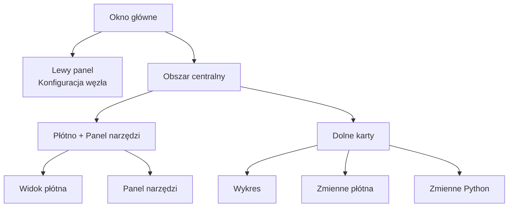

## Anatomia głównego interfejsu

FloWorks organizuje swoje okno główne w **trzy strefy funkcjonalne**, które wynikają z jasnej filozofii:
> *Środek ekranu służy do pracy z przepływem (Płótno). Po lewej stronie znajduje się konfiguracja wybranego węzła. Po prawej narzędzia pomocnicze. Na dole wizualizacja i dane.*

Taki układ nie jest przypadkowy: pozwala **budować i uruchamiać przepływy bez utraty szczegółów**, zachowując zawsze dostęp do konfiguracji aktywnego węzła i narzędzi analitycznych.

---

### 1. Lewy panel: Konfiguracja węzła

Ten panel, umiejscowiony po lewej stronie, jest przeznaczony **wyłącznie do wyświetlania i edycji parametrów węzła, który jest zaznaczony** na Płótnie.

**Co tu zobaczysz:**

- **Tytuł** wskazujący funkcję panelu.
- **Nazwę zaznaczonego węzła** wyróżnioną w ramce. Jeśli żaden węzeł nie jest zaznaczony, pojawi się odpowiedni komunikat.
- **Przewijany obszar konfiguracji**, w którym pojawiają się opcje specyficzne dla każdego węzła (np. wartości progowe, nazwy sygnałów, parametry akwizycji itp.).

**Filozofia projektowania:**

- Panel jest **zawsze widoczny**; nie jest to okno wyskakujące.
- Gdy żaden węzeł nie jest zaznaczony, wyświetlana jest pusta przestrzeń zachęcająca do wyboru węzła.
- Po kliknięciu dowolnego węzła na Płótnie panel ten aktualizuje się **automatycznie**, aby pokazać jego opcje.

| | |
|:---:|:---:|
|  |  |
| *Lewy panel bez zaznaczenia* | *Lewy panel z zaznaczonym węzłem* |

---

### 2. Obszar centralny: Płótno i panel narzędzi

Prawa część jest podzielona pionowo: u góry znajduje się **Płótno**, a na dole **dolne karty**.

#### Płótno (widok węzłów)

To **wizualne serce FloWorks**. Tutaj:

- Umieszczasz i łączysz węzły tworzące Twój przepływ pracy.
- Poruszasz się po siatce (przesuwanie lub powiększenie), aby zobaczyć cały przepływ.
- Zaznaczasz węzły do edycji w lewym panelu.

#### Panel narzędzi (Drawer)

Po prawej stronie Płótna znajduje się **wysuwany panel boczny** zawierający narzędzia pomocnicze. Możesz go otwierać i zamykać według potrzeb, zwalniając przestrzeń dla Płótna.

| Ikona | Narzędzie | Do czego służy |
|:-----:|:------------|:----------------|
| 📉 | Panele analityczne | Wizualizacja i analiza sygnałów (wykresy, metryki). |
| 🧮 | Kalkulator naukowy | Szybkie obliczenia bez opuszczania środowiska. |
| 📊 | Arkusz kalkulacyjny | Przeglądanie i manipulowanie danymi liczbowymi w formacie tabelarycznym. |
| 📈 | Monitor wydajności | Podgląd ogólnych metryk komputera (obciążenie CPU, pamięć itp.). |
| 🐍 | Konsola Python | Bezpośredni dostęp do interpretera Pythona dla zadań zaawansowanych. |

| | | | | |
|:---:|:---:|:---:|:---:|:---:|
|  |  |  |  |  |
| *Analiza* | *Kalkulator* | *Arkusz kalkulacyjny* | *Monitor* | *Konsola Python* |

**Filozofia projektowania:**
Panel narzędzi pozwala **utrzymać skupienie na Płótnie** bez rezygnacji z dostępu do funkcji potrzebnych w określonych momentach. Jest naturalnym rozszerzeniem przepływu pracy, a nie stałym rozpraszaczem uwagi.

[Tutorial Konsola Python](tutorial-console.md){ .md-button }
[Tutorial Spreadsheet](tutorial-spreadsheet.md){ .md-button .md-button--primary }

---

### 3. Dolne karty: Wykres i zmienne

Pod Płótnem znajduje się obszar z kartami, który oferuje dwa uzupełniające się widoki:

#### 📈 Wykres
- Wizualnie przedstawia dane generowane lub pozyskiwane przez węzły.
- Aktualizuje się automatycznie w miarę produkowania nowych wartości przez węzły.
- Współdzieli ten sam widok co Panele analityczne, zapewniając spójność wizualną.

#### 📋 Zmienne płótna (Workspace)
- Wyświetla tabelę z **zmiennymi, sygnałami lub danymi** obecnymi na Płótnie w Twoim przepływie.
- Aktualizuje się w czasie rzeczywistym razem z wykresem.
- To "surowy" widok danych: idealny do debugowania i weryfikacji liczbowej.

#### 📋 Zmienne Python (Terminal)
- Wyświetla tabelę z **zmiennymi, sygnałami lub danymi** zadeklarowanymi w terminalu python.
- Aktualizuje się w czasie rzeczywistym.
- Pokazuje wymiary i właściwości każdej przechowywanej zmiennej.

| |
|:---:|
|  |
| *Karta Wykres* |
|  |
| *Karta Zmienne płótna* |
|  |
| *Karta Zmienne Python* |

---

### 4. Właściwości układu

- **Paneli o zmiennych rozmiarach**
  Zarówno podział lewo/prawo, jak i góra/dół można dostosować przeciągając krawędzie, aby interfejs odpowiadał Twojemu przepływowi pracy.

- **Początkowe proporcje**
  - Lewy panel: **25 %** całkowitej szerokości.
  - Prawy obszar: pozostałe **75 %**.
  - W pionie Płótno zajmuje około **480 px**, a dolne karty **320 px** (można to zmienić).

- **Marginesy i odstępy**
  Marginesy są minimalne, aby w pełni wykorzystać przestrzeń roboczą, nie tracąc przy tym czytelności.

---

### 5. Reaktywność interfejsu

FloWorks zostało zaprojektowane tak, aby **każda czynność na Płótnie natychmiast oddziaływała na panele**:

- Po zaznaczeniu węzła lewy panel pokazuje jego opcje.
- Po uruchomieniu przepływu wykres i tabela danych aktualizują się automatycznie.
- Po usunięciu węzła panel konfiguracji zostaje wyczyszczony, jeśli był to zaznaczony węzeł.
- Jeśli przepływ zawiera niezapisane zmiany, interfejs wskazuje to wizualnie (np. gwiazdką w tytule lub wskaźnikiem).

To **reaktywne doświadczenie** eliminuje konieczność ręcznego odświeżania widoku: zawsze widzisz najnowszy stan swojej pracy.

---

### 6. Zmiana motywu w trakcie pracy

FloWorks umożliwia zmianę motywu wizualnego (jasny/ciemny) **bez ponownego uruchamiania aplikacji**. Możesz przełączać się między motywami podczas pracy, a **interfejs dostosuje się natychmiast**, zachowując stan Twojego przepływu bez zmian.

**Praktyczna korzyść:**
Pracuj z motywem, który jest dla Ciebie najwygodniejszy w zależności od warunków oświetleniowych lub preferencji osobistych, bez przerywania sesji.

---

### 7. Internacjonalizacja (wielojęzyczność)

Wszystkie teksty interfejsu (menu, tytuły, przyciski, komunikaty) są przygotowane do **wyświetlania w wielu językach**. FloWorks zawiera system tłumaczeń, który umożliwia łatwą zmianę języka aplikacji bez konieczności ponownej instalacji lub restartu.

**Filozofia projektowania:**
Narzędzie jest przeznaczone dla użytkowników z różnych regionów; język nie powinien być barierą.

---

> **Podsumowanie wizualne:** Ekran jest zorganizowany tak, abyś widział **wszystko istotne na pierwszy rzut oka**: węzły (środek), konfiguracja węzła (lewo), narzędzia pomocnicze (prawo, wysuwane) oraz wyniki/dane (dół). Wszystko reaktywne, z natychmiastową zmianą motywu i obsługą wielu języków.
