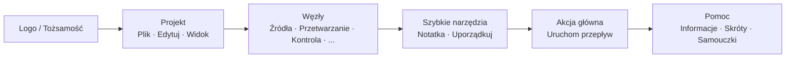

## Główny pasek narzędzi: Organizacja i filozofia

Górny pasek narzędzi to **szybkie centrum dowodzenia** FloWorks. Jego projekt podąża za logiką przepływu pracy: od lewej do prawej znajdziesz akcje w typowej kolejności, w jakiej są potrzebne podczas sesji.

### Organizacja według grup

Pasek jest podzielony na **sześć grup funkcjonalnych**, oddzielonych subtelnymi pionowymi liniami. Każda grupa gromadzi powiązane akcje, abyś nie musiał szukać ich w rozproszonych menu.

---

### 1. Tożsamość (Logo)

Na samym końcu po lewej zobaczysz **logo FloWorks**. Nie jest tylko dekoracyjne: kliknięcie na nie otwiera **okno powitalne**, które zawiera ogólne informacje i filozofię użycia.

- **Tooltip:** "Informacje i powitanie FloWorks".

**Filozofia:** Logo działa jako punkt dostępu do tożsamości i początkowej pomocy, nie zajmując miejsca w menu.

---

### 2. Projekt: Plik, Edytuj i Widok

Grupuje operacje związane z **zarządzaniem projektem i wyglądem interfejsu**.

#### 📁 Plik
- **Nowy**: tworzy pusty przepływ.
- **Otwórz**: ładuje istniejący projekt.
- **Zapisz / Zapisz jako**: zapisuje aktualny przepływ.
- **Zakończ**: zamyka aplikację.

#### ✂️ Edytuj
- **Cofnij / Ponów**: cofa lub przywraca zmiany na Płótnie.
- **Wytnij / Kopiuj / Wklej**: manipuluje wybranymi węzłami.
- **Preferencje**: otwiera okno globalnej konfiguracji.

#### 👁️ Widok
To menu kontroluje, jak interfejs wygląda i dostosowuje się do Twoich preferencji:

- **Język**: zmienia język całej aplikacji (menu, przyciski, komunikaty).
- **Motyw**: przełącza między motywami wizualnymi (jasny, ciemny itp.) w trakcie pracy.
- **Rozmiar czcionki**: dostosowuje rozmiar tekstu w całym interfejsie, z opcjami predefiniowanymi i niestandardowymi.
- **Podgląd logów**: wyświetla wewnętrzne logi aplikacji (przydatne przy zaawansowanym debugowaniu).

**Filozofia:** Wszystko związane z "moim projektem i moim środowiskiem pracy" jest razem, ale oddzielone od akcji dodających lub uruchamiających węzły.

---

### 3. Węzły (według kategorii)

Ta grupa jest **automatycznie generowana z katalogu węzłów** dostępnego w FloWorks. Nie jest zakodowana ręcznie: jeśli dodany zostanie nowy węzeł do programu, jego kategoria pojawi się tu automatycznie.

Typowe kategorie obejmują:

- **Źródła** (generatory sygnałów, wejścia danych).
- **Przetwarzanie** (filtry, transformacje matematyczne).
- **Kontrola** (logika przepływu, warunki).
- **Wyjścia** (ujścia, wizualizery, eksporterzy).
- I dowolna inna kategoria zdefiniowana przez społeczność lub Twoje własne węzły.

**Inteligentne zachowanie:**

- Jeśli kategoria zawiera **jeden węzeł**, pasek wyświetla bezpośrednio przycisk z jego nazwą; kliknięcie dodaje ten węzeł do Płótna.
- Jeśli zawiera **wiele węzłów**, wyświetlane jest menu rozwijane ze wszystkimi. Wybór umieszcza go na Płótnie.

**Filozofia:** Dostęp do węzłów jest zawsze widoczny, bez potrzeby otwierania panelu bocznego. Pasek dostosowuje się do katalogu, zachowując spójność i unikając ręcznej konfiguracji.

---

### 4. Szybkie narzędzia

Dwa przyciski dla bezpośredniej produktywności:

- **📝 Karteczka samoprzylepna**: dodaje wizualną notatkę na Płótno do dokumentowania części przepływu.
- **🔧 Uporządkuj automatycznie**: reorganizuje wszystkie węzły na Płótnie w uporządkowany i czytelny sposób jednym kliknięciem.

**Filozofia:** To akcje często używane, które nie zasługują na bycie ukrytymi w menu. Jedno kliknięcie i gotowe.

---

### 5. Akcja główna: Uruchom przepływ

Przycisk **Uruchom** jest wizualnie wyróżniony kolorową obwódką (zazwyczaj zieloną) i ikoną "odtwórz". To najbardziej rzucające się w oczy przycisk na pasku, ponieważ reprezentuje centralną akcję FloWorks: **uruchomienie przepływu danych**.

- Kliknięcie **uruchamia aktualny przepływ** i aktualizuje wykres oraz dolną tabelę danych.
- Przycisk lekko zmienia wygląd po naciśnięciu, dając dotykową informację zwrotną.

**Filozofia:** Najważniejsza akcja musi być najbardziej widoczna. Nie trzeba przeglądać menu, aby uruchomić; zawsze jest na wyciągnięcie kliknięcia.

---

### 6. Pomoc

Na końcu paska znajdziesz menu **Pomoc** z bezpośrednimi linkami do:

- **Informacje**: szczegóły o wersji i projekcie.
- **Skróty klawiszowe**: pełna lista kombinacji dla zaawansowanych użytkowników.
- **Samouczki**: przewodniki krok po kroku do nauki FloWorks.

**Filozofia:** Pomoc jest zawsze dostępna, ale oddzielona od przepływu pracy, aby nie przeszkadzać.

---

### Właściwości adaptacyjne

- **Natychmiastowe tłumaczenie**: przy zmianie języka z menu Widok **wszystkie teksty na pasku aktualizują się natychmiast**, bez restartu.
- **Motywy i rozmiar czcionki**: pasek przerysowuje się natychmiast w nowym stylu wizualnym.
- **Dynamiczny katalog**: jeśli dodane zostaną nowe węzły do programu, ich kategorie pojawią się automatycznie na pasku, bez ręcznej interwencji.

**Podsumowanie:** Pasek narzędzi jest zaprojektowany, aby być **intuicyjny, szybki i adaptowalny**. Podąża za naturalnym przepływem pracy: skonfiguruj projekt → edytuj → dodaj węzły → uruchom → skonsultuj pomoc. Wszystko inne pozostaje z dala, ale dostępne, gdy jest potrzebne.
