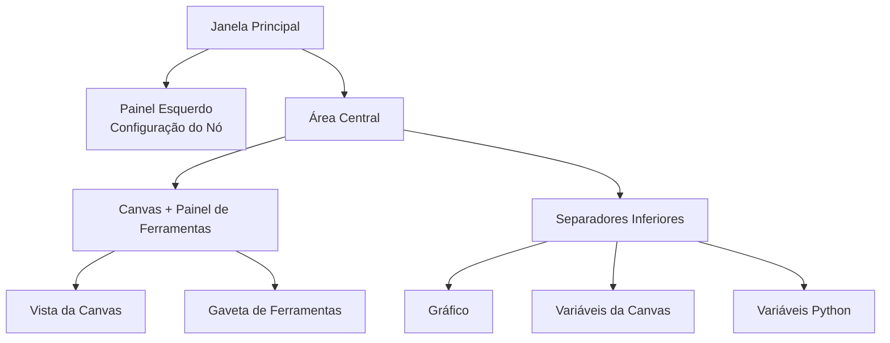

## Anatomia da Interface Principal

O FloWorks organiza a sua janela principal em **três zonas funcionais** que seguem uma filosofia clara:

> *O centro do ecrã é para o fluxo de trabalho (a Canvas). À esquerda, a configuração do nó selecionado. À direita, ferramentas auxiliares. Em baixo, visualização e dados.*

Esta disposição não é arbitrária: permite-lhe **construir e executar fluxos sem perder os detalhes de vista**, mantendo sempre a configuração do nó ativo e as ferramentas de análise ao seu alcance.

---

### 1. Painel Esquerdo: Configuração do Nó

Este painel, localizado à esquerda, é dedicado **exclusivamente a apresentar e editar os parâmetros do nó que selecionou** na Canvas.

**O que vê aqui:**

- Um **título** que indica a função do painel.
- O **nome do nó selecionado** numa caixa destacada. Se nenhum nó estiver selecionado, aparece uma mensagem a indicar isso.
- Uma **área de configuração com scroll** onde são apresentadas as opções específicas de cada nó (por exemplo, valores de limiar, nomes de sinais, parâmetros de aquisição, etc.).

**Filosofia de design:**

- O painel está **sempre visível**; não é uma janela pop-up.
- Quando nenhum nó está selecionado, é mostrado um espaço vazio que o convida a selecionar um.
- Quando clica em qualquer nó na Canvas, este painel atualiza-se **automaticamente** para mostrar as suas opções.

| | |
|:---:|:---:|
|  |  |
| *Painel esquerdo sem seleção* | *Painel esquerdo com nó selecionado* |

---

### 2. Área Central: Canvas e Painel de Ferramentas

A área da direita é dividida verticalmente: a **Canvas** fica em cima e os **separadores inferiores** ficam em baixo.

#### Canvas (Vista de Nós)

Este é o **coração visual do FloWorks**. É aqui que:

- Coloca e liga os nós que formam o seu fluxo de trabalho.
- Navega pela grelha (por *panning* ou *zoom*) para ver todo o fluxo.
- Seleciona nós para os editar no painel esquerdo.

#### Gaveta de Ferramentas (Tool Drawer)

À direita da Canvas existe um **painel lateral recolhível** que contém ferramentas auxiliares. Pode abri-lo ou fechá-lo conforme necessário, libertando espaço para a Canvas.

| Ícone | Ferramenta | Para que serve |
|:-----:|:------------|:----------------|
| 📉 | Painéis de Análise | Visualização e análise de sinais (gráficos, métricas). |
| 🧮 | Calculadora Científica | Cálculos rápidos sem sair do ambiente. |
| 📊 | Folha de Cálculo | Visualizar e manipular dados numéricos em formato tabular. |
| 📈 | Monitor de Desempenho | Ver métricas gerais do computador (uso de CPU, memória, etc.). |
| 🐍 | Consola Python | Acesso direto a um interpretador Python para tarefas avançadas. |

| | | | | |
|:---:|:---:|:---:|:---:|:---:|
|  |  |  |  |  |
| *Análise* | *Calculadora* | *Folha de Cálculo* | *Monitor* | *Consola Python* |

**Filosofia de design:**
O painel de ferramentas permite-lhe **manter o foco na Canvas** sem sacrificar o acesso a funções de que precisa em momentos específicos. É uma extensão natural do fluxo de trabalho, não uma distração permanente.

[Tutorial Consola Python](tutorial-console.md){ .md-button }
[Tutorial Folha de Cálculo](tutorial-spreadsheet.md){ .md-button .md-button--primary }

---

### 3. Separadores Inferiores: Gráfico e Variáveis

Abaixo da Canvas existe uma área com separadores que mostra duas vistas complementares:

#### 📈 Gráfico (Plot)
- Representa visualmente os dados gerados ou adquiridos pelos nós.
- Atualiza-se automaticamente à medida que os nós produzem novos valores.
- Partilha a mesma vista que os Painéis de Análise, garantindo consistência visual.

#### 📋 Variáveis da Canvas (Workspace)
- Apresenta uma tabela com as **variáveis, sinais ou dados** presentes na Canvas do seu fluxo.
- Atualiza-se em tempo real juntamente com o gráfico.
- É a vista "em bruto" dos dados: ideal para depuração e verificação numérica.

#### 📋 Variáveis Python (Terminal)
- Apresenta uma tabela com as **variáveis, sinais ou dados** declarados na consola Python.
- Atualiza-se em tempo real.
- Mostra as dimensões e propriedades de cada variável armazenada.

| |
|:---:|
|  |
| *Separador Gráfico* |
|  |
| *Separador Variáveis da Canvas* |
|  |
| *Separador Variáveis Python* |

---

### 4. Propriedades do Layout

- **Painéis redimensionáveis**
  Tanto a divisão esquerda/direita como a de cima/baixo são ajustáveis arrastando as bordas, para adaptar a interface ao seu fluxo de trabalho.

- **Proporções iniciais**
  - Painel esquerdo: **25%** da largura total.
  - Área direita: **75%** restantes.
  - Verticalmente, a Canvas ocupa aproximadamente **480 px** e os separadores inferiores **320 px** (pode alterar isto).

- **Margens e espaçamento**
  As margens são mínimas para maximizar o espaço de trabalho, sem sacrificar a legibilidade.

---

### 5. Reactividade da Interface

O FloWorks é concebido para que **tudo o que faz na Canvas tenha um efeito imediato nos painéis**:

- Quando seleciona um nó, o painel esquerdo mostra as suas opções.
- Quando executa um fluxo, o gráfico e a tabela de dados atualizam-se automaticamente.
- Quando elimina um nó, o painel de configuração limpa-se se esse era o nó selecionado.
- Se o fluxo tiver alterações não guardadas, a interface indica-o visualmente (por exemplo, com um asterisco no título ou um indicador).

Esta **experiência reativa** evita ter de atualizar a vista manualmente: vê sempre o estado mais recente do seu trabalho.

---

### 6. Mudança de Tema em Tempo Real

O FloWorks permite-lhe alterar o tema visual (claro/escuro) **sem reiniciar a aplicação**. Pode alternar entre temas enquanto trabalha e a **interface adapta-se instantaneamente**, mantendo o estado do seu fluxo intacto.

**Benefício prático:**
Trabalhe com o tema que for mais confortável consoante as condições de iluminação ou preferência pessoal, sem interromper a sua sessão.

---

### 7. Internacionalização (Multilingue)

Todos os textos da interface (menus, títulos, botões, mensagens) estão preparados para **serem apresentados em vários idiomas**. O FloWorks inclui um sistema de tradução que lhe permite alterar o idioma da aplicação facilmente, sem necessidade de reinstalar ou reiniciar.

**Filosofia de design:**
A ferramenta é pensada para utilizadores de diferentes regiões; o idioma não deve ser uma barreira.

---

> **Resumo visual:** O ecrã está organizado para que veja **tudo o que é relevante num relance**: nós (centro), configuração do nó (esquerda), ferramentas auxiliares (direita, recolhíveis) e resultados/dados (em baixo). Tudo é reativo, com mudança de tema instantânea e suporte multilingue.
