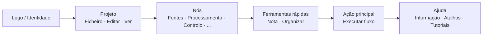

## Barra de Ferramentas Principal: Organização e Filosofia

A barra de ferramentas superior é o **centro de comando rápido** do FloWorks. O seu design segue uma lógica de fluxo de trabalho: da esquerda para a direita, encontra as ações na ordem típica em que as necessita durante uma sessão.

### Organização por grupos

A barra está dividida em **seis grupos funcionais**, separados por linhas verticais subtis. Cada grupo agrupa ações relacionadas para que não tenha de procurar em menus dispersos.

---

### 1. Identidade (Logo)

No extremo esquerdo verá o **logo do FloWorks**. Não é meramente decorativo: ao clicar sobre ele abre-se o **diálogo de boas-vindas**, que inclui informação geral e a filosofia de utilização.

- **Tooltip:** "Informação e boas-vindas do FloWorks".

**Filosofia:** O logo atua como um ponto de acesso à identidade e à ajuda inicial, sem ocupar espaço nos menus.

---

### 2. Projeto: Ficheiro, Editar e Ver

Agrupa as operações relacionadas com a **gestão do projeto e o aspeto da interface**.

#### 📁 Ficheiro
- **Novo**: cria um fluxo em branco.
- **Abrir**: carrega um projeto existente.
- **Guardar / Guardar como**: guarda o fluxo atual.
- **Sair**: fecha a aplicação.

#### ✂️ Editar
- **Desfazer / Refazer**: reverte ou restaura alterações no Canvas.
- **Cortar / Copiar / Colar**: manipula nós selecionados.
- **Preferências**: abre a janela de configuração global.

#### 👁️ Ver
Este menu controla como a interface se apresenta e se adapta às suas preferências:

- **Idioma**: altera o idioma de toda a aplicação (menus, botões, mensagens).
- **Tema**: alterna entre temas visuais (claro, escuro, etc.) em tempo real.
- **Tamanho da letra**: ajusta o tamanho do texto em toda a interface, com opções predefinidas e personalizado.
- **Visualizador de registos**: mostra os logs internos da aplicação (útil para depuração avançada).

**Filosofia:** Tudo relacionado com "o meu projeto e o meu ambiente de trabalho" está junto, mas separado das ações que adicionam ou executam nós.

---

### 3. Nós (por categorias)

Este grupo é **auto-gerado a partir do catálogo de nós** disponível no FloWorks. Não está codificado manualmente: se se adiciona um novo nó ao programa, a sua categoria aparece automaticamente aqui.

As categorias típicas incluem:

- **Fontes** (geradores de sinais, entradas de dados).
- **Processamento** (filtros, transformações matemáticas).
- **Controlo** (lógica de fluxo, condicionais).
- **Saídas** (sumidouros, visualizadores, exportadores).
- E qualquer outra categoria definida pela comunidade ou pelos seus próprios nós personalizados.

**Comportamento inteligente:**

- Se uma categoria contém **um único nó**, a barra mostra diretamente um botão com o seu nome; ao clicar, esse nó é adicionado ao Canvas.
- Se contém **vários nós**, é mostrado um menu pendente com todos eles. Ao escolher um, é colocado no Canvas.

**Filosofia:** O acesso aos nós está sempre visível, sem necessidade de abrir um painel lateral. A barra adapta-se ao catálogo, mantendo a coerência e evitando configurações manuais.

---

### 4. Ferramentas rápidas

Dois botões de produtividade direta:

- **📝 Nota adesiva**: adiciona uma nota visual ao Canvas para documentar partes do fluxo.
- **🔧 Organizar automaticamente**: reorganiza todos os nós do Canvas de forma ordenada e legível com um único clique.

**Filosofia:** São ações que se usam com frequência e que não merecem estar escondidas em menus. Um clique e pronto.

---

### 5. Ação principal: Executar fluxo

O botão **Executar** está destacado visualmente com uma margem de cor (normalmente verde) e um ícone de "play". É o botão mais chamativo da barra, porque representa a ação central do FloWorks: **colocar em marcha o fluxo de dados**.

- Ao clicar, **executa o fluxo atual** e atualiza o gráfico e a tabela de dados inferiores.
- O botão muda ligeiramente de aspeto ao ser pressionado, dando retroação tátil.

**Filosofia:** A ação mais importante deve ser a mais visível. Não há que navegar por menus para executar; está sempre a um clique.

---

### 6. Ajuda

No final da barra, encontra o menu de **Ajuda**, com acessos diretos a:

- **Informação**: detalhes sobre a versão e o projeto.
- **Atalhos de teclado**: uma lista completa de combinações para utilizadores avançados.
- **Tutoriais**: guias passo a passo para aprender o FloWorks.

**Filosofia:** A ajuda está sempre disponível, mas afastada do fluxo de trabalho para não atrapalhar.

---

### Características adaptativas

- **Tradução instantânea**: ao alterar o idioma desde o menu Ver, **todos os textos da barra atualizam-se no momento**, sem reiniciar.
- **Temas e tamanho da letra**: a barra redesenha-se com o novo estilo visual de imediato.
- **Catálogo dinâmico**: se se adicionam novos nós ao programa, as suas categorias aparecem automaticamente na barra, sem intervenção manual.

**Resumo:** A barra de ferramentas está concebida para ser **intuitiva, rápida e adaptável**. Segue o fluxo natural de trabalho: configurar projeto → editar → adicionar nós → executar → consultar ajuda. Todo o resto fica fora do caminho, mas acessível quando necessário.
