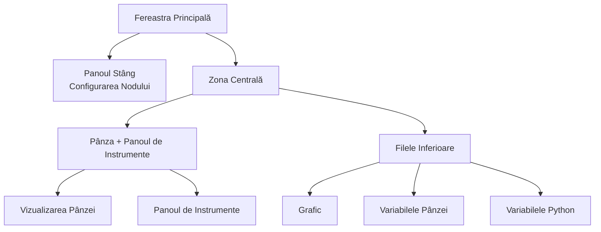

## Anatomia Interfeței Principale

FloWorks își organizează fereastra principală în **trei zone funcționale** care se bazează pe o filozofie clară:
> *Centrul ecranului este destinat fluxului de lucru (Pânza). În stânga, configurarea nodului selectat. În dreapta, instrumente auxiliare. Jos, vizualizare și date.*

Această dispunere nu este arbitrară: permite **construirea și executarea fluxurilor fără a pierde din vedere detaliile**, menținând întotdeauna accesibile configurarea nodului activ și instrumentele de analiză.

---

### 1. Panoul Stâng: Configurarea Nodului

Acest panou, situat în stânga, este dedicat **exclusiv afișării și editării parametrilor nodului pe care l-ați selectat** pe Pânză.

**Ce vedeți aici:**

- Un **titlu** care indică funcția panoului.
- **Numele nodului selectat** într-un chenar evidențiat. Dacă nu este selectat niciun nod, apare un mesaj care indică acest lucru.
- O **zonă de configurare derulantă** unde apar opțiunile specifice fiecărui nod (de exemplu, valori prag, denumiri de semnale, parametri de achiziție etc.).

**Filozofia designului:**

- Panoul este **întotdeauna vizibil**; nu este o fereastră pop-up.
- Când nu este selectat niciun nod, se afișează un spațiu gol care invită la selectarea unuia.
- La clic pe orice nod de pe Pânză, acest panou se actualizează **automat** pentru a-i afișa opțiunile.

| | |
|:---:|:---:|
|  |  |
| *Panoul stâng fără selecție* | *Panoul stâng cu nod selectat* |

---

### 2. Zona Centrală: Pânza și Panoul de Instrumente

Zona din dreapta este divizată vertical: sus se află **Pânza**, iar jos **filele inferioare**.

#### Pânza (Vizualizarea Nodurilor)

Este **inima vizuală a FloWorks**. Aici:

- Plasați și conectați nodurile care formează fluxul dumneavoastră de lucru.
- Vă deplasați prin grilă (prin *pan* sau *zoom*) pentru a vedea întregul flux.
- Selectați noduri pentru a le edita în panoul din stânga.

#### Panoul de Instrumente (Drawer)

În dreapta Pânzei se află un **panou lateral pliabil** care conține instrumente auxiliare. Îl puteți deschide sau închide după necesități, eliberând astfel spațiu pentru Pânză.

| Pictogramă | Instrument | La ce servește |
|:-----:|:------------|:----------------|
| 📉 | Panouri de Analiză | Vizualizarea și analiza semnalelor (grafice, metrici). |
| 🧮 | Calculator Științific | Calcule rapide fără a părăsi mediul de lucru. |
| 📊 | Foaie de Calcul | Vizualizarea și manipularea datelor numerice în format tabelar. |
| 📈 | Monitor de Performanță | Vizualizarea metricilor generale ale Calculatorului (utilizare CPU, memorie etc.). |
| 🐍 | Consolă Python | Acces direct la un interpretor Python pentru sarcini avansate. |

| | | | | |
|:---:|:---:|:---:|:---:|:---:|
|  |  |  |  |  |
| *Analiză* | *Calculator* | *Foaie de calcul* | *Monitor* | *Consolă Python* |

**Filozofia designului:**
Panoul de instrumente permite **menținerea focalizării pe Pânză** fără a renunța la accesul la funcțiile de care aveți nevoie în anumite momente. Este o extensie naturală a fluxului de lucru, nu o distragere permanentă.

[Tutorial Consolă Python](tutorial-console.md){ .md-button }
[Tutorial Spreadsheet](tutorial-spreadsheet.md){ .md-button .md-button--primary }

---

### 3. Filele Inferioare: Grafic și Variabile

Sub Pânză se află o zonă cu file care afișează două perspective complementare:

#### 📈 Grafic
- Reprezintă vizual datele generate sau achiziționate de noduri.
- Se actualizează automat pe măsură ce nodurile produc valori noi.
- Partajează aceeași vizualizare cu Panourile de Analiză, garantând coerența vizuală.

#### 📋 Variabilele Pnzei (Workspace)
- Afișează un tabel cu **variabilele, semnalele sau datele** prezente pe Pânză în fluxul dumneavoastră.
- Se actualizează în timp real împreună cu graficul.
- Este vederea "brută" a datelor: ideală pentru depanare și verificare numerică.

#### 📋 Variabilele Python (Terminal)
- Afișează un tabel cu **variabilele, semnalele sau datele** declarate în terminalul python.
- Se actualizează în timp real.
- Afișează dimensiunile și proprietățile fiecărei variabile stocate.

| |
|:---:|
|  |
| *Filă Grafic* |
|  |
| *Filă Variabile Pânză* |
|  |
| *Filă Variabile Python* |

---

### 4. Proprietățile Layout-ului

- **Panouri redimensionabile**
  Atât separarea stânga/dreapta, cât și cea sus/jos sunt ajustabile prin tragerea marginilor, pentru a adapta interfața la fluxul dumneavoastră de lucru.

- **Proporții inițiale**
  - Panoul stâng: **25%** din lățimea totală.
  - Zona dreaptă: **75%** rămași.
  - Pe verticală, Pânza ocupă aproximativ **480 px**, iar filele inferioare **320 px** (se pot modifica).

- **Margini și spațieri**
  Marginile sunt minime pentru a valorifica la maximum spațiul de lucru, fără a sacrifica lizibilitatea.

---

### 5. Reactivitatea Interfeței

FloWorks este conceput astfel încât **orice acțiune pe Pânză să aibă un efect imediat în panouri**:

- La selectarea unui nod, panoul stâng îi afișează opțiunile.
- La executarea unui flux, graficul și tabela de date se actualizează automat.
- La ștergerea unui nod, panoul de configurare se curăță dacă era nodul selectat.
- Dacă fluxul are modificări nesalvate, interfața indică acest lucru vizual (de exemplu, cu un asterisc în titlu sau un indicator).

Această **experiență reactivă** evită necesitatea de a reîmprospăta manual vizualizarea: vedeți întotdeauna starea cea mai recentă a lucrării dumneavoastră.

---

### 6. Schimbarea Temei în Timp Real

FloWorks permite schimbarea temei vizuale (deschisă/întunecată) **fără a reporni aplicația**. Puteți alterna între teme în timp ce lucrați și **interfața se adaptează instantaneu**, menținând intactă starea fluxului dumneavoastră.

**Beneficiu practic:**
Lucrați cu tema care vă este mai confortabilă în funcție de condițiile de iluminare sau preferințele personale, fără a întrerupe sesiunea.

---

### 7. Internaționalizare (Multi-limbă)

Toate textele interfeței (meniuri, titluri, butoane, mesaje) sunt pregătite pentru **a fi afișate în mai multe limbi**. FloWorks include un sistem de traducere care permite schimbarea limbii aplicației cu ușurință, fără a fi necesară reinstalarea sau repornirea.

**Filozofia designului:**
Instrumentul este conceput pentru utilizatori din diferite regiuni; limba nu ar trebui să fie o barieră.

---

> **Rezumat vizual:** Ecranul este organizat astfel încât să vedeți **tot ce este relevant dintr-o privire**: noduri (centru), configurarea nodului (stânga), instrumente auxiliare (dreapta, pliabile) și rezultate/date (jos). Totul reactiv, cu schimbare instantanee a temei și suport multi-limbă.
