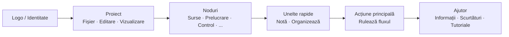

## Bară de unelte principală: Organizare și filozofie

Bara de unelte superioară este **centrul de comandă rapidă** al FloWorks. Designul său urmează o logică a fluxului de lucru: de la stânga la dreapta, veți găsi acțiunile în ordinea tipică în care aveți nevoie de ele în timpul unei sesiuni.

### Organizare pe grupuri

Bara este împărțită în **șase grupuri funcționale**, separate prin linii verticale subtile. Fiecare grup grupează acțiuni legate, astfel încât să nu trebuiască să le căutați în meniuri dispersate.

---

### 1. Identitate (Logo)

La extremitatea stângă veți vedea **logo-ul FloWorks**. Nu este decorativ: la clic pe el se deschide **dialogul de bun venit**, care include informații generale și filozofia de utilizare.

- **Tooltip:** "Informații și bun venit FloWorks".

**Filozofie:** Logo-ul acționează ca un punct de acces la identitate și ajutorul inițial, fără a ocupa spațiu în meniuri.

---

### 2. Proiect: Fișier, Editare și Vizualizare

Grupează operațiunile legate de **gestionarea proiectului și aspectul interfeței**.

#### 📁 Fișier
- **Nou**: creează un flux gol.
- **Deschide**: încarcă un proiect existent.
- **Salvează / Salvează ca**: salvează fluxul curent.
- **Ieșire**: închide aplicația.

#### ✂️ Editare
- **Anulează / Refă**: revine sau restaurează modificările pe Panză.
- **Taie / Copiază / Lipește**: manipulează nodurile selectate.
- **Preferințe**: deschide fereastra de configurare globală.

#### 👁️ Vizualizare
Acest meniu controlează cum se vede și se adaptează interfața la preferințele dumneavoastră:

- **Limbă**: schimbă limba întregii aplicații (meniuri, butoane, mesaje).
- **Temă**: comută între temele vizuale (deschis, întunecat etc.) în timp real.
- **Dimensiune font**: ajustează dimensiunea textului în întreaga interfață, cu opțiuni predefinite și personalizate.
- **Vizualizator jurnale**: afișează jurnalele interne ale aplicației (util pentru depanare avansată).

**Filozofie:** Tot ce ține de "proiectul meu și mediul meu de lucru" este la un loc, dar separat de acțiunile care adaugă sau execută noduri.

---

### 3. Noduri (pe categorii)

Acest grup este **auto-generat din catalogul de noduri** disponibil în FloWorks. Nu este codat manual: dacă se adaugă un nod nou în program, categoria sa apare automat aici.

Categoriile tipice includ:

- **Surse** (generatoare de semnale, intrări de date).
- **Prelucrare** (filtre, transformări matematice).
- **Control** (logică de flux, condiționale).
- **Ieșiri** (colectoare, vizualizatoare, exportatoare).
- Și orice altă categorie definită de comunitate sau de nodurile personalizate.

**Comportament inteligent:**

- Dacă o categorie conține **un singur nod**, bara afișează direct un buton cu numele său; la clic, acel nod este adăugat pe Pânză.
- Dacă conține **mai multe noduri**, se afișează un meniu derulant cu toate. La alegerea unuia, se plasează pe Pânză.

**Filozofie:** Accesul la noduri este întotdeauna vizibil, fără a deschide un panou lateral. Bara se adaptează catalogului, menținând coerența și evitând configurările manuale.

---

### 4. Unelte rapide

Două butoane de productivitate directă:

- **📝 Notă adezivă**: adaugă o notă vizuală pe Pânză pentru a documenta părți ale fluxului.
- **🔧 Organizează automat**: reorganizează toate nodurile de pe Pânză într-un mod ordonat și lizibil cu un singur clic.

**Filozofie:** Sunt acțiuni frecvent utilizate care nu merită să fie ascunse în meniuri. Un clic și gata.

---

### 5. Acțiune principală: Rulează fluxul

Butonul **Rulează** este evidențiat vizual cu o bordură colorată (de obicei verde) și o pictogramă "play". Este cel mai atrăgător buton de pe bară, deoarece reprezintă acțiunea centrală a FloWorks: **punerea în mișcare a fluxului de date**.

- La clic, se **execută fluxul curent** și se actualizează graficul și tabelul de date inferior.
- Butonul își schimbă ușor aspectul la apăsare, oferind feedback tactil.

**Filozofie:** Cea mai importantă acțiune trebuie să fie cea mai vizibilă. Nu trebuie să navighezi prin meniuri pentru a executa; este întotdeauna la un clic distanță.

---

### 6. Ajutor

La capătul barei, veți găsi meniul **Ajutor**, cu accesuri directe la:

- **Informații**: detalii despre versiune și proiect.
- **Scurtături de tastatură**: o listă completă de combinații pentru utilizatori avansați.
- **Tutoriale**: ghiduri pas cu pas pentru a învăța FloWorks.

**Filozofie:** Ajutorul este întotdeauna disponibil, dar separat de fluxul de lucru pentru a nu deranja.

---

### Caracteristici adaptive

- **Traducere instantanee**: la schimbarea limbii din meniul Vizualizare, **toate textele de pe bară se actualizează pe loc**, fără repornire.
- **Teme și dimensiune font**: bara se redesenează imediat în noul stil vizual.
- **Catalog dinamic**: dacă se adaugă noduri noi în program, categoriile lor apar automat pe bară, fără intervenție manuală.

**Rezumat:** Bara de unelte este proiectată să fie **intuitivă, rapidă și adaptabilă**. Urmează fluxul natural de lucru: configurează proiectul → editează → adaugă noduri → execută → consultă ajutorul. Tot restul rămâne în afara drumului, dar accesibil când ai nevoie.
