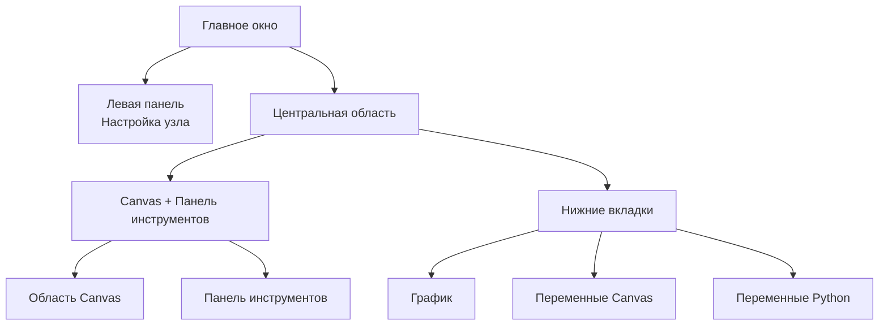

## Анатомия главного интерфейса

FloWorks организует главное окно в **три функциональные зоны**, следуя чёткой философии:

> *Центр экрана отведён рабочему пространству (Canvas). Слева — настройка выбранного узла. Справа — вспомогательные инструменты. Снизу — визуализация и данные.*

Такое расположение не случайно: оно позволяет **создавать и запускать потоки, не теряя деталей из виду**, всегда держа под рукой настройки активного узла и инструменты анализа.

---

### 1. Левая панель: Настройка узла

Эта панель, расположенная слева, предназначена **исключительно для отображения и редактирования параметров узла, выбранного** на Canvas.

**Что здесь отображается:**

- **Заголовок**, указывающий назначение панели.
- **Имя выбранного узла** в выделенном поле. Если ни один узел не выбран, появляется соответствующее сообщение.
- **Прокручиваемая область настройки**, где отображаются специфические параметры каждого узла (например, пороговые значения, названия сигналов, параметры захвата данных и т.д.).

**Философия дизайна:**

- Панель **всегда видима**; это не всплывающее окно.
- Когда ни один узел не выбран, отображается пустое пространство, приглашающее выбрать узел.
- При щелчке по любому узлу на Canvas эта панель **автоматически обновляется**, чтобы показать его параметры.

| | |
|:---:|:---:|
|  |  |
| *Левая панель без выбора* | *Левая панель с выбранным узлом* |

---

### 2. Центральная область: Canvas и панель инструментов

Правая область разделена вертикально: сверху находится **Canvas**, а снизу — **нижние вкладки**.

#### Canvas (Область узлов)

Это **визуальное сердце FloWorks**. Здесь вы можете:

- Размещать и соединять узлы, формирующие ваш поток обработки.
- Перемещаться по сетке (панорамированием или масштабированием), чтобы видеть весь поток.
- Выбирать узлы для редактирования на левой панели.

#### Панель инструментов (Tool Drawer)

Справа от Canvas находится **скрываемая боковая панель**, содержащая вспомогательные инструменты. Вы можете открывать или закрываь её по мере необходимости, освобождая место для Canvas.

| Значок | Инструмент | Назначение |
|:-----:|:------------|:----------------|
| 📉 | Панели анализа | Визуализация и анализ сигналов (графики, метрики). |
| 🧮 | Научный калькулятор | Быстрые вычисления, не покидая среду. |
| 📊 | Таблица данных | Просмотр и обработка числовых данных в табличном формате. |
| 📈 | Монитор производительности | Просмотр общих показателей компьютера (загрузка ЦП, память и т.д.). |
| 🐍 | Консоль Python | Прямой доступ к интерпретатору Python для расширенных задач. |

| | | | | |
|:---:|:---:|:---:|:---:|:---:|
|  |  |  |  |  |
| *Анализ* | *Калькулятор* | *Таблица* | *Монитор* | *Консоль Python* |

**Философия дизайна:**
Панель инструментов позволяет **сохранять фокус на Canvas**, не жертвуя доступом к функциям, которые нужны в конкретные моменты. Это естественное расширение потока обработки, а не постоянное отвлечение.

[Tutorial Python Console](tutorial-console.md){ .md-button }
[Tutorial Spreadsheet](tutorial-spreadsheet.md){ .md-button .md-button--primary }

---

### 3. Нижние вкладки: График и переменные

Под Canvas расположена область с вкладками, отображающая два дополняющих друг друга представления:

#### 📈 График (Plot)
- Визуально отображает данные, сгенерированные или захваченные узлами.
- Автоматически обновляется по мере того, как узлы производят новые значения.
- Использует то же представление, что и панели анализа, обеспечивая визуальную согласованность.

#### 📋 Переменные Canvas (Рабочее пространство)
- Отображает таблицу с **переменными, сигналами или днными** на Canvas, присутствующими в вашем потоке.
- Обновляется в реальном времени вместе с графиком.
- Это "сырой" вид данных: идеально подходит для отладки и числовой проверки.

#### 📋 Переменные Python (Терминал)
- Отображает таблицу с **переменными, сигналами или данными**, объявленными в терминале Python.
- Обновляется в реальном времени.
- Показывает размерности и свойства каждой сохранённой переменной.

| |
|:---:|
|  |
| *Вкладка графика* |
|  |
| *Вкладка переменных Canvas* |
|  |
| *Вкладка переменных Python* |

---

### 4. Свойства расположения

- **Изменяемые размеры панелей**
  Как разделение слева/справа, так и разделение сверху/снизу регулируются перетаскиванием границ, чтобы адаптировать интерфейс под ваш рабочий процесс.

- **Начальные пропорции**
  - Левая панель: **25%** от общей ширины.
  - Правая область: оставшиеся **75%**.
  - По вертикали Canvas занимает примерно **480 px**, а нижние вкладки — **320 px** (вы можете изменить это).

- **Поля и интервалы**
  Поля минимальны, чтобы максимизировать рабочее пространство, не жертвуя читаемостью.

---

### 5. Реактивность интерфейса

FloWorks спроектирован так, что **любое действие на Canvas немедленно отражается на панелях**:

- При выборе узла левая панель показывает его параметры.
- При запуске потока график и таблица данных обновляются автоматически.
- При удалении узла панель настройки очищается, если это был выбранный узел.
- Если в потоке есть несохранённые изменения, интерфейс визуально об этом сигнализирует (например, звёздочкой в заголовке или индикатором).

Этот **реактивный опыт** избавляет от необходимости вручную обновлять вид: вы всегда видите самое актуальное состояние вашей работы.

---

### 6. Мгновенное переключение темы

FloWorks позволяет менять визуальную тему (светлая/тёмная) **без перезапуска приложения**. Вы можете переключаться между темами прямо во время работы, и **интерфейс адаптируется мгновенно**, сохраняя состояние вашего потока нетронутым.

**Практическая польза:**
Работайте с темой, которая наиболее комфортна в зависимости от условий освещения или личных предпочтений, не прерывая сеанс.

---

### 7. Интернационализация (Многоязычность)

Все тексты интерфейса (меню, заголовки, кнопки, сообщения) подготовлены для **отображения на нескольких языках**. FloWorks включает систему перевода, позволяющую легко менять язык приложения без необходимости переустановки или перезапуска.

**Философия дизайна:**
Инструмент рассчитан на пользователей из разных регионов; язык не должен быть барьером.

---

> **Визуальная сводка:** Экран организован так, что вы видите **всё важное одним взглядом**: узлы (в центре), настройку узла (слева), вспомогательные инструменты (справа, скрываемые) и результаты/данные (снизу). Всё реактивно, с мгновенным переключением тем и поддержкой нескольких языков.
