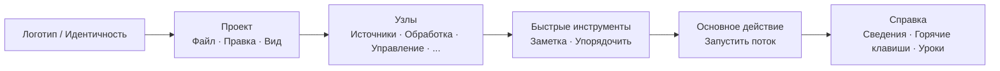

## Главная панель инструментов: Организация и философия

Верхняя панель инструментов — это **центр быстрого управления** FloWorks. Её дизайн следует логике рабочего потока: слева направо вы найдёте действия в том порядке, в котором обычно нуждаетесь в них во время сеанса.

### Организация по группам

Панель разделена на **шесть функциональных групп**, разделённых тонкими вертикальными линиями. Каждая группа объединяет связанные действия, чтобы не приходилось искать их в разрозненных меню.

---

### 1. Идентичность (Логотип)

На крайнем левом краю вы увидите **логотип FloWorks**. Он не просто декоративен: щелчок по нему открывает **диалог приветствия**, включающий общую информацию и философию использования.

- **Подсказка:** "Информация и приветствие FloWorks".

**Философия:** Логотип служит точкой доступа к идентичности и начальной справке, не занимая место в еню.

---

### 2. Проект: Файл, Правка и Вид

Объединяет операции, связанные с **управлением проектом и внешним видом интерфейса**.

#### 📁 Файл
- **Создать**: создаёт пустой поток.
- **Открыть**: загружает существующий проект.
- **Сохранить / Сохранить как**: сохраняет текущий поток.
- **Выход**: закрывает приложение.

#### ✂️ Правка
- **Отменить / Повторить**: отменяет или восстанавливает изменения на холсте.
- **Вырезать / Копировать / Вставить**: управляет выделенными узлами.
- **Настройки**: открывает окно глобальной конфигурации.

#### 👁️ Вид
Это меню управляет те, как выглядит и адаптируется интерфейс к вашим предпочтениям:

- **Язык**: меняет язык всего приложения (меню, кнопки, сообщения).
- **Тема**: переключает между визуальными темами (светлая, тёмная и т.д.) на лету.
- **Размер шрифта**: настраивает размер текста во всём интерфейсе, с предустановленными и пользовательскими вариантами.
- **Просмотрщик журналов**: показывает внутренние журналы приложения (полезно для расширенной отладки).

**Философия:** Всё, что связано с "моим проектом и моим рабочим окружением", находится рядом, но отделено от действий, которые добавляют или запускают узлы.

---

### 3. Узлы (по категориям)

Эта группа **автоматичски генерируется из каталога узлов**, доступного в FloWorks. Она не прописана вручную: если в программу добавляется новый узел, его категория появляется здесь автоматически.

Типичные категории включают:

- **Источники** (генераторы сигналов, входы данных).
- **Обработка** (фильтры, математические пробразования).
- **Управление** (логика потока, условные операторы).
- **Выходы** (приёмники, визуализаторы, экспортёры).
- И любые другие категории, определённые сообществом или вашими собственными пользовательскими узлами.

**Умное поведение:**

- Если категория содержит **один узел**, панель показывает сразу кнопку с его именем; при щелчке этот узел добавляется на холст.
- Если содержит **несколько узлов**, отображается раскрывающееся меню со всеми ними. При выборе одного он помещается на холст.

**Философия:** Доступ к узлам всегда виден, без необходимости открывать боковую панель. Панель адаптируется к каталогу, сохраняя согласованност и избегая ручной настройки.

---

### 4. Быстрые инструменты

Две кнопки для прямого повышения продуктивности:

- **📝 Стикер**: добавляет визуальную заметку на холст для документирования частей потока.
- **🔧 Автоупорядочивание**: одним щелчком реорганизует все узлы на холсте в аккуратном и читаемом порядке.

**Философия:** Это действия, которые используются часто и не заслуживают того, чтобы быть спрятанными в меню. Один щелчок — и готово.

---

### 5. Основное действие: Запустить поток

Кнопка **Запустить** визуально выделена цветной рамкой (обычно зелёной) и значком "play". Это самая заметная кнопка на панели, потому что она представляет центральное действие FloWorks: **запустить поток данных**.

- При щелчке **выполняется текущий поток** и обновляются график и таблица данных внизу.
- Кнопка слегка меняет внешний вид при нажатии, давая тактильную обратную связь.

**Философия:** Самое важное действие должно быть самым заметным. Не нужно лазить по меню для запуска; всегда доступно одним щелчком.

---

### 6. Справка

В конце панели находится меню **Справка**, с прямыми ссылками на:

- **Сведения**: подробности о версии и проекте.
- **Горячие кавиши**: полный список комбинаций для продвинутых пользователей.
- **Уроки**: пошаговые руководства для изучения FloWorks.

**Философия:** Справка всегда доступна, но отстранена от рабочего потока, чтобы не мешать.

---

### Адаптивные характеристики

- **Мговенный перевод**: при смене языка из меню Вид **все тексты панели обновляются мгновенно**, без перезапуска.
- **Темы и размер шрифта**: панель немедленно перерисовывается с новым визуальным стилем.
- **Динамический каталог**: если в программу добавляются новые узлы, их категории появляются на панели автоматически, без ручного вмешательства.

**Резюме:** Панель инструментов спроектирована так, чтобы быть **интуитивной, быстрой и адаптивной**. Она следует естественному рабочему потоку: настроить проект → редактировать → добавить узлы → запустить → обратиться к справке. Всё остальное убрано с дороги, но доступно, когда оно нужно.
