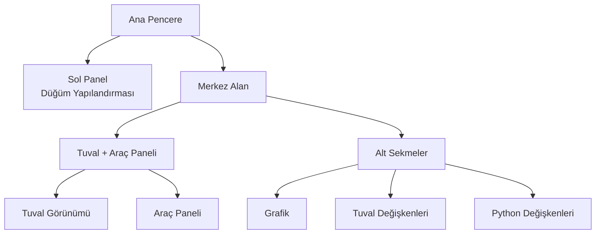

## Ana Arayüzün Anatomisi

FloWorks, ana penceresini net bir felsefeye dayanan **üç işlevsel bölge** halinde düzenler:
> *Ekranın merkezi iş akışı içindir (Tuval). Solda, seçili düğümün yapılandırması. Sağda, yardımcı araçlar. Altta, görselleştirme ve veriler.*

Bu düzen tesadüfi değildir: **detayı gözden kaybetmeden akışları oluşturmanıza ve çalıştırmanıza** olanak tanır; aktif düğümün yapılandırması ve analiz araçları her zaman erişilebilir kalır.

---

### 1. Sol Panel: Düğüm Yapılandırması

Bu panel, solda yer alır ve **yalnızca Tuvale seçili düğümün parametrelerini göstermek ve düzenlemek** için ayrılmıştır.

**Burada görecekleriniz:**

- Panelin işlevini belirten bir **başlık**.
- Vurgulu bir kutuda **seçili düğümün adı**. Hiçbir düğüm seçili değilse, bunu belirten bir mesaj görünür.
- Her düğüm için özel seçeneklerin (örneğin eşik değerleri, sinyal adları, edinim parametreleri vb.) göründüğü **kaydırılabilir bir yapılandırma alanı**.

**Tasarım felsefesi:**

- Panel **her zaman görünür**; açılır pencere değildir.
- Hiçbir düğüm seçili değilken, bir düğüm seçmeye davet eden boş bir alan gösterilir.
- Tuvaleki herhangi bir düğüme tıkladığınızda, bu panel seçeneklerini göstermek üzere **otomatik olarak güncellenir**.

| | |
|:---:|:---:|
|  |  |
| *Seçim olmadan sol panel* | *Seçili düğümle sol panel* |

---

### 2. Merkez Alan: Tuval ve Araç Paneli

Sağ alan dikey olarak bölünmüştür: üstte **Tuval**, altta **alt sekmeler** bulunur.

#### Tuval (Düğüm Görünümü)

Bu, **FloWorks'ün görsel kalbidir**. Burada:

- İş akışınızı oluşturan düğümleri yerleştirir ve bağlarsınız.
- Tüm akışı görmek için ızgarada dolaşırsınız (*pan* veya *zoom* yaparak).
- Sol panelde düzenlemek üzere düğümler seçersiniz.

#### Araç Paneli (Çekmece)

Tuvalin sağında, yardımcı araçları içeren **açılır bir yan panel** bulunur. Tuval için alan açmak amacıyla gerektiğinde açıp kapatabilirsiniz.

| Simge | Araç | Amaç |
|:-----:|:------------|:----------------|
| 📉 | Analiz Panelleri | Sinyallerin görselleştirilmesi ve analizi (grafikler, ölçümler). |
| 🧮 | Bilimsel Hesap Makinesi | Ortamdan çıkmadan hızlı hesaplamalar. |
| 📊 | Hesap Tablosu | Sayısal verileri tablo biçiminde görüntüleme ve düzenleme. |
| 📈 | Performans Monitörü | Bilgisayarın genel ölçümlerini (CPU kullanımı, bellek vb.) görme. |
| 🐍 | Python Konsolu | Gelişmiş görevler için doğrudan bir Python yorumlayıcısına erişim. |

| | | | | |
|:---:|:---:|:---:|:---:|:---:|
|  |  |  |  |  |
| *Analiz* | *Hesap makinesi* | *Hesap tablosu* | *Monitör* | *Python konsolu* |

**Tasarım felsefesi:**
Araç paneli, **odak noktasını Tuvale tutarken** zaman zaman ihtiyaç duyduğunuz işlevlere erişimi kaybetmemenizi sağlar. İş akışının doğal bir uzantısıdır, kalıcı bir dikkat dağıtıcı değil.

[Python Konsolu Eğitimi](tutorial-console.md){ .md-button }
[Spreadsheet Eğitimi](tutorial-spreadsheet.md){ .md-button .md-button--primary }

---

### 3. Alt Sekmeler: Grafik ve Değişkenler

Tuvalin altında, birbirini tamamlayan iki görünüm sunan bir sekme alanı bulunur:

#### 📈 Grafik
- Düğümler tarafından üretilen veya edinilen verileri görsel olarak temsil eder.
- Düğümler yeni değerler ürettikçe otomatik olarak güncellenir.
- Analiz Panelleri ile aynı görünümü paylaşır, böylece görsel tutarlılık sağlanır.

#### 📋 Tuval Değişkenleri (Çalışma Alanı)
- Akışınızdaki Tuvale yer alan **değişkenleri, sinyalleri veya verileri** içeren bir tablo gösterir.
- Grafikle birlikte gerçek zamanlı olarak güncellenir.
- Verilerin "ham" görünümüdür: hata ayıklama ve sayısal doğrulama için idealdir.

#### 📋 Python Değişkenleri (Terminal)
- Python terminalinde bildirilen **değişkenleri, sinyalleri veya verileri** içeren bir tablo gösterir.
- Gerçek zamanlı olarak güncellenir.
- Saklanan her değişkenin boyutlarını ve özelliklerini gösterir.

| |
|:---:|
|  |
| *Grafik Sekmesi* |
|  |
| *Tuval Değişkenleri Sekmesi* |
|  |
| *Python Değişkenleri Sekmesi* |

---

### 4. Yerleşim Özellikleri

- **Yeniden boyutlandırılabilir paneller**
  Hem sol/sağ hem de üst/alt bölme, arayüzü iş akışınıza uydurmak için kenarları sürükleyerek ayarlanabilir.

- **Başlangıç oranları**
  - Sol panel: toplam genişliğin **%25**'i.
  - Sağ alan: kalan **%75**.
  - Dikey olarak Tuval yaklaşık **480 px**, alt sekmeler ise **320 px** kaplar (değiştirilebilir).

- **Kenar boşlukları ve aralıklar**
  Çalışma alanından azami ölçüde yararlanmak için kenar boşlukları minimumdur; okunabilirlikten ödün verilmez.

---

### 5. Arayüzün Reaktifliği

FloWorks, **Tuvale yaptığınız her işlemin panellerde anında etkisini göstermesi** için tasarlanmıştır:

- Bir düğüm seçildiğinde, sol panel seçeneklerini gösterir.
- Bir akış çalıştırıldığında, grafik ve veri tablosu otomatik olarak güncellenir.
- Bir düğüm silindiğinde, eğer seçili düğüm ise yapılandırma paneli temizlenir.
- Akışta kaydedilmemiş değişiklikler varsa, arayüz bunu görsel olarak belirtir (örneğin başlıkta bir yıldız veya gösterge ile).

Bu **reaktif deneyim**, görünümü manuel olarak yenileme gereksinimini ortadan kaldırır: çalışmanızın en güncel durumunu her zaman görürsünüz.

---

### 6. Çalışırken Tema Değiştirme

FloWorks, görsel temayı (açık/koyu) **uygulamayı yeniden başlatmadan** değiştirmenize olanak tanır. Çalışırken temalar arasında geçiş yapabilir ve **arayüz anında uyum sağlar**, akış durumunuz bozulmadan kalır.

**Pratik fayda:**
Oturumunuzu kesmeden, aydınlatma koşullarına veya kişisel tercihlerinize göre size en uygun temayla çalışın.

---

### 7. Ulusallaştırma (Çok Dilli)

Arayüzdeki tüm metinler (menüler, başlıklar, düğmeler, mesajlar) **çeşitli dillerde görüntülenmek üzere** hazırlanmıştır. FloWorks, yeniden kurulum veya yeniden başlatma gerektirmeden uygulamanın dilini kolayca değiştirmenizi sağlayan bir çeviri sistemi içerir.

**Tasarım felsefesi:**
Araç, farklı bölgelerdeki kullanıcılar için tasarlanmıştır; dil bir engel olmamalıdır.

---

> **Görsel özet:** Ekran, **ilgili her şeyi bir bakışta görmeniz** için düzenlenmiştir: düğümler (merkez), düğüm yapılandırması (sol), yardımcı araçlar (sağ, açılır) ve sonuçlar/veriler (alt). Her şey reaktif, anında tema değişimi ve çok dilli destek ile.
