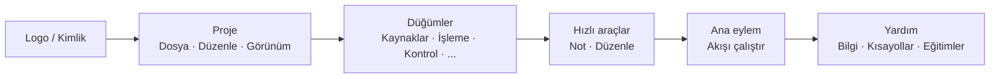

## Ana Araç Çubuğu: Organizasyon ve Felsefe

Üst araç çubuğu, FloWorks'ün **hızlı komuta merkezidir**. Tasarımı, bir çalışma oturumunda ihtiyaç duyduğunuz tipik sırayla eylemleri soldan sağa doğru sunan bir iş akışı mantığı izler.

### Gruplara göre organizasyon

Araç çubuğu, ince dikey çizgilerle ayrılmış **altı işlevsel gruba** bölünmüştür. Her grup, ilgili eylemleri bir araya getirir, böylece dağınık menülerde aramanıza gerek kalmaz.

---

### 1. Kimlik (Logo)

En solda **FloWorks logosunu** göreceksiniz. Sadece dekoratif değildir: üzerine tıklamak, genel bilgileri ve kullanım felsefesini içeren **karşılama iletişim kutusunu** açar.

- **Tooltip:** "FloWorks bilgi ve karşılama".

**Felsefe:** Logo, menülerde yer kaplamadan kimlik ve ilk yardıma bir erişim noktası olarak davranır.

---

### 2. Proje: Dosya, Düzenle ve Görünüm

**Proje yönetimi ve arayüz görünümüyle** ilgili işlemleri gruplar.

#### 📁 Dosya
- **Yeni**: boş bir akış oluşturur.
- **Aç**: mevcut bir projeyi yükler.
- **Kaydet / Farklı kaydet**: geçerli akışı kaydeder.
- **Çıkış**: uygulamayı kapatır.

#### ✂️ Düzenle
- **Geri al / Yinele**: Tuvaldeki değişiklikleri geri alır veya geri yükler.
- **Kes / Kopyala / Yapıştır**: seçili düğümleri yönetir.
- **Tercihler**: genel yapılandırma penceresini açar.

#### 👁️ Görünüm
Bu menü, arayüzün nasıl göründüğünü ve tercihlerinize nasıl uyum sağladığını kontrol eder:

- **Dil**: uygulamanın tamamının dilini değiştirir (menüler, düğmeler, mesajlar).
- **Tema**: çalışırken görsel temalar (açık, koyu vb.) arasında geçiş yapar.
- **Yazı tipi boyutu**: arayüzdeki metin boyutunu, önceden tanımlanmış ve özel seçeneklerle ayarlar.
- **Günlük görüntüleyici**: uygulamanın iç günlüklerini gösterir (gelişmiş hata ayıklama için kullanışlıdır).

**Felsefe:** "Benim projem ve çalışma ortamım" ile ilgili her şey bir aradadır, ancak düğüm ekleyen veya çalıştıran eylemlerden ayrılmıştır.

---

### 3. Düğümler (kategorilere göre)

Bu grup, FloWorks'te mevcut olan **düğüm kataloğundan otomatik olarak oluşturulur**. Manuel olarak kodlanmamıştır: programa yeni bir düğüm eklenirse, kategorisi burada otomatik olarak görünür.

Tipik kategoriler şunları içerir:

- **Kaynaklar** (sinyal jeneratörleri, veri girişleri).
- **İşleme** (filtreler, matematiksel dönüşümler).
- **Kontrol** (akış mantığı, koşullar).
- **Çıkışlar** (havuzlar, görüntüleyiciler, dışa aktarıcılar).
- Ve topluluk tarafından veya kendi özel düğümleriniz tarafından tanımlanan diğer herhangi bir kategori.

**Akıllı davranış:**

- Bir kategori **tek bir düğüm** içeriyorsa, araç çubuğu doğrudan adıyla bir düğme gösterir; tıklamak o düğümü Tuval'e ekler.
- **Birden fazla düğüm** içeriyorsa, hepsini içeren bir açılır menü gösterilir. Birini seçmek onu Tuval'e yerleştirir.

**Felsefe:** Düğümlere erişim her zaman görünürdür, bir yan panel açmaya gerek yoktur. Araç çubuğu kataloğa uyum sağlar, tutarlılığı korur ve manuel yapılandırmayı önler.

---

### 4. Hızlı araçlar

Doğrudan verimlilik için iki düğme:

- **📝 Yapışkan not**: akışın bölümlerini belgelemek için Tuval'e görsel bir not ekler.
- **🔧 Otomatik düzenle**: tek bir tıklamayla Tuval'deki tüm düğümleri düzenli ve okunabilir bir şekilde yeniden düzenler.

**Felsefe:** Bunlar sık kullanılan, menülerde gizlenmeyi hak etmeyen eylemlerdir. Bir tıklama ve hazır.

---

### 5. Ana eylem: Akışı çalıştır

**Çalıştır** düğmesi, renkli bir kenarlık (genellikle yeşil) ve bir "oynat" simgesiyle görsel olarak vurgulanmıştır. FloWorks'ün merkezi eylemini temsil ettiği için araç çubuğundaki en dikkat çekici düğmedir: **veri akışını başlatmak**.

- Tıklamak, **geçerli akışı çalıştırır** ve grafiği ile alt veri tablosunu günceller.
- Düğme, basıldığında hafifçe görünüm değiştirir, dokunsal geri bildirim sağlar.

**Felsefe:** En önemli eylem en görünür olmalıdır. Çalıştırmak için menülerde gezinmeye gerek yoktur; her zaman bir tıklama uzaklıktadır.

---

### 6. Yardım

Araç çubuğunun sonunda, şunlara doğrudan bağlantılar sunan **Yardım** menüsünü bulacaksınız:

- **Bilgi**: sürüm ve proje hakkında ayrıntılar.
- **Klavye kısayolları**: gelişmiş kullanıcılar için kombinasyonların tam listesi.
- **Eğitimler**: FloWorks'ü öğrenmek için adım adım kılavuzlar.

**Felsefe:** Yardım her zaman mevcuttur, ancak iş akışını engellememek için ayrılmıştır.

---

### Uyarlanabilir özellikler

- **Anında çeviri**: Görünüm menüsünden dil değiştirildiğinde, **araç çubuğundaki tüm metinler anında güncellenir**, yeniden başlatma olmadan.
- **Temalar ve yazı tipi boyutu**: araç çubuğu hemen yeni görsel stilde yeniden çizilir.
- **Dinamik katalog**: programa yeni düğümler eklendiğinde, kategorileri araç çubuğunda otomatik olarak belirir, manuel müdahale olmadan.

**Özet:** Araç çubuğu **sezgisel, hızlı ve uyarlanabilir** olacak şekilde tasarlanmıştır. Doğal iş akışını izler: projeyi yapılandır → düzenle → düğüm ekle → çalıştır → yardımı incele. Gerisi yoldan çıkarılır, ancak ihtiyaç duyduğunuzda erişilebilir.
