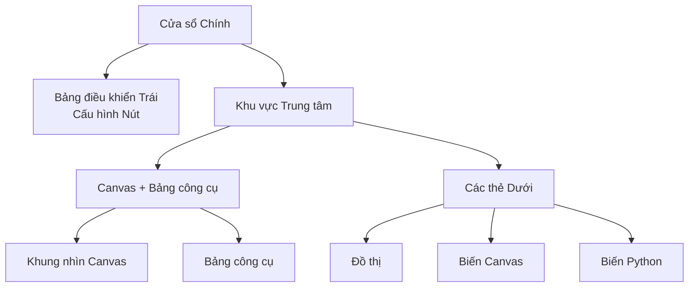

## Giải phẫu Giao diện Chính

FloWorks sắp xếp cửa sổ chính của mình thành **ba khu vực chức năng** dựa trên một triết lý rõ ràng:
> *Trung tâm màn hình dành cho luồng công việc (Canvas). Bên trái là cấu hình của nút đã chọn. Bên phải là các công cụ hỗ trợ. Phía dưới là hiển thị trực quan và dữ liệu.*

Bố cục này không phải ngẫu nhiên: nó cho phép **xây dựng và chạy luồng mà không đánh mất chi tiết**, luôn giữ cho cấu hình của nút đang hoạt động và các công cụ phân tích trong tầm tay.

---

### 1. Bảng điều khiển Trái: Cấu hình Nút

Bảng này, nằm bên trái, được dành **riêng để hiển th và chỉnh sửa các tham số của nút mà bạn đã chọn** trên Canvas.

**Những gì bạn thấy ở đây:**

- Một **tiêu đề** cho biết chức năng của bảng.
- **Tên của nút đã chọn** trong một khung nổi bật. Nếu không có nút nào được chọn, sẽ xuất hiện thông báo cho biết điều đó.
- Một **vùng cấu hình có thể cuộn** nơi hiển thị các tùy chọn cụ thể của từng nút (ví dụ: giá trị ngưỡng, tên tín hiệu, tham số thu thập dữ liệu, v.v.).

**Triết lý thiết kế:**

- Bảng này **luôn hiển thị**; không phải là cửa sổ bật lên.
- Khi không có nút nào được chọn, một khoảng trống sẽ hiển thị, mời bạn chọn một nút.
- Khi nhấp vào bất kỳ nút nào trên Canvas, bảng này sẽ cập nhật **tự động** để hiển thị các tùy chọn của nút đó.

| | |
|:---:|:---:|
|  |  |
| *Bảng trái khi không chọn* | *Bảng trái khi có nút được chọn* |

---

### 2. Khu vực Trung tâm: Canvas và Bảng công cụ

Khu vực bên phải được chia theo chiều dọc: phía trên là **Canvas** và phía dưới là **các thẻ dưới**.

#### Canvas (Khung nhìn Nút)

Đây là **trái tim trực quan của FloWorks**. Tại đây bạn:

- Đặt và kết nối các nút tạo thành luồng công việc của mình.
- Di chuyển qua lưới (bằng *pan* hoặc *zoom*) để xem toàn bộ luồng.
- Chọn các nút để chỉnh sửa trong bảng bên trái.

#### Bảng công cụ (Drawer)

Bên phải Canvas có một **bảng bên có thể thu gọn** chứa các công cụ hỗ trợ. Bạn có thể mở hoặc đóng nó tùy theo nhu cầu, giải phóng không gian cho Canvas.

| Biểu tượng | Công cụ | Mục đích |
|:-----:|:------------|:----------------|
| 📉 | Bảng phân tích | Hiển thị trực quan và phân tích tín hiệu (đồ thị, chỉ số). |
| 🧮 | Máy tính khoa học | Tính toán nhanh mà không cần rời khỏi môi trường. |
| 📊 | Bảng tính | Xem và thao tác dữ liệu số ở dạng bảng. |
| 📈 | Giám sát Hiệu suất | Xem các chỉ số chung của Máy tính (mức sử dụng CPU, bộ nhớ, v.v.). |
| 🐍 | Bảng điều khiển Python | Truy cập trực tiếp đến trình thông dịch Python cho các tác vụ nâng cao. |

| | | | | |
|:---:|:---:|:---:|:---:|:---:|
|  |  |  |  |  |
| *Phân tích* | *Máy tính* | *Bảng tính* | *Giám sát* | *Bảng điều khiển Python* |

**Triết lý thiết kế:**
Bảng công cụ cho phép **duy trì tập trung vào Canvas** mà không phải đánh đổi quyền truy cập vào các chức năng bạn cần vào những thời điểm cụ thể. Nó là phần mở rộng tự nhiên của luồng công việc, không phải là sự phân tâm liên tục.

[Hướng dẫn Bảng điều khiển Python](tutorial-console.md){ .md-button }
[Hướng dẫn Spreadsheet](tutorial-spreadsheet.md){ .md-button .md-button--primary }

---

### 3. Các thẻ Dưới: Đồ thị và Biến

Bên dưới Canvas là một khu vực có các thẻ hiển thị hai chế độ xem bổ sung cho nhau:

#### 📈 Đồ thị
- Biểu diễn trực quan các dữ liệu được tạo ra hoặc thu thập bởi các nút.
- Tự động cập nhật khi các nút tạo ra các giá trị mới.
- Chia sẻ cùng chế độ xem với Bảng phân tích, đảm bảo tính nhất quán về mặt trực quan.

#### 📋 Biến Canvas (Workspace)
- Hiển thị một bảng với các **biến, tín hiệu hoặc dữ liệu** có trên Canvas trong luồng của bạn.
- Cập nhật theo thời gian thực cùng với đồ thị.
- Đây là chế độ xem "thô" của dữ liệu: lý tưởng cho gỡ lỗi và xác minh số.

#### 📋 Biến Python (Terminal)
- Hiển thị một bảng với các **biến, tín hiệu hoặc dữ liệu** được khai báo trong terminal python.
- Cập nhật theo thời gian thực.
- Hiển thị kích thước và thuộc tính của từng biến được lưu trữ.

| |
|:---:|
|  |
| *Thẻ Đồ thị* |
|  |
| *Thẻ Biến Canvas* |
|  |
| *Thẻ Biến Python* |

---

### 4. Thuộc tính Bố cục

- **Các bảng có thể điều chỉnh kích thước**
  Cả phân chia trái/phải và trên/dưới đều có thể điều chỉnh bằng cách kéo các cạnh, để giao diện phù hợp với luồng công việc của bạn.

- **Tỷ lệ ban đầu**
  - Bng trái: **25%** tổng chiều rộng.
  - Khu vực phải: **75%** còn lại.
  - Theo chiều dọc, Canvas chiếm khoảng **480 px** và các thẻ dưới **320 px** (có thể thay đổi).

- **Lề và khoảng cách**
  Các lề được giữ ở mức tối thiểu để tận dụng tối đa không gian làm việc, không ảnh hưởng đến khả năng đọc.

---

### 5. Tính phản hồi của Giao diện

FloWorks được thiết kế để **mọi thao tác trên Canvas đều có tác động ngay lập tức đến các bảng**:

- Khi chọn một nút, bảng trái hiển thị các tùy chọn của nó.
- Khi chạy một luồng, đồ thị và bảng dữ liệu tự động cập nhật.
- Khi xóa một nút, bảng cấu hình sẽ được xóa nếu đó là nút đã chọn.
- Nếu luồng có thay đổi chưa lưu, giao diện sẽ chỉ ra điều đó bằng hình ảnh (ví dụ: dấu sao trong tiêu đề hoặc chỉ báo).

Trải nghiệm **phản hồi** này loại bỏ việc phải làm mới thủ công chế độ xem: bạn luôn thấy trạng thái mới nhất của công việc mình.

---

### 6. Thay đổi Chủ đề khi đang chạy

FloWorks cho phép thay đổi chủ đề trực quan (sáng/tối) **mà không cần khởi động lại ứng dụng**. Bạn có thể chuyển đổi giữa các chủ đề trong khi làm việc và **giao diện sẽ thích ứng ngay lập tức**, giữ nguyên trạng thái luồng của bạn.

**Lợi ích thực tế:**
Làm việc với chủ đề thoải mái nhất cho bạn tùy theo điều kiện ánh sáng hoặc sở thích cá nhân, mà không làm gián đoạn phiên làm việc.

---

### 7. Đa ngôn ngữ (Quốc tế hóa)

Tất cả các văn bản trong giao diện (menu, tiêu đề, nút, thông báo) đã được chuẩn bị để **hiển thị bằng nhiều ngôn ngữ**. FloWorks bao gồm một hệ thống dịch thuật cho phép dễ dàng thay đổi ngôn ngữ của ứng dụng mà không cần cài đặt lại hoặc khởi động lại.

**Triết lý thiết kế:**
Công cụ được thiết kế cho người dùng ở các khu vực khác nhau; ngôn ngữ không nên là rào cản.

---

> **Tóm tắt trực quan:** Màn hình được tổ chức để bạn thấy **mọi thứ quan trọng trong một cái nhìn**: các nút (trung tâm), cấu hình nút (trái), công cụ hỗ trợ (phải, có thể thu gọn) và kết quả/dữ liệu (dưới). Tất cả đều phản hồi, với thay đổi chủ đề tức thì và hỗ trợ đa ngôn ngữ.
