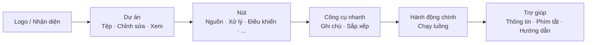

## Thanh công cụ chính: Tổ chức và Triết lý

Thanh công cụ phía trên là **trung tâm chỉ huy nhanh** của FloWorks. Thiết kế của nó tuân theo logic luồng công việc: từ trái sang phải, bạn sẽ tìm thấy các hành động theo thứ tự điển hình mà bạn cần trong một phiên.

### Tổ chức theo nhóm

Thanh công cụ được chia thành **sáu nhóm chức năng**, được phân tách bằng các đường thẳng đứng mảnh. Mỗi nhóm nhóm các hành động liên quan để bạn không phải tìm kiếm trong các menu rời rạc.

---

### 1. Nhận diện (Logo)

Ở cực bên trái, bạn sẽ thấy **logo FloWorks**. Nó không chỉ mang tính trang trí: nhấp vào nó sẽ mở **hộp thoại chào mừng**, bao gồm thông tin chung và triết lý sử dụng.

- **Tooltip:** "Thông tin và chào mừng FloWorks".

**Triết lý:** Logo đóng vai trò là điểm truy cập vào nhận diện và trợ giúp ban đầu, không chiếm chỗ trong menu.

---

### 2. Dự án: Tệp, Chỉnh sửa và Xem

Nhóm các thao tác liên quan đến **quản lý dự án và giao diện**.

#### 📁 Tệp
- **Mới**: tạo một luồng trống.
- **Mở**: tải một dự án hiện có.
- **Lưu / Lưu thành**: lưu luồng hiện tại.
- **Thoát**: đóng ứng dụng.

#### ✂️ Chỉnh sửa
- **Hoàn tác / Làm lại**: hoàn nguyên hoặc khôi phục các thay đổi trên Canvas.
- **Cắt / Sao chép / Dán**: thao tác các nút đã chọn.
- **Tùy chọn**: mở cửa sổ cấu hình toàn cục.

#### 👁️ Xem
Menu này kiểm soát giao diện hiển thị và cách nó thích ứng với tùy chọn của bạn:

- **Ngôn ngữ**: thay đổi ngôn ngữ của toàn bộ ứng dụng (menu, nút, thông báo).
- **Chủ đề**: chuyển đổi giữa các chủ đề trực quan (sáng, tối, v.v.) khi đang chạy.
- **Cỡ chữ**: điều chỉnh kích thước văn bản trong toàn bộ giao diện, với các tùy chọn định sẵn và tùy chỉnh.
- **Trình xem nhật ký**: hiển thị nhật ký nội bộ của ứng dụng (hữu ích cho gỡ lỗi nâng cao).

**Triết lý:** Mọi thứ liên quan đến "dự án của tôi và môi trường làm việc của tôi" đều ở cùng nhau, nhưng tách biệt với các hành động thêm hoặc chạy nút.

---

### 3. Nút (theo danh mục)

Nhóm này được **tự động tạo từ danh mục nút** có sẵn trong FloWorks. Nó không được mã hóa thủ công: nếu một nút mới được thêm vào chương trình, danh mục của nó sẽ tự động xuất hiện ở đây.

Các danh mục điển hình bao gồm:

- **Nguồn** (bộ tạo tín hiệu, đầu vào dữ liệu).
- **Xử lý** (bộ lọc, phép biến đổi toán học).
- **Điều khiển** (logic luồng, điều kiện).
- **Đầu ra** (đích, bộ xem, bộ xuất).
- Và bất kỳ danh mc nào khác do cộng đồng hoặc các nút tùy chỉnh của bạn xác định.

**Hành vi thông minh:**

- Nếu một danh mục chứa **một nút**, thanh công cụ hiển thị trực tiếp một nút có tên của nó; nhấp vào sẽ thêm nút đó vào Canvas.
- Nếu chứa **nhiều nút**, một menu thả xuống hiển thị tất cả. Chọn một sẽ đặt nó vào Canvas.

**Triết lý:** Quyền truy cập vào các nút luôn hiển thị, không cần mở bảng bên. Thanh công cụ thích ứng với danh mục, duy trì tính nhất quán và tránh cấu hình thủ công.

---

### 4. Công cụ nhanh

Hai nút để tăng năng suất trực tiếp:

- **📝 Ghi chú dán**: thêm một ghi chú trực quan vào Canvas để ghi chép các phần của luồng.
- **🔧 Tự động sắp xếp**: sắp xếp lại tất cả các nút trên Canvas một cách gọn gàng và dễ đọc chỉ bằng một cú nhấp chuột.

**Triết lý:** Đây là những hành động được sử dụng thường xuyên và không xứng đáng bị ẩn trong menu. Một cú nhấp chuột là xong.

---

### 5. Hành động chính: Chạy luồng

Nút **Chạy** được làm nổi bật trực quan bằng đường viền màu (thường là xanh lá) và biểu tượng "phát". Đây là nút nổi bật nhất trên thanh công cụ, vì nó đại diện cho hành động trung tâm của FloWorks: **khởi động luồng dữ liệu**.

- Khi nhấp, **luồng hiện tại được thực thi** và biểu đồ cùng bảng dữ liệu phía dưới được cập nhật.
- Nút thay đổi nhẹ vẻ bề ngoài khi nhấn, cung cấp phản hồi xúc giác.

**Triết lý:** Hành động quan trọng nhất phải là hành động dễ thấy nhất. Không cần duyệt menu để chạy; luôn chỉ cách một cú nhấp chuột.

---

### 6. Trợ giúp

Ở cuối thanh công cụ, bạn sẽ tìm thấy menu **Trợ giúp**, với các phím tắt đến:

- **Thông tin**: chi tiết v phiên bản và dự án.
- **Phím tắt**: danh sách đầy đủ các tổ hợp cho người dùng nâng cao.
- **Hướng dẫn**: hướng dẫn từng bước để học FloWorks.

**Triết lý:** Trợ giúp luôn có sẵn, nhưng tách biệt khỏi luồng công việc để không gây phiền toái.

---

### Đặc điểm thích ứng

- **Dịch tức thì**: khi thay đổi ngôn ngữ từ menu Xem, **tất cả văn bản trên thanh công cụ được cập nhật ngay lập tức**, không cần khởi động lại.
- **Chủ đề và cỡ chữ**: thanh công cụ được vẽ lại ngay lập tức với phong cách trực quan mới.
- **Danh mục động**: nếu các nút mới được thêm vào chương trình, danh mục của chúng sẽ tự động xuất hiện trên thanh công cụ, không cần can thiệp thủ công.

**Tóm tắt:** Thanh công cụ được thiết kế để **trực quan, nhanh chóng và thích ứng**. Nó tuân theo luồng công việc tự nhiên: cấu hình dự án → chỉnh sửa → thêm nút → chạy → tham khảo trợ giúp. Mọi thứ khác đều ở ngoài tầm với, nhưng có thể truy cập khi bạn cần.
