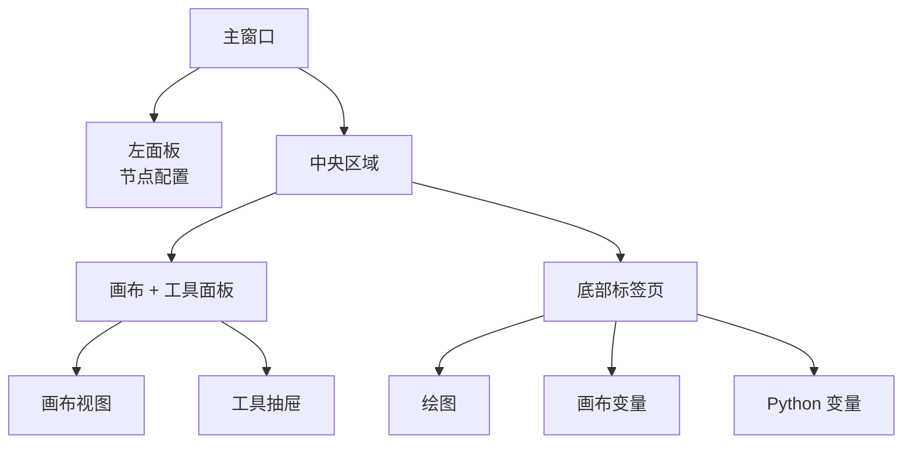

## 主界面解剖

FloWorks 将主窗口组织为**三个功能区域**，遵循一个清晰的理念：
> *屏幕中心用于工作流（画布）。左侧用于所选节点的配置。右侧用于辅助工具。底部用于可视化和数据。*

这种布局并非随意：它让您**在构建和运行流程时不会忽略细节**，始终可以轻松访问活动节点的配置和分析工具。

---

### 1. 左面板：节点配置

该面板位于左侧，**专门用于显示和编辑您在画布上选择的节点的参数**。

**您在这里看到的内容：**

- 一个指示面板功能的**标题**。
- 一个突出显示框中显示的**所选节点的名称**。如果未选择任何节点，则会显示一条提示信息。
- 一个**可滚动的配置区域**，其中显示每个节点的特定选项（例如，阈值、信号名称、采集参数等）。

**设计理念：**

- 该面板**始终可见**；不是弹出窗口。
- 当未选择任何节点时，会显示一个空白区域，提示您选择一个节点。
- 当您单击画布上的任意节点时，该面板会**自动**更新以显示其选项。

| | |
|:---:|:---:|
|  |  |
| *无选择时的左面板* | *有节点选中时的左面板* |

---

### 2. 中央区域：画布和工具面板

右侧区域垂直划分：**画布**在上方，**底部标签页**在下方。

#### 画布（节点视图）

这是 **FloWorks 的视觉核心**。在这里您可以：

- 放置并连接构成工作流的节点。
- 在网格上移动（通过*平移*或*缩放*）以查看整个流程。
- 选择节点以在左面板中编辑它们。

#### 工具抽屉

画布右侧有一个**可折叠的侧面板**，其中包含辅助工具。您可以根据需要打开或关闭它，为画布腾出空间。

| 图标 | 工具 | 用途 |
|:-----:|:------------|:----------------|
| 📉 | 分析面板 | 信号的可视化和分析（图表、指标）。 |
| 🧮 | 科学计算器 | 无离开环境即可进行快速计算。 |
| 📊 | 电子表格 | 以表格形式查看和操作数值数据。 |
| 📈 | 性能监视器 | 查看计算机的整体指标（CPU 使用率、内存等）。 |
| 🐍 | Python 控制台 | 直接访问 Python 解释器以执行高级任务。 |

| | | | | |
|:---:|:---:|:---:|:---:|:---:|
|  |  |  |  |  |
| *分析* | *计算器* | *电子表格* | *监视器* | *Python 控制台* |

**设计理念：**
工具面板让您**注意力集中在画布上**，同时不牺牲在特定时刻所需功能的访问。它是工作流的自然延伸，而不是永久的干扰。

[Python 控制台教程](tutorial-console.md){ .md-button }
[电子表格教程](tutorial-spreadsheet.md){ .md-button .md-button--primary }

---

### 3. 底部标签页：绘图和变量

画布下方是一个带标签的区域，显示两个互补的视图：

#### 📈 绘图
- 以可视化方式示节点生成或获取的数据。
- 随着节点产生新值自动更新。
- 与分析面板共享相同的视图，确保视觉一致性。

#### 📋 画布变量（工作区）
- 显示一个表格，其中包含流程中画布上存在的**变量、信号或数据**。
- 与绘图一起实时更新。
- 这是数据的“原始”视图：非常适合调试和数值验证。

#### 📋 Python 变量（终端）
- 显示一个表格，其中包含 Python 终端中声明的**变量、信号或数据**。
- 实时更新。
- 显示每个存储变量的维度和属性。

| |
|:---:|
|  |
| *绘图标签页* |
|  |
| *画布变量标签页* |
|  |
| *Python 变量标签页* |

---

### 4. 布局属性

- **可调整大小的面板**
  左右和上下分隔线都可以通过拖动边缘进行调整，以适应您的工作流。

- **初始比例**
  - 左面板：总宽度的 **25%**。
  - 右侧区域：剩余的 **75%**。
  - 垂直方向上，画约占 **480 px**，底部标签页约占 **320 px**（您可以更改）。

- **边距和间距**
  边距最小化以最大化工作空间，同时不牺牲可读性。

---

### 5. 界面响应性

FloWorks 的设计使得**您在画布上执行的每项操作都会立即对面板产生影响**：

- 当您选择一个节点时，左面板会显示其选项。
- 当您运行流程时，绘图和数据表会自动更新。
- 当您删除一个节点时，如果它是被选中的节点，配置面板会被清空。
- 如果流程有未保存的更改，界面会以视觉方式指示（例如，标题中的星号或指示器）。

这种**响应式体验**避免了手动刷新视图：您始终可以看到工作的最新状态。

---

### 6. 热主题切换

FloWorks 允许您**在不重启应用程序的情况下**切换视觉主题（浅色/深色）。您可以在工作时在主题之间切换，**界面会立即适应**，同时保持流程状态不变。

**实际好处：**
根据照明条件或个人喜好，使用对您最舒适的主题工作，而不会中断会话。

---

### 7. 国际化（多言）

所有界面文本（菜单、标题、按钮、消息）都准备好**以多种语言显示**。FloWorks 包含一个翻译系统，可让您轻松更改应用程序语言，无需重新安装或重启。

**设计理念：**
该工具为来自不同地区的用户而设计；语言不应成为障碍。

---

> **视觉摘要：** 屏幕经过组织，让您可以**一目了然地看到所有相关内容**：节点（中心）、节点配置（左侧）、辅助工具（右侧，可折叠）以及结果/数据（底部）。一切响应迅速，支持即时主题切换和多语言。
